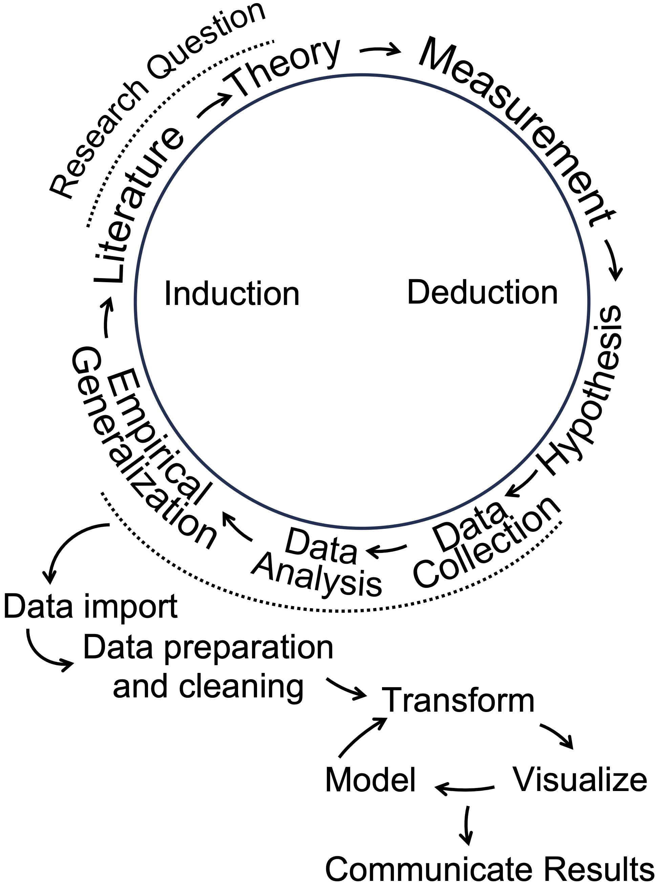

\mainmatter

# Introduction {#ch1}

Chapter \@ref(ch1) introduces the importance of data analysis in political science and situates it within the broader context of political science research.

## Learning objectives and chapter resources{-}

By the end of Chapter \@ref(ch1), you should be able to (1) explain why data analysis skills are important in the study of politics; (2) explain the practice of data analysis within the broader research endeavor of political science; and (3) explain the purpose of two different examples of coding for data analysis. 

## Introduction  {-}

In 1959 two political scientists, Ithiel De Sola Pool \index{De Sola Pool, Ithiel} and William McPhee \index{McPhee, William} along with a psychologist, Robert Abelson \index{Abelson, Robert}, launched a research project to study the public opinion of American voters, particularly to understand the factors holding together northern African Americans in the Democratic party coalition [@desolapool1961]. Of course they needed data.  They turned to mass opinion polls, at the time on the cusp of their golden age of widespread use in national elections.  The authors pooled together survey data collected by pollsters George Gallup and Elmo Roper, from 1952 to 1958, then merged these responses with separate records of corresponding local election results. Imagined as a spreadsheet, it would consist of hundreds of columns and nearly a hundred thousand rows. From the survey responses, the authors identified 480 distinct demographic "voter types", such as "'Eastern, metropolitan, lower-income, white, Catholic, female Demo-crats[sic]'" [@desolapool1961, 168]. The assembly of the data is all the more impressive given the limitations of the era's technology -- such data analysis at the time consisted of physical paper 'punch cards' to be sorted slowly by a massive mainframe computer. As explained by historian Jill Lepore, this effort was intended to represent, in the phrase of de Sola Pool,  "a kind of Manhattan Project" for public opinion and electoral politics [@lepore2021, p. 104].  

While not quite the same intellectual achievement nor significance for global history as the Manhattan Project, the event would nonetheless reflect two fundamental changes in data and politics still with us today.  One is the beginning of modern campaigns and elections: data intensive with mass opinion polling, neighborhood canvassing and a televised mass media forecasting the outcome based on real-time precinct level voting [@donaldson2007, @rorabaugh2009]. De Sola Pool and McPhee would go on to be employed as consultants for the J. F. Kennedy presidential campaign in 1960 [@lepore2021]. 

The second change involves data. De Sola Pool and McPhee founded a company, Simulmatics\index{Simulmatics}, to apply these same novel methods of analyzing data to consumer behavior.  As explained by historian Jill Lepore \index{Lepore, Jill}, the company would fail within 10 years, bankrupted in part and ironically from a lack of data [@lepore2021]. There were simply not enough publicly available surveys of consumer behavior, and massive sales records of millions of consumers would not be available for decades. It was an attempt at a data science of politics before data science could exist. In Lepore's history of the company and the era, their failure presaged our world where algorithms and data patterns rule, constructing social media feeds, directing advertising, and mobilizing voters. Being literate in data --- having basic competencies in the organization and analysis of data --- is more important than ever.  

From another perspective, some parts of contemporary political science look broadly similar to De Sola Pool and McPhee's work in 1959. Political scientists\index{political scientist} investigate research questions, construct data-driven measurements of voter characteristics, and polling is everywhere.  For example, their 480 voter types would lack parsimony by today's standards, but the goal of categorizing and characterizing voters is a ubiquitous one in survey research. The Pew Research Center, in their series of reports, "Beyond Red vs. Blue", categorize voters into a typology of nine different segments on a left-to-right continuum [@pew2021].  

Political scientists often make use of multiple data sources, accessing the data that De Sola Pool and McPhee lacked but sorely needed. The study of politics, even public opinion itself, is no longer solely focused on sample surveys resembling the sampling methods of the 1950s.  Data is everywhere, so the challenge is making sense of the enormous scale of it, from campaign polls and financial statements, to social media activity, country level human rights reports, parliamentary debate transcripts, to global development indicators spanning decades. Organizing and interpreting it requires skill.

## What we will do: data science + statistics
 
What we will learn is a combination of two closely related fields, statistics and data science in the study of politics. In political science, statistics often has often meant inferring likely population characteristics from sample surveys, much like those involved in the work of De Sola Pool and McPhee. The boundaries between the two are fuzzy, but 'data science'\index{data science} has largely emerged in response to the sheer volume of information we all have at our fingertips [@donaho2017]. At its core, data consists of the measurement of facts.  Data science is the process of applying systematic methods of analysis to these facts; practitioners, the data scientists, "are people who are interested in converting the data that is now abundant into actionable information that always seems to be scarce" [@baumer2017].  As a result, the book is about more than sample statistics, because the starting point for data analysis is rarely ever a neat and tidy sample survey.  The sea of data at the disposal of political science requires learning more than inferential statistics. Learning how to assemble and organize data for analysis is as much a critical skill, reflecting the same basic idea that De Sola Pool and McPhee engaged in back in 1959.  However, unlike their efforts, we actually do have the data.  And if anything, too much of it.   So in this text, you will learn some fundamentals of data science (and statistics) in the study of politics.  

In our study of political data analysis, we will learn about the concepts embedded within it, the required assumptions about data, and the interpretation of the results.  There is very little math, certainly no more than is encountered in high school algebra. Because the textbook and course are ultimately about how we apply techniques of data analysis to learn about politics, the emphasis is on the application --- how we use the techniques to learn about politics.  In place of math, what is required is the mindset to approach how we will analyze data --- through coding, which requires patience and persistence.  Coding for data analysis requires attention to detail and breaking big problems down into smaller, sequential steps.   

## How we will do it: coding  

Political scientists, not just computer scientists, often write code in the analysis of data. The code is collected into a step-by-step set of instructions within a text file, often known as a "script" file\index{script file} [@donaho2017].  Writing the code does not require extensive knowledge of a computing language; a small set of coding tools can accomplish a great deal of analysis [@baumer2017]. 

In this text you will learn to write code in the statistical software application, named __R__ [@r2022], within a helper application Posit Workbench\index{Posit Workbench} (also known as "RStudio"), which will be useful for organizing our work.\footnote{R is a statistical programming language first written and published openly under a General Public License in 1995 by Ross Ihaka and Robert Gentleman of the University of Auckland. As open source software, R is used by millions of people around the world.} **R** is widely regarded as the \emph{lingua franca} of data analysis; in political science, __R__ is arguably the most commonly used language. In developing your skills as a data analyst, you will become part of this global community of __R__ users. 

Before getting started with R coding for data analysis, let us consider the bigger picture of how data analysis fits into political science research.  Then we will briefly review some applications of data analysis with two examples, one from the study of global development and the other from US presidential elections. 

## Data analysis in the research process

Data analysis \index{data analysis}--- in the context of political science --- is situated within a particular part of a broader research process, an empirical (evidence-based) investigation about how some part of the political world works. It is worth briefly reviewing some key concepts in research design prior to getting introduced to data analysis coding in __R__. This introduction is necessarily brief; more comprehensive reviews of the subject are found in research design oriented textbooks. 

The research process is depicted as a cyclical process in Figure \@ref(fig:wheelgraph). Typically, researchers begin with a research question, a 'how' or 'why' puzzle. Research questions relate to how the world of politics works. Questions can be either descriptive or explanatory.  A descriptive research question, as is suggested by the phrase, is a question that describes a political phenomenon or concept of interest: How does the quality of democratic government support for democracy vary around the world? An explanatory question, however, queries the relationship between two concepts.  Examples of such questions include the following: Why have party caucuses in the US Congress become more polarized?; How does social trust affect government effectiveness?  The 'how' or 'why' part leads to the investigation of causal relationships or puzzles to explain.  

```{R wheelgraph, echo=FALSE, out.width='50%', fig.asp=.75, fig.align='center', fig.cap="Data analysis as part of a broader cyclical research process. Adapted from Wallace (1971) and Wickham and Grolemund (2016)."}

```

From the research question follows a literature review, a search for prior research. From there, a theory emerges. A theory is a tentative answer to a research question.  Then the researcher translates theoretical concepts into empirically observable quantities.  This translation is often referred to as "operationalization", the process of deciding how to develop data-based (empirical) measures of concepts. Next, hypotheses are derived from the theory; expressed in terms of the measured concepts, often referred to as "variables", hypotheses express an anticipation of how variation in one measured concept is related to another.  A 'directional hypothesis' expresses how variation in an "independent" variable (the cause) relates to a particular direction of variation in the "dependent" variable (the effect). 

As illustrated in Figure \@ref(fig:wheelgraph), data analysis in __R__ plays a central role in the research process, beginning after data collection to describe a phenomenon or test a hypothesis. The steps outlined in the wheel, starting with "Data Import," present a data analysis cycle. "Data Import" involves reading external data into __R__, followed by "Data Preparation and Cleaning," where messy or unformatted data is organized into a tidy, analyzable format. During the "Transform" step, researchers manipulate variables --- rescaling or creating new ones to prepare for analysis. Next, "Visualize" involves creating graphics to explore or present patterns. "Model" refers to identifying statistical relationships. Finally, "Communicate Results" emphasizes sharing insights from the analysis, completing the cycle of induction in which data driven insights contribute to the literature and inform future research questions. These steps integrate data analysis into the broader research process, linking empirical generalizations to theoretical contributions.

## Two examples of coding for political data analysis

Two examples illustrate some of the key ideas and skills we will learn in _Introduction to Political Analysis in R_, through the use of coding in the **R** language.  

1) managing rectangular datasets to extract descriptive measures of global economic development, life expectancy, and poverty, visualizing how the relationships between these country-level measures have changed over time.

2) explaining how the outcomes of US presidential elections are shaped by the so-called 'fundamentals': presidential approval, economic conditions, and incumbency status.  

The presentation of these examples is mostly conceptual and illustrative, apart from a few lines of __R__ code. We will learn the technical details --- including the code --- in subsequent chapters. 

### Measuring changes in global development {-}

In 2007, Hans Rosling, a Swedish professor of public health at the Karolinksa Institute delivered a TED talk entitled, "The best stats you've ever seen" [@gapminder]. The talk became famous for his visualization of country-level global development.  In a series of yearly scatterplots showing the relationship between (human) life expectancy and fertility rates, Rosling visualized country- and regional-level changes in a dynamic graphic. Encoded within each of the scatterplots were the population (point size) and region (point color) of each country, showing over time how population, fertility, and life expectancy have changed in tandem, making uneven but steady progress [@rosling2018].   

A sense of the dynamic visualizations and evidence Rosling displayed is found in the panels in Figure \@ref(fig:fertle7515). Both figures display the same country characteristics, but for different years, 1975 and 2015. Because of the varying size of the points in the scatterplot, figures such as this are known as 'bubble charts'. Countries within the South Asia region are labeled. Comparing the movement of these countries from the upper to lower figure panels in the figure illustrates one of the points Rosling made. In 1975, there is wide variation in fertility rates, with much of the world population having a relatively low life expectancy compared to North America; in South Asia, all but Sri Lanka hold a life expectancy below 60 years old.  Yet by 2015 improvements are such that life expectancy for much of the global population is above 60 years old. 
```{r echo=FALSE, message=FALSE, warning=FALSE}
library(tidyverse)
```
```{r warning=FALSE, message=FALSE, echo=FALSE }
wbdatach1<-read_csv("./data/ch1 data/wbdatach1.csv")
wbdatach1<-subset(wbdatach1, region!="Aggregates") # dropping regional aggregates

wbdatach1<- wbdatach1 %>%
  select(-NY.GDP.PCAP.KD)

wbdatach175<-wbdatach1 %>%
  filter(year==1975)

wbdatach115<-wbdatach1 %>%
  filter(year==2015)

```
```{r echo=FALSE, message=FALSE, warning=FALSE}
namesub75<-wbdatach175 %>%
  filter(country %in% c("China", "India", "United States"))
namesub15<-wbdatach115 %>%
  filter(country %in% c("China", "India", "United States"))

library(viridis) 
```
```{r fertle7515, echo=FALSE, warning=FALSE, message=FALSE, fig.cap="Scatterplots of life expectancy at birth (years) by fertility rate (births per woman) for 1975 (upper panel) and 2015 (lower panel), with countries colored by world region. Marker size indicates population size. In 1975, countries exhibited wide variation in both fertility and life expectancy, with limited regional clustering. By 2015, most countries experienced increases in life expectancy and declines in fertility, resulting in tighter regional clustering, except for Sub-Saharan Africa, which remains more dispersed in both measures.", fig.height=7}
library(ggplot2)
library(ggrepel)
library(patchwork)   

fig1 <- ggplot(data = wbdatach175) +
  geom_point(aes(x = SP.DYN.TFRT.IN, y = SP.DYN.LE00.IN,
                 color = region, size = SP.POP.TOTL, alpha = 0.6)) +
  geom_text_repel(data = subset(wbdatach175, region == "South Asia"),
                  aes(SP.DYN.TFRT.IN, y = SP.DYN.LE00.IN, label = country),
                  alpha = 1, force_pull = 2, min.segment.length = 0) +
  theme(legend.position = "bottom", legend.box = "vertical",
        legend.margin = margin()) +
  labs(x = "1975 fertility rate, total (births per woman)",
       y = "1975 life expectancy at birth") +
  scale_color_viridis(discrete = TRUE) +
  scale_y_continuous(limits = c(30, 90)) +
  scale_x_continuous(limits = c(1, 8)) +
  scale_size(range = c(1, 10),
             breaks = c(129626, 968928, 3189550, 6683893, 15578239)) +
  guides(size = "none", alpha = "none", color = guide_legend(ncol = 3))

fig2 <- ggplot(data = wbdatach115) +
  geom_point(aes(x = SP.DYN.TFRT.IN, y = SP.DYN.LE00.IN,
                 color = region, size = SP.POP.TOTL, alpha = 0.6)) +
  geom_text_repel(data = subset(wbdatach115, region == "South Asia"),
                  aes(SP.DYN.TFRT.IN, y = SP.DYN.LE00.IN, label = country),
                  alpha = 1, force_pull = 0, min.segment.length = 0) +
  theme(legend.position = "bottom", legend.box = "vertical",
        legend.margin = margin()) +
  labs(x = "2015 fertility rate, total (births per woman)",
       y = "2015 life expectancy at birth") +
  scale_color_viridis(discrete = TRUE) +
  scale_y_continuous(limits = c(30, 90)) +
  scale_x_continuous(limits = c(1, 8)) +
  scale_size(range = c(1, 10),
             breaks = c(129626, 968928, 3189550, 6683893, 15578239)) +
  guides(size = "none", alpha = "none", color = guide_legend(ncol = 3))

(fig1 / fig2) + plot_layout(guides = "collect") & theme(legend.position = "bottom")
```

The source of the data for these figures is the World Bank [@worldbank_gdi]. Through __R__ code, it is relatively simple to download data directly into an organized dataset. Members of the __R__ community write bits of code to perform useful analytical tasks.  These fragments of code are assembled into 'packages' that can be downloaded for use. For example, a popular package for accessing data from the World Bank is the _WDI_ package [@R-WDI]. For example, the code below will automatically download the data for Rosling's figures from the World Bank's data servers.

```{r eval=FALSE, warning=FALSE, message=FALSE }
wbdata1<-WDI(country="all", 
         indicator=c("SP.DYN.TFRT.IN", "SP.DYN.LE00.IN", "SP.POP.TOTL"), 
         start=1975, end=2015, extra=TRUE)
```

The three lines of code above download measures of fertility (average births per female), life expectancy (average expected at birth), and total population for all countries from 1975 to 2015 using the `WDI()` \index{WDI R package | \texttt{WDI() }}function from the __WDI__ package. Functions are commands, and the parentheses contain the specific instructions of what to do. The dataset is stored in an object named wbdata1, which could be named anything, though shorter, meaningful names are easier to use. The <- symbol is the assignment operator\index{assignment operator}, meaning "gets," and is used to assign the results of the function to the object. The WDI() function specifies arguments inside its parentheses, such as `country="all"` to include all countries, the indicator argument to select specific measures, and the `start=` and `end=` arguments to set the time range. When the code is run, __R__ downloads the specified data and stores it in the _wbdata1_ object for further analysis.

```{r echo=FALSE, warning=FALSE, messsage=FALSE}
library(WDI)
wbdatach115<-wbdatach1 %>%
  filter(year==2015)
```  

Table \@ref(tab:wbdata1-tab1) displays an excerpt of the downloaded data for 2015, structured as a rectangular dataset\index{rectangular dataset}. Each row represents a country, while the columns record features of the countries, life expectancy and fertility rates. Missing values, such as _NA_ for Andorra, indicate data that is not available for that year. Overall, this example highlights code and the structure of datasets you will work with in __R__ for learning skills in data organization, visualization, and analysis in later chapters.

```{r wbdata1-tab1, echo=FALSE}
knitr::kable(head(wbdatach115[,c(2,4,5) ], 5), caption=" Excerpt of World Bank data for Figure 1.4. The second column lists fertility rate and the third life expectancy", booktabs=TRUE)
```

### Modeling U.S. presidential elections {-}

Election forecasting\index{forecasting} models provide another example of the data analysis concepts and skills covered in this book. A "model" refers to a simplified representation of a political phenomenon, built using data and assumptions about how different aspects of the data are related. During U.S. presidential campaigns, forecasts of election outcomes frequently appear in the news, ranging from expert historical judgments to computational predictions based on data analysis.

These dynamic models build on static forecasts from the 1970s and 1980s, which focused on the so-called "fundamentals", contextual factors like economic conditions and presidential approval that shape elections beyond the influence of campaigns [@lewis2005]. For example, Abramowitz’s "Time for Change" model [`@abramowitz2016] predicts the incumbent party’s share of the two-party vote based on three factors: (1) the incumbent president's approval rating in early summer, (2) second-quarter GDP growth, and (3) whether the incumbent party is running for a third term. Figure \@ref(fig:incgdp1) illustrates this relationship using a bubble chart: the incumbent party's vote share appears on the Y-axis, GDP growth on the X-axis, and approval rating is encoded in the size of the points. The positive slope of the trend line shows how GDP growth is strongly associated with incumbent support. (Approval rating influences the size of the points but not the line itself.) The trend line, $y = 50.70 + 0.80X_{gdp}$, reveals the linear relationship. Here, the y-intercept (50.70) is the predicted incumbent vote share when GDP growth is zero, and the slope (0.80) indicates the expected change in vote share for each one-unit increase in GDP growth. This model and its forecasting potential will be explored further in later chapters.

```{r echo=FALSE, warning=FALSE, message=FALSE}
library(ggrepel)
library(readr)
library(ggplot2)
prez<-read_csv(file="./data/ch1 data/forecastimport.csv")
prez<-prez %>%
  relocate(year, candidates, incprez, vote, approval, qgdprate, incstatus) %>%
  select(-candidates)
```


```{r incgdp1, echo=FALSE, fig.height=6, warning=FALSE, message=FALSE, fig.cap="Scatterplot of incumbent party two-party popular vote share (in percent) by second quarter GDP growth rate (in percent) for U.S. presidential elections (1948–2020). Each point represents an election year, with point size reflecting the incumbent president’s approval rating at mid-year (larger points indicate higher approval). The red trend line summarizes the positive linear relationship between GDP growth and vote share: incumbents tend to receive a higher share of the popular vote when economic growth is stronger."}
ggplot(data=prez) +
#  geom_point(aes(x=qgdprate, y=vote)) +
  stat_smooth(method="lm", se=FALSE, aes(x=qgdprate, y=vote), color="red") +
  labs(y="incumbent percentage share of two-party vote",
       x="GDP second quarter growth rate, election year") +
  geom_text_repel(aes(x=qgdprate, y=vote, label=year), alpha=.6)  +
  geom_point(aes(x=qgdprate, y=vote, size= approval), alpha=.6, show.legend = FALSE) +
  theme(legend.position="bottom") 
# scale_size(breaks=c(20, 40, 60, 80), labels=expression(20, 40, 60, 80))
# title="GDP growth rate by vote for incumbent president",

```

```{r echo=FALSE}
reg3<-lm(vote ~ qgdprate, data=prez)
predicted_vote<-reg3$fitted.values # store the predicted vote scores
prez<-cbind(prez, predicted_vote) # merge them with the prez dataset
prez<-prez %>%
 mutate(residuals = vote - predicted_vote)
```

By fitting the model $y = 50.70 + 0.80X_{gdp}$ to presidential elections from 1948 to 2020, we can substitute the GDP growth rate for each election year to generate predicted vote shares for the incumbent party. In some years, the predictions align closely with reality: for example, in 2012, the model predicted a 51.01 percent vote share for President Obama, nearly identical to the observed 51.10 percent, showing the economy’s expected influence on his reelection. However, in 2008, the model predicted 51.09 percent for the incumbent Republican party ticket, yet the actual vote share was 45.70 percent, reflecting a significant economic under performance. These differences highlight how elections can sometimes align with a "fundamentals" based model while in other years, much less so.

This example illustrates purpose of data analysis: understanding historical patterns, incorporating data to measure the patterns, and making predictions or simply exploring relationships. While fitting a model to historical data reveals important relationships, using it to forecast an upcoming election, like 2024, introduces additional uncertainty. Substituting in projected GDP values can generate a prediction, but this process requires careful consideration of the model's assumptions and limitations, which highlights the complexity of data analysis: it guides us toward insights, but also reminds us of the need for critical thinking about what the numbers mean. This theme --- connecting data, models, and real-world interpretation --- underscores the purpose of the book.

## A roadmap to the chapters {-}

The book organization is as follows. In Chapter \@ref(ch2), we will get **R** apps up and running. We will learn some of the fundamentals of using the **R** language for data analysis and useful features of Posit Workbench (also known as RStudio), an integrated development environment (IDE) for **R**.  As an IDE it is an interface for working more efficiently with R code, importing datasets, saving code and output such as visualizations.  

In Chapter \@ref(ch3) we will learn about the organization and manipulation of rectangular datasets.  For example, we will learn about the organization of data into tabular (tables or rows and columns) form, how to organize data for observations collected across time and space -- observations on one or many points in time, and how to merge multiple data sources.  We will learn about different measurement levels, storage types in R, and common summary statistics.     

In Chapter \@ref(ch4) we will learn about data visualization, common visualization types, and we will investigate visualizations for describing data or comparing relationships, such as histograms and box-whiskers plots, scatterplots, and 'bubble' chart variants. While this chapter focuses on the fundamentals, because data visualization is so commonly used to communicate ideas with data, subsequent chapters introduce new data visualization types based on these fundamentals. 

In Chapter \@ref(ch5) we will learn about 'data wrangling', or how to extract meaningful information from relatively large datasets.  We will learn to filter, sort, rearrange, summarize, and create new measures. We will focus our attention on changes in global development and the challenges of tidying data tables detailing election returns.   

In Chapter \@ref(ch6) we will learn how to manage spatial or geographically defined data.  We will learn various ways to create maps of election results tied to geographic areas, such as ‘red — blue’ election maps.  We will also learn how to evaluate claims of ‘gerrymandering’ of U.S. Congressional districts.  

In Chapter \@ref(ch7) our attention turns to two different methods of data analysis, scaling and clustering.  We will study patterns of roll call voting in the U.S. Congress and the electorate's feelings toward American social and political groups. 

In Chapter \@ref(ch8) we turn to the study of ‘text as data’. We will first apply scaling and clustering to texts, including the study of disputed authorship of *The Federalist* papers. Next we will study ways of summarizing the thematic content of the text, including public comment on proposed federal regulations on Title IX civil rights policy affecting transgender students. 

In Chapter \@ref(ch9) we will study public opinion through election sample surveys.  We will learn fundamental skills in the analysis of survey data, from sample survey statistics to inferring population-level characteristics. Along the way we will consider how to account for the sample design of contemporary election surveys, and post-sampling adjustments made to observations to make the samples more representative.  Our analysis will focus on the American National Election Studies (ANES) survey fielded in 2020.  

Chapters \@ref(ch10) to \@ref(ch12) turn to the workhorse of the social sciences, linear modeling, much like the model of presidential elections reviewed in this chapter.  We will learn the tools and common pitfalls to avoid in constructing models.  Chapter \@ref(ch10) introduces the subject of simple linear and multiple regression models, while in Chapter \@ref(ch11) we consider complications to the models. In Chapter \@ref(ch12) we will construct models often expressed in probabilistic terms, binary logistic regression, for assessing questions such as how increasing educational attainment affects the probability of an individual supporting or opposing a particular policy issue. 

Finally, the appendix presents a description of the datasets available to download from the author's website <https://faculty.gvsu.edu/kilburnw/inpolr.html> for use within the examples presented within the text. 

## Resources {-}

FRED, St. Louis Federal Reserve, <https://fred.stlouisfed.org/> an extensive collection of economic data.

Our World in Data: tracking global change in public health, economic, social, and political development, collected from many official sources <https://ourworldindata.org/>. 

Party Facts: an extensive aggregation of data related to political party organizations around the world <https://partyfacts.herokuapp.com/>. 

World Bank Global Development Indicators: <https://databank.worldbank.org/source/world-development-indicators> A repository of data on national level political, economic, and social characteristics.

R Graphs Gallery: <https://r-graph-gallery.com/> A wide ranging gallery of data visualizations generated with __R__ code. 

Gapminder: <https://www.gapminder.org/> Hans Rosling's work on global development data and visualization. 

<!--
## Exercises

1. Think about a subject matter that interests you in political science.  What is it, and what is a possible research question that could be used to begin studying it it? What kinds of data do you imagine you would need to address the research question?  

2. Election results --- vote counts --- are a ubiquitous form of data.  Websites like Ballotpedia <https://ballotpedia.org/> crowd source data on parties, candidates, and elections.  But to find election results directly from the government entity responsible for conducting the election where would you go?  Find a website for local election results and one for a regional election.  How easy is it to access the results?  What form, if any, are the results available for download? 

3. In other political science courses, or internships, what kinds of data have you encountered? And how has it guided decision making or shaped understanding of politics?

4. GDP measurement...and/or World Bank global development indicators...inerpreting it somehow??..some comparison...
TK make question about using rosling website, and others... together...
-->
 
  
