# Getting Started with R for Data Analysis {#ch2}

Chapter \@ref(ch2) introduces __R__ and the RStudio interface, working through an example of importing a data table and writing __R__ code. 

## Learning objectives and waterials {-}

By the end of Chapter \@ref(ch2), you should be able to (1) install __R__ software, (2) identify key parts of the RStudio interface, (3) write __R__ code interactively through the Console prompt, (4) import a dataset into RStudio, (5) open, edit, and save a text script file containing __R__ code, (6) create a data visualization, (7) save and knit __R__ code into an RMarkdown (.Rmd) document to create a self-contained Word or PDF document. The material uses the datafile _gdpfert.csv_ and a text file of __R__ code _chapter2.r_ from <https://faculty.gvsu.edu/kilburnw/inpolr.html>

## Getting started with R and RStudio

Our tool for learning data analysis is programming language __R__ in the application RStudio.  __R__ is both a language and a specific application --- an app --- and it powers the interface RStudio, which provides many useful features for __R__ coding. There are two main routes to get started: one is through the 'computing cloud', in which the __R__ software is set up for you on a server, and you interact with it through a web browser.  (You would know if this option applies to you, having been given the web address to access it.)  More likely, however, you will go the second route, which is to install __R__ on your personal computer. 

The chapter begins with instructions for downloading and installing the software.  If you are working in RStudio through a website (such as the Posit Workbench), skip these sections and go to the section "Orientation to the RStudio interface".

### Downloading R {-}

The base R software is available free of charge to download. The first step is to go to \textcolor{cyan}{\url{http://cran.r-project.org}}, the Comprehensive R Archive Network, \index{Comprehensive R Archive Network (CRAN)} where you will see a set of links for the operating system of your personal computer. Click the corresponding link, shown in Figure \@ref(fig:cranlinks).   

```{R cranlinks, echo=FALSE, out.width='100%', fig.asp=.75, fig.align='center', fig.cap="Comprehensive R Archive Network (CRAN) is the home of the \\textbf{R} computing language.  At the top of the CRAN home page, click the link for your computer operating system to download the base \\textbf{R} app."}
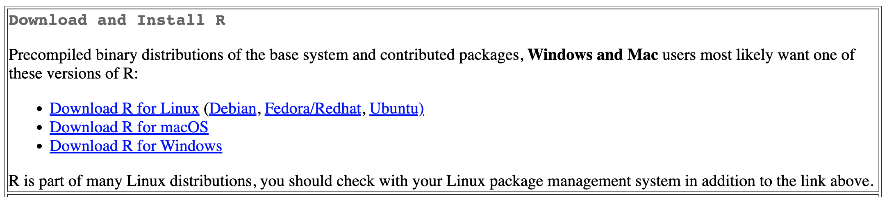
```

**For MacOS**, download the .pkg file for your version of the MacOS operating system; unless you are on an older Mac (check by going to the Apple menu, then "About This Mac"), you will want to download the .pkg file under the subheading "Latest release". The file will have a sequence of numbers that identifies the most recent version of R available for downloading, similar to "R-4.X.X.pkg". (As of this writing, it is version 4.3.1.). Open the .pkg file and install the R base software, following the default prompts to complete the installation. If you encounter trouble, check the MacOS FAQs^[<https://cran.r-project.org/bin/macosx/RMacOSX-FAQ.html>].  

**For Windows**, at the top of the page, find the line beginning with the "base" file, and click the link to "install R for the first time."  From that page, you will see a link that appears similar to "Download R-4.X.X for Windows". (As of this writing it is version R-4.3.1.) Install the .exe file as you would other software on your Windows system.  If you encounter trouble, check the Windows FAQs^[<https://cran.r-project.org/bin/windows/base/rw-FAQ.html>].  

After downloading and installing the R app, move on to doing the same for RStudio. Generally, you will never need to open the R app directly. R will run in the background, while you interact with RStudio. The RStudio app provides a more polished and user-friendly way to do data analysis through writing R code. RStudio provides support for accessibility screen readers, for example.^[<https://support.posit.co/hc/en-us/articles/360045612413-RStudio-Screen-Reader-Support>] 

### Downloading RStudio {-}

Next, download the RStudio IDE for R. The app is free and open source, developed by the data science company Posit, and available at \url{https://posit.co/downloads/}. Go to this page, then you will see a link to the RStudio desktop, as shown in Figure \@ref(fig:rstudiolink).  
<!-- didn't messs with fig.asp=.75, -->
```{R rstudiolink, echo=FALSE, out.width='30%',  fig.align='center', fig.cap="Click the Download RStudio icon at the Posit.co website to find the version of RStudio Desktop for your operating system."}
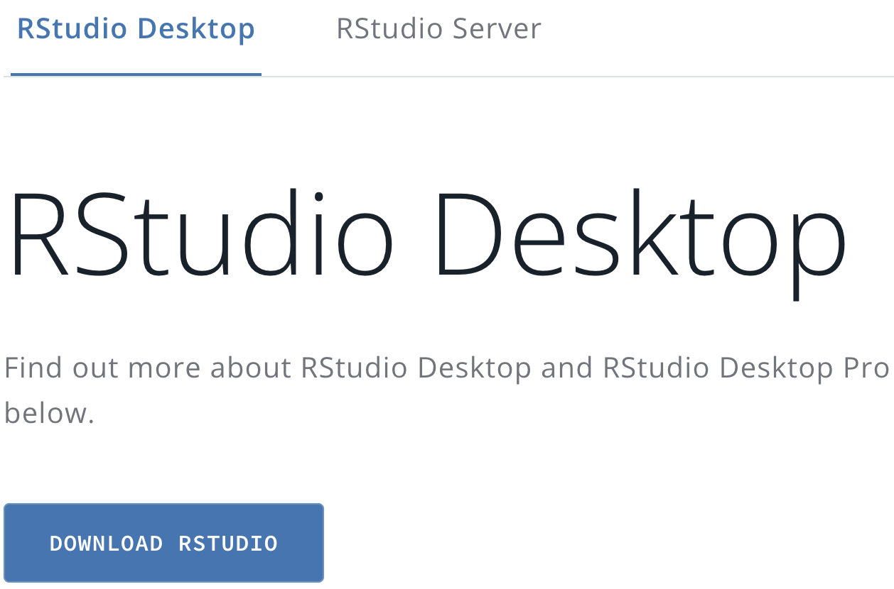
```

Once you click that link, you will see two steps, downloading base R (which you have already done) and then RStudio. The second step will show a link to the RStudio software "Recommended for your system". Download and install it. 

After you have it installed, you are now ready to get started with R coding.  Remember that when you analyze data, you will start up and use RStudio rather than the base R software. Each time you begin any data analysis, you will open up RStudio, which will automatically run the base R software in the background.^[Periodically, (perhaps once a semester), you should update your copy of R and RStudio, by reinstalling each one.]     

## Orientation to the RStudio interface

To begin, start up the RStudio app you just installed.  The Rstudio interface has many features; to keep it simple, we will use only the essential parts. Figure \@ref(fig:Rstudioconsole2) displays the RStudio interface along with an arrow and annotation pointing out the essential parts.  No matter whether you are on an RStudio server or your own computer installation, your view of RStudio will have these same components.^[If you are working on an RStudio website, the functionality of RStudio is the same, for the most part. The only major difference is getting files into and out of the cloud. For that, there is an 'upload' button above the files pane, and for downloading, an 'export' button.] 
 
(1) On the left-hand side, an arrow and annotation points out the Console \index{Console pane} pane.  The Console is where __R__ code is interpreted to follow instructions. __R__ code is either entered directly at the `>` prompt or saved in a file and sent to the prompt to be interpreted.

(2) On the upper right-hand side, an arrow points to the Environment pane, \index{Environment pane}, which says it is "empty", but later will be filled with data. The Environment pane displays data loaded into RStudio, and saved objects such as data visualizations. 

(3) Next to the Environment pane is the History \index{History pane} pane, which reports the history of commands you have run in RStudio. 

(4) On the lower right-hand side is the Files \index{Files pane} pane that displays your machine's files and folders, starting with a default directory. Note that it shows all files and folders, not just those associated with RStudio. 

(5) Next to the Files pane is the Plots \index{Plots pane} pane, which displays data visualizations. 

```{r Rstudioconsole2, echo=FALSE, out.width='100%', fig.align='center', fig.cap="RStudio interface. The left pane displays the Console window, through which commands are entered at the > prompt. The upper right pane shows an Environment tab, which displays data loaded into RStudio. The History tab shows previously issued commands. On the lower right side, the Files tab displays all files, while the Plots tab displays data visualizations."}
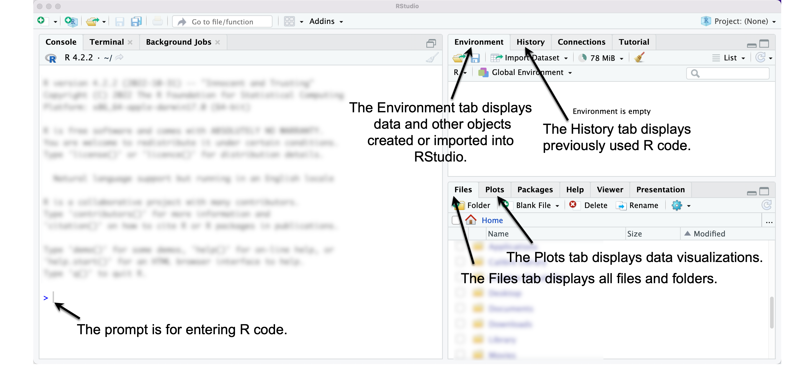
```

### Enter R code at the command line prompt {-}

Locate the RStudio console pane, on the left-hand side of your computer screen. (If unsure, compare your screen to Figure \@ref(fig:Rstudioconsole2).) Click to the right of the `>` sign; the `>` is the R prompt, \index{prompt} signaling that R is waiting for you to issue a command. 

The most basic of all data analysis commands is to use __R__ as a calculator \index{R as a calculator},  `+` for addition, `-` subtraction, `*` multiplication, and `/` division. Try out some simple arithmetic expressions at the prompt: enter `5  * 10`. Press the return key. Observe the result --- `50`  --- prefaced by `[1]`. R usually identifies the output with a number in brackets. This feature -- the identification of lines of output -- will be useful later.

```{r}
5*10
```

Try typing `5 *` at the prompt, and then press return.  You will see that now in place of the > prompt, there is a `+` symbol. The `+` symbol means that __R__ is waiting for you to complete the command. Enter the number `10` at the `+` sign and notice that RStudio performs the arithmetic and returns the result as expected. When a command is recognized by __R__ as incomplete, you will see a  `+` sign in place of the `>` prompt. Pressing the Escape key ("esc") will interrupt an incomplete command and return you back to the `>` prompt. 

## Use functions for data analysis

In our analyses, we will generally not apply arithmetic operations directly to numbers, entered into the command prompt, as in `2+2`. Instead, we will use functions. \index{R functions}  

__R__ functions are instructions or commands to perform on data. For example, an arithmetic mean, or average, is a function. It is a set of operations or steps that are performed on a set of numbers. In __R__, functions are identified by parentheses. The name of the function -- a hint at what the function does -- precedes a set of parentheses, `()`. The parentheses hold the arguments of the function, the input to the function. 

An example of an **R** function is `seq()` \index{\texttt{seq()}}, in which `seq` is short for "sequence". The sequence function automatically creates a sequence of numbers from a specified start and end point in increments of one. The start and end points (the arguments) are placed within the parentheses, separated by a comma. To create a sequence of integers from 0 to 20:

```{r}
 seq(0,20)
```

An __R__ function always includes open and closed `( )` parentheses. The function operates on the arguments contained within the parentheses. Try an argument and observe the result, such as `seq(50,100)`. In the `seq()` function, the required arguments are the beginning and end of the sequence.  

### Functions are nested {-}

Functions can be nested within other functions. For example, the `mean()` function calculates an arithmetic mean.  To calculate the mean of the sequence of integers from 0 to 20, the `seq(0,20)` function is placed within the `mean()` function:

```{r}
mean(seq(0,20))
```

There are multiple ways to use functions to achieve the same result. For example, instead of using `mean()` we could use the `sum()` function. The mean, 10, can be found with the `sum()` function, which will calculate a sum -- adding up the elements as it is instructed, then dividing by 21 (the sequence starts from 0):

```{r}
 sum(seq(0,20))/21
```

### Functions are case sensitive {-}

Case sensitivity applies to all parts of the R language. Notice the output when the function `Seq()` is entered:

```{r error=TRUE}
 sum(Seq(0,20))/20 # Notice the typo in the function Seq().
```

### Hashtags are for explanatory comments and output {-}

In the example of R code above, an explanatory comment about the typo in the function was preceded by a hashtag, `#` \index{hashtag}.  The hashtag in R refers to the beginning of a comment. In input code, everything to the right of a hashtag is ignored by R.  In output, hashtags are used for formatting.

### Finding a help file for a function {-}

At the console `>`, type `?seq()`. The question mark before the name of the function results in the help file for the function appearing in the lower right-hand pane of RStudio. Scan through this help file entry to see that the `seq()` function accommodates a third object, which specifies the count sequence of steps.  For example, to create a sequence of numbers from 0 to 50, by 10s:

```{r}
seq(0,50,10)
```

The help file for any __R__ function can be accessed with the `?` \index{R help files} prefix. The entries, however, are somewhat cryptic and often written with the purpose of providing a detailed, technical explanation of how the function works.  So getting help is usually easier with the use of web searches and other resources, described at the end of this chapter. 

### Create objects to store data {-}

In __R__, an object \index{object} is a stored value or data container, such as _wbdata1_ from Chapter \@ref(ch1). Objects are fundamental to R programming, serving as building blocks for storing data, analysis results, or visualizations. A common saying in R is "everything is an object," meaning nearly any element --- data, functions, or results --- can be stored and reused, provided it fits the purpose of the function in which it appears.

To create an object, use the assignment operator `<-`, \index{assignment operator} which assigns everything on the right to the object name on the left. For example, in `a <- seq(1, 20)`, the sequence of numbers from 1 to 20 is assigned to the object _a_. Typing the object name afterward will print its contents: 

```{r}
a<-seq(1,20)

a
```
Object names can be almost anything but must follow a few rules: they cannot begin with a number (e.g., _1a_ is invalid, but _a1_ is valid) or an underscore (e.g., _\_dataobject_ is invalid, but _data_object_ is valid). Using underscores to separate words is called "snake case," which we will use as a standard throughout the book.

Objects can be passed into functions as arguments. For instance, `mean(a)` and `mean(seq(1, 20))` both return the same result, `10.5`, because `a` stores the sequence seq(1, 20): 

```{r}
mean(a)

mean(seq(1,20))
```
 
Objects can also interact with one another. For example:

```{r}
a<-seq(1,10)

b<-1

c<-a + b

c
```

Here, _a_ is a vector of integers from 1 to 10, and _b_ is a single number. Adding _b_ to _a_ creates a new vector, _c_, where each element of _a_ is increased by 1, resulting in integers from 2 to 11. These examples illustrate three key concepts in _R_:

(1) Analyses are performed using functions, which modify or summarize data.
(2) Data are stored as objects that can be reused or manipulated.
(3) Functions typically require arguments—objects or instructions placed inside parentheses `( )` to perform specific tasks.

## Packages extend the functionality of R 

"Base __R__" refers to the core functionality of __R__, but its capabilities can be greatly expanded by using packages. Packages, like __WDI__ from Chapter \@ref(ch1), are collections of functions, data, and documentation created by __R__ users and shared via repositories like the Comprehensive R Archive Network (CRAN). As of this writing, CRAN hosts over 17,000 packages, ranging from general purpose tools to highly specialized resources for advanced statistics and specific fields of study.

Among the most widely used packages are those in the __tidyverse__ ecosystem \index{tidyverse} [@R-tidyverse], which provides a cohesive framework for data science. Key packages in the __tidyverse__ include __dplyr__ for data manipulation [@R-dplyr], __ggplot2__ for data visualization [@R-ggplot2], and __readr__ for importing and exporting data [@R-readr]. For instance, the __readr__ package includes functions to load external datasets into __R__ as objects, ready for analysis. 

### Installing packages {-}

To install a package, use the `install.packages()` function. For example, the tidyverse suite can be installed with:

```{r eval=FALSE}
install.packages("tidyverse")
```

If R cannot find the package, you may need to specify the CRAN repository \index{repository} with `repos=`: `install.packages("tidyverse", repos="http://cran.r-project.org")`. Package installation might prompt additional steps, such as handling dependencies (other packages required for the installation). If prompted with a statement "There is a binary version available but the source version is later...", typically, choosing "no" when asked to install from source will ensure a smoother installation process. Once installed, packages do not need to be reinstalled unless you update __R__ to a new version. You can update all packages with `update.packages()`.

### Attaching or loading a package {-}

After installation, packages must be attached (loaded into memory) each time you start __R__. Use the `library()` function to do this. For example, to load the __tidyverse__, run:

```{r}
library(tidyverse)
```
Two important steps to remember:

(1) Install each package once.

(2) Each time you open up RStudio after it has been closed, or starting a new __R__ session, attach packages with `library()` to make the package available for use in your analysis.

## A brief example from data import to report writing 

In this section we will work through a simplified analysis workflow in __R__, covering data import, visualization, and report creation. We'll start by organizing files, setting a working directory, and writing __R__ code in a script file to keep track of our work.

### Organize folders for analysis files {-}

First, create a folder for your work, such as `political_analysis`. From the text website, save the files, _gdpfert.csv_ (data) and _chapter2.r_ (script), into this folder. If working in RStudio through a web browser, upload the files into your workspace instead.

### Set the working directory {-}

The working directory \index{working directory} is the folder where RStudio looks for files to import and saves exported data. Check your current working directory by running `getwd()`. To change it, use the function `setwd()` with the file path to your folder. Getting this path exactly correct is error prone; it is easier with RStudio to set the working directory through the top-level menus: "Session" > "Set Working Directory" > "Choose Directory...". Figure \@ref(fig:setwd) shows this process. Alternatively, navigate to your folder in the Files pane and set it via the "More file commands" icon > "Set As Working Directory".

Use the Session menu in RStudio to set your working directory to the folder containing your chapter2.r script and gdpfert.csv dataset, so R can locate these files.

```{r setwd, echo=FALSE, out.width='50%', fig.align='center', fig.cap="Set the working directory in RStudio using the Session menu, so \\textbf{R} can locate your  \\emph{chapter2.r} script and \\emph{gdpfert.csv} dataset."}
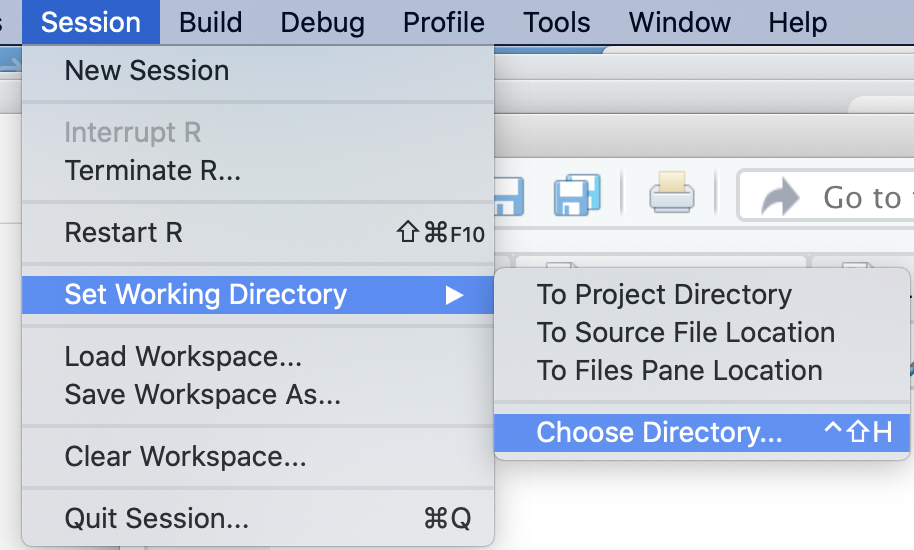
```

Once set, the files in your working directory, such as _chapter2.r_ and _gdpfert.csv_, will appear in the `Files` pane, as displayed in Figure \@ref(fig:fileschapter2).

```{r fileschapter2, echo=FALSE, out.width='60%', fig.align='center', fig.cap="The Files pane in RStudio showing \\emph{chapter2.r} and \\emph{gdpfert.csv} after setting the working directory."}
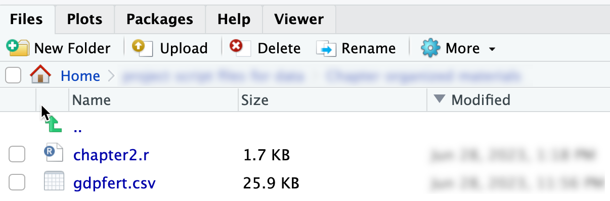
```

### Writing and running code in a script file {-}

A script file \index{script file} is a plain text file in which you write and save __R__ code for future use. Open the _chapter2.r_ script file by clicking it in the Files pane. This action opens the script in the top-left pane of RStudio (as in Figure \@ref(fig:scriptconsole)).

In the script, highlight the code you want to run and click the `Run` button, or place the cursor on a line and press `Run` to execute it directly in the Console. For example, line 20 in the script identifies an external dataset, _gdpfert.csv_, imports it, and stores it in an R object named _gdpfert_, `gdpfert <- read_csv("gdpfert.csv")`. 

```{r scriptconsole, echo=FALSE, out.width='100%', fig.asp=.75, fig.align='center', fig.cap="The \\emph{chapter2.r} script file after it has been opened in RStudio."}
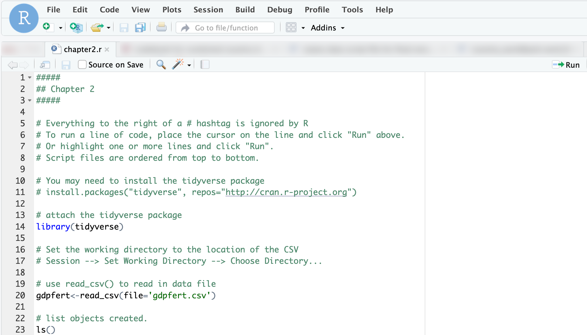
```

Key points about script files as as follows: 

(1) Purpose: Script files preserve code step-by-step for future use or as a record of completed work. 
(2) Structure: Keep scripts organized logically—load packages first, then import data, followed by analysis.
(3) Comments: Add comments (lines beginning with `#`) to document your work and make it easier to understand.
(4) Format: Use spaces around operators and consistent indentation to improve readability.

To create a new script file, go to "File" > "New File" > "R Script." Save it with a `.R` or `.r` extension to take advantage of RStudio’s tools, such as predictive text and the `Run` button. And most important of all, remember that scripts are intended to be self-contained and read from top to bottom.

### Running R code to import the gdpfert.csv dataset {-}

If you have not already done so, click on line 20 in the _chapter2.r_ script file. Highlight it -- or just leave the mouse cursor on this line:

```{r eval=FALSE}
gdpfert<-read_csv(file='gdpfert.csv')
```

In the upper-right corner of the script file window (as in Figure \@ref(fig:scriptconsole)), click the `Run` icon. By clicking `Run`, you send the line to the **R** Console window; **R** follows the instructions in the line.

In this line, `gdpfert` is the name of an **R** object that we are creating to store the contents of the data from `gdpfert.csv`, an external datafile in "comma-separated value" (CSV) format. This format is perhaps the most common storage type for sharing data, and more will be discussed about this format in subsequent chapters.  For now, though, you could open up the file within a text editor or a spreadsheet \index{spreadsheet} editor, such as Microsoft Excel, to get a sense of what it means that values in the file are separated by commas. 

Assigning the dataset to an object saves the dataset as a dataframe. Now that the dataset is stored as a dataframe object in **R**, the dataset is available for analysis. Nevertheless, if you encounter an error `does not exist in current working directory`, you either did not save the file to the correct folder or the working directory is set to a different location. 

As we will see throughout the study of data analysis, this is the basic process of reading in data to be analyzed in **R**: it exists as an external file somewhere, and we read it into **R** with a function such as `read_csv()`. The dataset is read into **R** and assigned to an object in **R**, which the script file named `gdpfert`; we could have named it anything.

An alternative to running lines with a mouse click is to use shortcut keys. Hover the cursor over the 'Run' icon on the top right-hand side of the Console window.  A tooltip will appear under the cursor, displaying the shortcut key to Run a line of code. Run the line by either clicking `Run` or pressing the shortcut key \index{Run shortcut key} --- on a Windows machine, _Control_ plus _Enter_ or _Return_ (both pressed at the same time), and on a Mac, _command_ (the _command_ key is to the left and right of the space bar) plus _return_.

### Dataframes {-}

A **dataframe** \index{dataframe} is the term in **R** for a rectangular dataset, a two-dimensional table with rows for units of observation (such as countries) and columns for measures or variables (such as GDP) that record different features of the rows. Dataframes are the most common way to store and interact with data in **R**. For example, externally to **R**, rectangular datasets are often stored as comma-separated value \index{comma-separated value (CSV) file} files; CSV \index{CSV file} files are organized in the same way as dataframes. (A CSV is a plain text file where for each observation, a comma separates different values; we will create a CSV file in Chapter \@ref(ch3).) When a CSV file --- or any other external dataset --- is imported into R for analysis, it is stored as a dataframe. 
 
```{r eval=FALSE}
gdpfert<-read_csv(file="gdpfert.csv")
```

```{r warning=FALSE, message=FALSE, echo=FALSE}
gdpfert<-read_csv(file="./data/ch2 data/gdpfert.csv")
```
The CSV file _gdpfert.csv_ focuses on a set of three measures from the World Bank Global Development Indicators. The first is a measure of the size of a country's economy, the Gross Domestic Product (GDP) per capita in 2010 U.S. dollars; GDP measures the sum total economic value of all goods and services produced within a country during a specified time period . As a per capita measure, this means that the total GDP for each country is divided by the human population of the country, which produces a roughly comparable measure of economic size, around the world.^[See the World Bank's notes on the measure here: <https://data.worldbank.org/indicator/NY.GDP.PCAP.KD>.] The second measure is human fertility rate, an average number of births per woman within each country.^[For an explanation of how the fertility rate is calculated, see <https://data.worldbank.org/indicator/SP.DYN.TFRT.IN>.] The third is average life expectancy at birth^[See <https://data.worldbank.org/indicator/SP.DYN.LE00.IN>.]. There are country and regional indicators, along with some additional information about income level of the country. 

The function `read_csv()` from the _readr_ package (in the _tidyverse_) will read and interpret the contents of a datafile in CSV format. But just reading the datafile with `read_csv()` isn't enough. We also want to store the results of `read_csv()` as a dataframe. That is what the assignment operator `<-` does: it assigns `read_csv(file="gdpfert.csv")` to `gdpfert`. With the assignment operator, the contents of the dataset are stored as a dataframe object named `gdpfert`.  

As with any object stored within **R**, typing its name will print out its contents. Observe the results of typing `gdpfert` below: 

```{r eval=FALSE}
gdpfert
```

By default, __R__ prints out the first ten rows and ten columns of the dataframe.  Above and below this printout are two comments. The first, `# A tibble: 211 x 10` identifies the dataframe as something called a _tibble_.  A _tibble_ \index{tibble} is the name of a method for printing out the contents of a dataset. It takes the contents of a dataset as input and outputs a tidy summary of the data.  A _tibble_ is also the name of the package in the _tidyverse_ from which this print method originates.  Because it is useful for printing out tidy summaries of data, we will store our data as tibbles whenever this print method is useful. 

Due to the space limitations of the printed page, only a few columns from the dataset can be printed without spilling over the left and right margins of the paper.  Typing `gdpfert` will print out the 10-by-10 snippet of the dataset, similar to the more limited view of the data printed below with the `glimpse()` function:

```{r}
glimpse(gdpfert)
```

### RStudio features for examining datasets {-}

Beyond printing the dataset through the console, there are features of RStudio for examining datasets.  Figure \@ref(fig:environmentpane) displays the Environment pane of RStudio, which after importing a dataset provides some useful information about it.  The Environment \index{Environment pane} panel shows datasets available in the **R** Workspace, datasets like `gdpfert` that have been imported.  The panel shows that the dataset consists of 214 observations with 13 variables. If you imagine the dataset as a rectangular matrix, the observations --- individual countries -- are rows, while variables --- measurements of country characteristics --- are the columns.

```{r environmentpane, echo=FALSE, out.width='75%', fig.asp=.75, fig.align='center', fig.cap="After importing \\emph{gdpfert.csv} the Environment pane displays the dataset with 214 observations and 13 variables, confirming a successful import."}
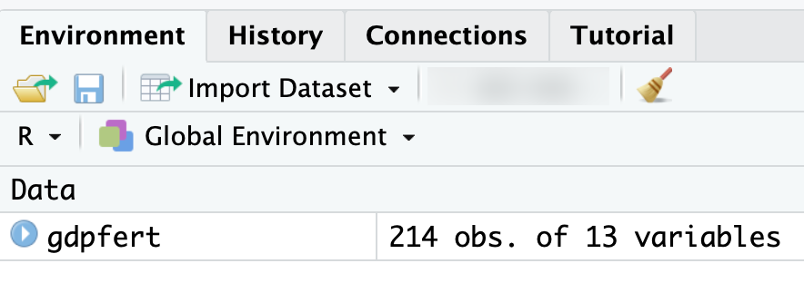
```


The 13 variables of the `gdpfert` dataset are the following selected measures from the World Bank's Global Development Indicators database. We can see this dataset by clicking on the matrix icon within the Environment tab, shown in Figure \@ref(fig:environmentpane). (The icon looks like a tiny spreadsheet.)  Clicking on this icon reveals a spreadsheet-like view of the data.  Scrolling up and down, or left and right within this spreadsheet reveals the observations on countries and variables.  To close this tab, click on the `x` in the tab. (Incidentally, the function to view the data is `View(gdpfert)`.)

To analyze the data, however, we need to return to the script file.  Let us illustrate a few uses of analysis commands within the script file. Try running lines 20 to 30 on your own and observe the results. 

To illustrate one analysis of the data, we will construct the scatterplot of GDP by fertility. Run the lines in the script file that correspond to a different figure. For example, run lines 42-43; highlight both lines together and click `Run`. Try the other figures. 

### A simple scatterplot {-}

We will learn about creating data visualizations in Chapter \@ref(ch4). But for now, let's see one example of how a function from the _ggplot2_ package (part of the _tidyverse_) will quickly plot the relationship between two measures, such as GDP per capita and the fertility rate by country within the `gdpfert` dataset. 

A function to draw quick graphics is named `qplot()`. \index{ggplot2 R package (tidyverse)| \texttt{qplot() }} Depending on the type of data stored, the function will determine a graphical form. The arguments within the `qplot()` function require a column of data to plot on `x=`, another on `y=`, and finally the name of the dataset to find the columns, `data=`. Figure \@ref(fig:firstqplot) displays the result: 

```{r firstqplot, warning=FALSE, message=FALSE, fig.cap="Output of \\texttt{qplot()} showing GDP per capita and fertility rate for countries in the gdpfert.csv dataset."}
qplot(x=NY.GDP.PCAP.KD, y= SP.DYN.TFRT.IN, data=gdpfert)
```

While not a presentation-ready graphic, it is a useful starting point. We will work on refining visualizations throughout subsequent chapters.  But for now, the `qplot()` function is a useful demonstration of a function that draws a graphic. 

### Saving data in an R Workspace {-}

Once we have imported or otherwise created a dataset, we will want to save it. Dataframes, and any other **R** object created during an **R** work session, are saved within a "Workspace". \index{Workspace} So the Workspace contains more than a single dataset; it can contain many. **R** graphics can be stored as objects, and since those are objects, those can be saved in an **R** workspace as well.  Once a dataframe (and any other **R** objects) are saved as a Workspace, the Workspace can be opened later.  From the drop-down menus, `Session` then `Save Workspace As` will save a Workspace containing all current objects in the **R** session.  

## Authoring a data analysis report: RMarkdown

RMarkdown \index{RMarkdown} is a tool for data analysis and report writing in **R**. It allows you to interweave narrative explanations, data visualizations, and code all within a self-contained document.  In an RMarkdown file, code is included with the document; when the document is "knit" together, the **R** code is interpreted and the results such as tables and graphs appear alongside the code. 

We will create an RMarkdown report based on the _chapter2.r_ script file; the report will contain the code in _chapter2.r_ along with output. 

To do so, go to the "File" menu, then choose "New File" and then "R Markdown..." as in Figure \@ref(fig:Rmarkdowncreate). After clicking "R Markdown..." a popup menu will appear as in Figure \@ref(fig:Rmarkdownname). Fill in the title and name.  And click "OK".^[Note that on the lower left side of the popup menu a button for creating a "Blank Document"; when you get used to creating an RMarkdown document, you may find it easier to create a blank one and including the minimal elements or an RMarkdown document, explained further below.] Unless you are working in RStudio via a web browser, after you click through Figure \@ref(fig:Rmarkdowncreate), you will be prompted to install some additional packages. Click `OK` to do so. Agree to install the packages.  Next, once the additional packages are installed, R will prompt you to name the RMarkdown document, as in Figure \@ref(fig:Rmarkdownname).  

```{r Rmarkdowncreate, echo=FALSE, out.width='60%', fig.align='center', fig.cap="File menu in RStudio to select R Markdown and begin creating a new report."}
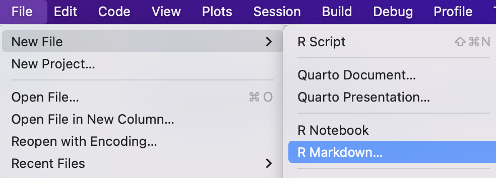
```

```{r Rmarkdownname, echo=FALSE, out.width='50%', fig.asp=.75, fig.align='center', fig.cap="Dialog box for creating a new RMarkdown document. Enter a title and your name as the author."}
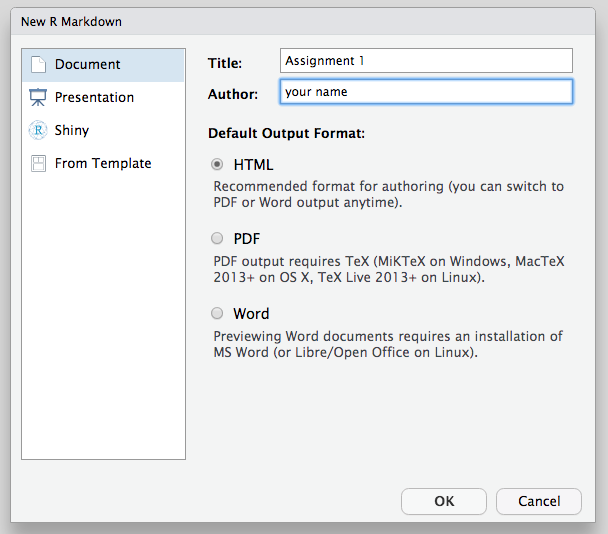
```

Once you click OK, RStudio will display a new tab for the RMarkdown document you just created. The file will appear as in Figure \@ref(fig:RMarkdownbase). 

```{r RMarkdownbase, echo=FALSE, out.width='100%', fig.asp=.75, fig.align='center', fig.cap="Default RMarkdown template, including a header, setup code chunk, narrative text, and an example \\textbf{R} code chunk."}
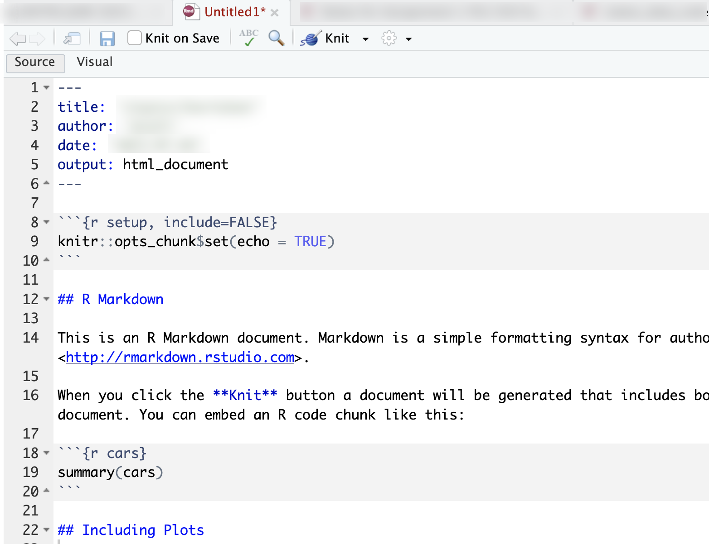
```

The RMarkdown file contains example **R** code, headings, and brief narrative explanations.  The **R** code appears within code chunks, the sections of the document that begin and end with three backticks (the key next to the number 1 on most keyboards). To observe the purpose of an RMarkdown file, how it weaves together code and interpretation into a self-contained report, click the **down triangle** button labeled "Knit" next to a ball of yarn. Choose "Knit to Word" and observe what happens. After a few seconds, you should see a Word document appear in your working directory, revealed within the Files pane. Open up the Word document to see the contents; pay attention to how the comments and **R** code are translated from the RMarkdown document to the Word document.  

```{r Rknitr, echo=FALSE, out.width='50%', fig.asp=.75, fig.align='center', fig.cap="Click the triangle next to the Knit button in RStudio to open the output format menu. Select Knit to Word to generate a Word document, which will appear in your working directory."}
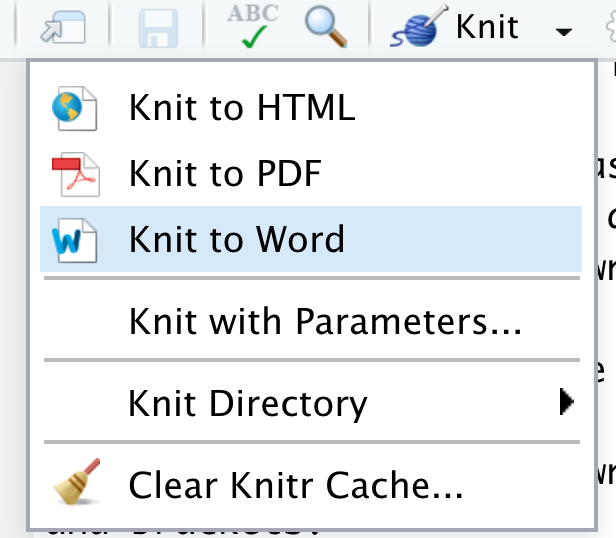
```

We now want to edit the RMarkdown \index{RMarkdown} document to interpret the code from the script file _chapter2.r_.  We need to delete the lines of the RMarkdown file from lines 11 to the end. (Keep lines 1 through 10 as in Figure \@ref(fig:RMarkdownbase).) In place of the deleted sections, we will add 

(1) an example of narrative text describing results of the **R** code; and 
(2) an **R** code chunk, denoted by triple backticks (\`\`\`) and a bracketed `{r}` that tells RStudio to begin interpreting **R** code and present the resulting output. The code chunk ends with triple backticks (\`\`\`).  Note the backtick key is usually to the left of the number 1 on most computer keyboards.

Figure \@ref(fig:codechunkmarkdown) displays the RMarkdown file with a blank **R** code chunk, beginning on line 13 and ending at line 16. Try copy-pasting all of the **R** code from the script file into the **R** code chunk at line 14 in Figure \@ref(fig:codechunkmarkdown). Any interpretive comments could be placed before or after the code chunk. 

```{r codechunkmarkdown, echo=FALSE, out.width='75%', fig.asp=.75, fig.align='center', fig.cap="RMarkdown file prepared for use with \\textbf{R} code from the \\emph{chapter2.r} script. Replace the placeholder text inside the \\textbf{R} code chunk with your own analysis code. Any content within a code chunk (delimited by triple backticks) is treated as \\textbf{R} code."}
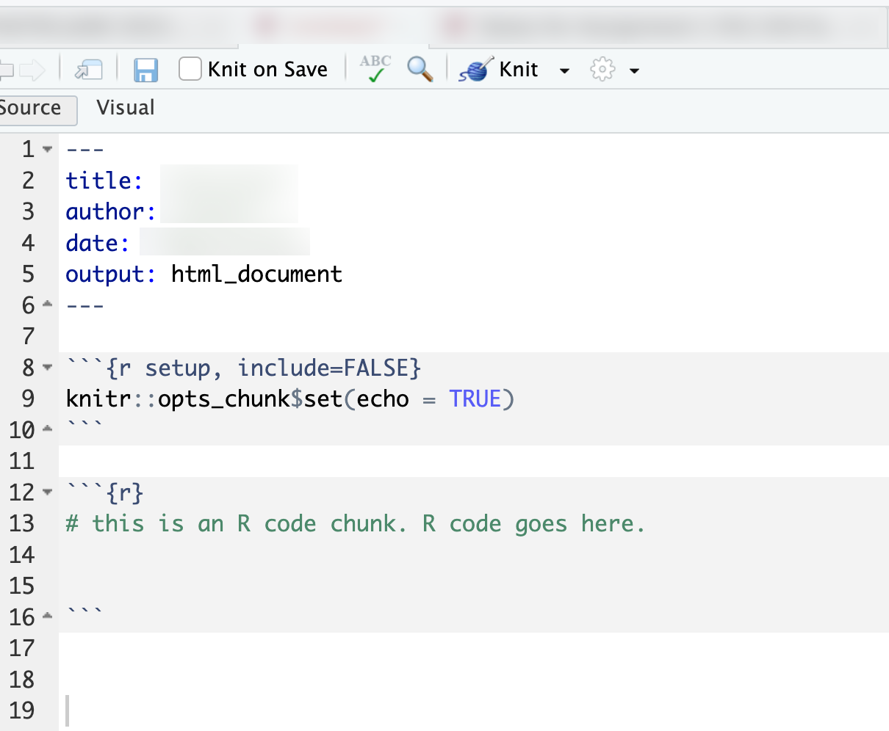
```

Then click to "Knit to Word" and observe how the results of the Word document change. You should now see the familiar summary statistics and scatterplots from the **R** code in _chapter2.r_ printed neatly in the Word document.^[Within this template, changing the `output:` header line to `output: word_document` will ensure that when clicking the "Knit" yarn icon, the document will automatically knit into a Word document.] When RMarkdown \index{RMarkdown} is running code, it works in a "fresh" **R** session. RMarkdown only has access to the code, packages, and data objects that are referenced within the **R** code chunks.  And the code is read from top to bottom. So it is essential that the code is in the correct order and all relevant packages are included first.  When knitting together code, RMarkdown will search the folder in which it is located to find any datafiles. 

### Saving R work {-}
 
Finally, you'll want to get into the habit of saving your work in order to return to it later.  Doing so in RStudio is easiest with an **R** Project (.RProj) file; each time you save the project from the "File" menu, RStudio will automatically prompt you to save the Workspace and script file.  If you are not working within an **R** Project file, make sure you do the following: 

(1) Save all edited **R** code in a script file (Go to "File" then "Save"). 
(2) Save the **R** Workspace and then reopen it later to continue working on it. The **R** Workspace is saved via the "Session" menu, choose "Session" then "Save Workspace...". The default file extension for an **R** Workspace is `.RData`. Double-clicking on a saved **R** Workspace will open up RStudio; then use the "File" menu to open up your last script file. Third, save any changes to an RMarkdown file.   

## Getting help

You will, at some point, need help resolving error messages or figuring out how to resolve a problem when you feel stuck.   There are three different approaches for doing so.  

(1) Consult the help menu in RStudio within "Help" tab on the lower right pane of RStudio.  Search for topics or specific functions such as by entering `?summary()` for help with the `summary()` function. Once you have attached a package to your R session, you can pull up help files for package-specific functions, such as `write_csv()` from the __tidyverse__ by typing `?write_csv().` If you click "R Help" under the "Help" top menu in RStudio, it will pull up a directory of **R** Resources.  There are a few very useful "Cheat Sheets" that summarize common features; start with the RStudio cheat sheet. Overall most of the "R Resources" are either for longer term help or more advanced niche **R** tools.  

(2) Two of those resources, however, stand out: "R on StackOverflow" and "RStudio Community Forum". These two fora are for posting questions, searching past discussion threads, and hopefully finding answers from other users. Follow the links to visit each forum. Once there, search for an error message or relevant discussion thread. A related resource is social media; /rstats is popular on Reddit.com, for example. A common help strategy is to web search on the error message; doing so with Google will most likely point you toward StackOverflow or the RStudio forum. And of course there are many **R** help pages all over the web. Searching simple statements such as "How to create a scatterplot in R" will bring up multiple web pages.  

3. This search strategy leads to the third major approach, though one fraught with ethical problems: ask an artificial intelligence (AI) chatbot for help. It "knows" **R** in the sense that it can diagnose syntax errors, tell you the name of the **R** function you cannot immediately recall but can describe, and even write **R** code from scratch given your instructions. Nevertheless, it has important limitations. It often makes mistakes. It may suggest outdated code or code that combines packages or functions in ways that do not work. Or it provides working code that is an oddly roundabout solution to the problem you identified in the prompt. It usually does, however, find basic syntax errors in code. Give it your code and explain the error message or what you are trying to do.  It will likely identify the source of the error or at least give you some places to start looking. It would be a poor learning strategy, however, to attempt to rely on an AI to write **R** code for you as a starting point, and doing so is unfeasible without some prior **R** knowledge to make sense of the results.  Most importantly, you should be aware of how your use of it may comply with course policies and an Honor Code.  Talk to your instructor about guidelines for the ethical use of AI chatbots. 

## Key points {-}

(1) RStudio is the interface for coding with **R**.  

(2) Startup the RStudio app to do any data analysis; the **R** app runs in the background.  

(3) **R** code is entered at the Console window `>` prompt. 

(4) Data analysis proceeds through the use of functions, such as `seq()`, and the assignment operator `<-` to create data objects. 

(5) A script file is a plain text file with an _.R_ or _.r_ suffix; the file contains R code and explanatory comments that begin with a hashtag, `#`. Script files organize **R** code. 

(6) **R** project files ( _.RProj_ ) are helpful for organizing work, though not essential.  

(7) RMarkdown files ( _.Rmd_ ) are used to generate self-contained reports, displaying code alongside any tables and graphics. 

## Resources {-}

Education portal for RStudio <https://education.rstudio.com/learn/>

The official website for the Tidyverse <https://www.tidyverse.org/>

RStudio Cheat Sheet <https://github.com/rstudio/cheatsheets/raw/main/rstudio-ide.pdf>

RMarkdown Cheat Sheet <https://github.com/rstudio/cheatsheets/raw/main/rmarkdown-2.0.pdf>
 
## Exercises

(1) Create a sequence of integers with `seq()` from 1 to 10, and store it as the object `B`. Type the name of the object and observe the results.
(2) Following the previous exercise, create a second object and call it `C`. Store the following numbers: from 0 to 50, every fifth number, such as 0, 5, 10, etc. Use the `seq()` function, but add a third argument to it, the number by which to skip or space the sequence.
(3) Create an object `D` that is the product of `C` times `B`. Inspect the contents of `D`. Given that `B` and `C` are different lengths, how would you explain the results of `D`?
(4) The `mean()` function calculates a mean on an object. Store a sequence of integers from 0 to 40 in an object, call it `testobject`, and calculate the mean with the `mean()` function. Do the calculation two ways: by evaluating the function on the object name, after it is created, and then directly on the function generating the sequence of integers.
(5) Open the _chapter2.r_ script file. Edit the file to include only the following code, line by line: (a) attach the __tidyverse__ package, (b) import the _gdpfert.csv_ dataset, and (c) use the `qqplot()` function to create a scatterplot of Life expectancy by GDP. Paste the three lines (as an __R__ 'code chunk'), then knit the file to a Word document. 
(6) The __datasets__ package is pre-installed and attached as part of the base R system, containing various datasets.  Enter `library(help = "datasets")` at the Console prompt and a tab will open up in RStudio explaining the contents. One of the US States datasets is `state.x77`, an excerpt from the 1977 Statistical Abstract of the United States, with observations on 50 States for the following variables: "Population, Income, Illiteracy, Life Exp, Murder, HS Grad, Frost, and Area". To view the dataset, simply type `state.x77` at the prompt.  Use the `summary()` function to calculate and interpret some summary statistics on Life Expectancy and the Illiteracy rates across the US.  Try using `qplot()` -- from __ggplot2__ in `library(tidyverse)` -- to construct a scatterplot of Life Expectancy by Income. Interpret what you have observed in a paragraph; include the code and discussion in an RMarkdown document, knitted to Word or a PDF.  


