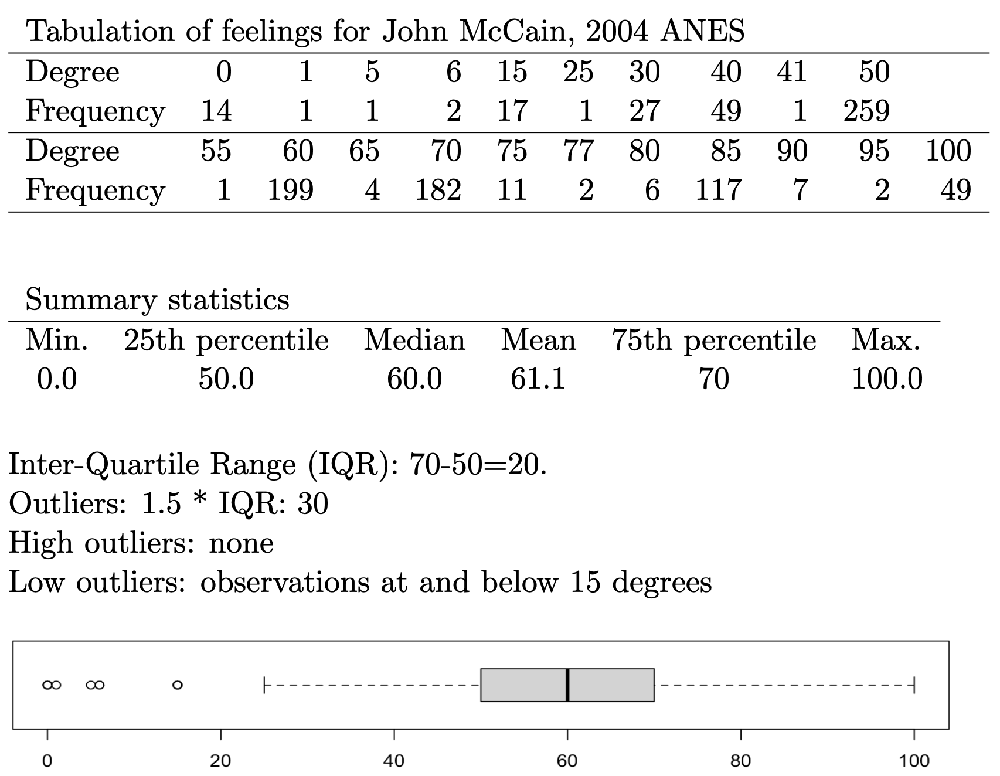
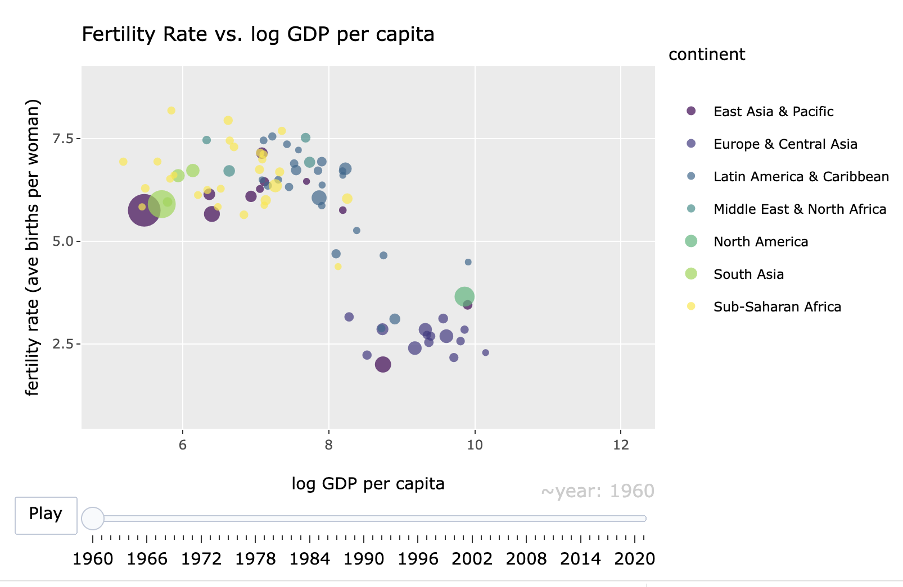

# Data Visualization {#ch4}

Chapter \@ref(ch4) introduces the tools for creating charts (data graphics) in __R__. 

## Learning objectives and chapter resources {-}

By the end of this chapter, you should be able to (1) identify the required elements of a data visualization with the __ggplot2__ package; (2) construct and interpret distributional graphics in the form of histograms, box whiskers, and density plots; (3) construct scatterplots and dynamic bubble plots; (4) construct a time series line plot. The material in this chapter requires the following packages: __ggplot2__ [@wickham2016] part of the __tidyverse__ [@R-tidyverse, @tidyverse2019],  which should already be installed, and __ggrepel__ [@R-ggrepel] and __plotly__ [@sievert2020] which will need to be installed separately.  The material uses the following datasets _gdpfert.csv_, _86_house_dw.csv_, _countries.csv_, _countries_tsxs.csv_, and _poll_ft.csv_ from  <https://faculty.gvsu.edu/kilburnw/inpolr.html>.  

## Introduction {-}

The term "data visualization" is everywhere. Hundreds of books published on the subject, thousands of websites, and social media communities showcase data visualizations. (For examples, see the Reddit community r/dataisbeautiful, with over 15 million members). In the COVID-19 pandemic era, for many of us reviewing graphical displays of case counts and deaths became an integral part of getting caught up on the day's news.  For students of political science, such visualizations are perhaps most commonly found in election results displayed across a geographic area through maps, or diagrams that show seat gains and losses for a political party within a legislature. The purpose of such visualizations is to enable greater insight into the data than would be accessible from an inspection of a data table alone.  

A data visualization is information in graphical form, a picture that communicates a researcher's findings or insights. Data tables are effective for organizing data, or visually looking up specific information, but a visualization could be constructed to highlight intriguing features of a dataset, to prompt further investigation. For example, recall the table from Chapter \@ref(ch3) of countries, GDP, and fertility rates. Without a scatterplot --- or prior knowledge of the two measures --- how easily could we have communicated evidence to others of how the two measures are related? A good data visualization should help explore patterns and relationships within data, to facilitate the process of communicating analysis results, telling the story of the data [@gelman2002; @gelmanunwin2013]. For our purpose in analyzing data, a good visualization should enhance understanding; it should not be an ornament, something constructed as a decoration or mainly for graphical design purposes such as an infographic. 

This chapter provides an orientation to some of the fundamental tools for constructing data visualizations in __R__.  The field of data visualization is vast; in Chapter \@ref(ch4) we consider univariate visualizations for continuous measures, followed by bivariate and multivariate visualizations for continuous measures, to learn data visualization functions. Most of the visualizations within this chapter are static image graphics, although we review the construction of one dynamic graphic type. At the end of the chapter, there are links to learn additional code for an endless variety of different data visualization types, both static and dynamic.  

## Key concepts for data visualization in R 

By far, the most common set of tools for visualizing data in __R__ come from the __tidyverse__, the graphics package __ggplot2__.  The subject of data visualization is exceptionally complex, and there is no single unified theory of how the analysis of data via visualizations should be conducted [@unwin2018]. There is, however, greater agreement about the appropriate theory to describe what graphics are, what their components are and how the parts are put together into a coherent whole and how to correctly interpret graphics [@cairo2019].  A set of standards, a grammar, for describing graphics by identifying their components [@wilkinson1999], is represented in the concepts used to build graphics in __ggplot2__. We will use these terms to build our own with the __ggplot2__ graphics package from the __tidyverse__. Fortunately, this theory, and to the extent that there are some generally agreed upon ideas for how data visualizations should appear, are built into the construction of __ggplot2__ functions. So while it is possible to get a graphic wrong with __ggplot2__, it is much easier by default to get it right.  

In constructing visualizations from scratch, a starting point is to first consider the purpose of the visualization and the scale of measurement of the underlying variables. For example, if the purpose is to display quantities such as percentages that vary across groups, a bar chart would be an appropriate choice.  If the underlying measure is continuous, and the purpose is to describe the shape of a distribution, then a histogram (a bar chart for continuous measures) would be appropriate.  Of course, there are many different alternative visualization forms to consider, but a helpful starting point is to first identify the intended quantity or quality to be visualized, and the measurement type of the corresponding variables. Simply put, some visualization types are appropriate for  categorical (nominal or ordinal) measures and others for continuous (interval or ratio) scaled measures.  Another consideration in constructing charts is whether the graphic is either exploratory or explanatory. An exploratory graphic is intended to examine features or relationships embedded within the data, without necessarily having in mind a specific feature or relationship to highlight. It may be a graphic in rough, unfinished form.  An explanatory graphic highlights important features or comparisons within the data, known previously to the researcher. The visualization, in a polished form, is intended to draw in the reader's attention to particular aspects of the data.

To introduce the code syntax for creating visualizations, we start with exploratory graphics for visualizing continuous distributions --- histograms, box-whiskers plots, and density plots. Next, we turn to variations on bar plots for graphing quantities across groups.  Finally, we examine variations on scatterplot based  tools for comparing at least paired (measured on an X and Y) observations.  The chapter concludes with an overview of some tools for modifying and adorning visualizations for explanatory purposes. 
 
### Visualizing continuous measures {-}

For concepts measured on a continuous, interval or ratio, scale, typically we are interested in understanding a measure's distribution, how scores vary across units of observation, how scores vary within and across groups, or how one distribution relates to another. Typically when investigating a continuous measure, we start with four characteristics: shape (S), the presence of unusual or outlier (O) observations, the location of the center (C) such as a mean or median, spread (S) such as the range of scores or standard deviation, often abbreviated as "SOCS". The visualizations for examining these features of data are useful for learning how to construct visualizations within the __ggplot2__ syntax. Perhaps the most common visualization type is the histogram, a sort of bar graph for continuous measures. We will review this visualization type, followed by others,  box-whisker and density plots before moving on to types of scatter plots and line plots. 

## Histogram

A histogram represent the distribution of a continuous measure by displaying the frequency or count of observations within specified intervals, or "bins," along a continuous scale. Similar to a bar graph, a histogram represents the measure through variation in bar height.  Higher bars correspond to more frequent values, which could be scaled by frequency or a relative frequency, such as a proportion (percentage) of the total observations.  But unlike a categorical measure for a bar graph, because the measure is continuous, the bars are drawn from equally spaced groups, or bins, of values. The bar widths are centered over a midpoint in the bin, so the bars sit adjacent (or touching) each other, unless there are gaps in the measure. We have already seen an example of a histogram in the form of a histogram of GDP per capita in the _gdpfert.csv_ dataset. 

```{r echo=FALSE}
gdpfert<-read.csv(file='data/ch3 data/gdpfert.csv')
```

To demonstrate, import this dataset. 

```{r eval=FALSE}
gdpfert<-read.csv(file='data/ch3 data/gdpfert.csv')
```

While the visualization functions are from __ggplot2__, we will do some data preparation using other packages, so we will load the entire suite of __tidyverse__ packages: 

```{r}
library(tidyverse)
```

We could attach simply the __ggplot2__ package as well (`library(ggplot2)`), but doing so would not make available the data preparation tools. \index{histogram}

Consider a histogram of GDP per capita; the code is below. Figure \@ref(fig:GDPhistv) displays the histogram. 

```{r GDPhistv, fig.cap="Histogram of country-level GDP per capita (in constant 2000 USD), created with the \\textbf{ggplot2} package. This figure displays the default \\textbf{ggplot2} style, including light gray background grids, black borders for bars, and axis labels.", warning=FALSE, message=FALSE, error=FALSE, out.width='80%', fig.align='center'}
ggplot(data=gdpfert) +
  geom_histogram(aes(NY.GDP.PCAP.KD), 
                 fill="gray", color="black", bins=25) +
  labs(x="GDP per capita (in constant 2000 US Dollars)",
       y="count")
```

Figure \@ref(fig:GDPhistv) displays on the X-axis GDP per capita (in 2010 US dollars) ranging from about 214 to 145,000 USD. The GDP values are grouped into 25 bins, and the height of each bar is drawn according to the number of countries within the bin. About 63 percent of the countries fall within the first two bins.  Eight of the 25 bins are empty, with a frequency of 0; these bars are still spaced out on the histogram, because of the even spacing of the 25 bins across the range of observations. Table \@ref(tab:tabhistvalues) displays the data table converted by __ggplot2__  to create the histogram.  \index{ggplot2 R package (tidyverse)| \texttt{geom\_histogram() }}

```{r echo=FALSE, warning=FALSE, message=FALSE}  
tempa<- ggplot(data=gdpfert) +
        geom_histogram(aes(NY.GDP.PCAP.KD), bins=25) 
tempb <- ggplot_build(tempa)
```

```{r tabhistvalues, tab.cap="test temp caption", echo=FALSE}
knitr::kable(
  tempb$data[[1]][2:5], caption = 'GDP bins, values, and counts for the histogram of GDP per capita',
  col.names=c("count", "midpoint", "bin min", "bin max"), digits=2, booktabs = TRUE)
```

The tallest bin is centered around zero and spans a distance of about 8000 USD, from below to above zero. The negative values do not make substantive sense, and there are no observations below 214 USD. But to draw the intervals equally spaced along the variable, and plot bars centered at the middle of each bin (25 total), this is necessary to do. The counts occur along the width of each bin through the scale, with several bins containing 0 observations, until reaching the highly skewed observations for the extraordinarily large GDP per capita countries. 

There are various formulas devised to determine the number of bins or bin widths, given statistics such as the total number of observations and the inter-quartile range. However, your judgment as a researcher is preferable.  Choose the number of bins based on your own judgment given the features of the data at hand [@unwin2018]. There are no fixed rules for how many bins should be plotted in a histogram, but there are guidelines: select the number of bins that draws attention to features of the data that are of interest to the researcher.  Perhaps these features could be the shape of the distribution, unusually frequent observations (such as modes), or outliers.  Too few bins tend to obscure these differences. While too many will draw attention away from these features, while emphasizing noise or characteristics that are less relevant to your interests as a researcher. An example in Figure \@ref(fig:histpanels51020) shows three histograms of country level human fertility rate (average births per woman), with differences in the number of bins, from 10, 20, to 40 bins.     

```{r message=FALSE, echo=FALSE, results='hide', cache=TRUE}
#install.packages("gridExtra", repos='http://cran.us.r-project.org')
library(gridExtra)
```

```{r echo=FALSE, histpanels51020,  warning=FALSE, message=FALSE, fig.cap="Histograms of country-level fertility rate, created with \\textbf{ggplot2}, with 10, 20, and 40 bins (left to right). Increasing the number of bins reveals more detail in the distribution but introduces more irregular patterns.", out.width='80%', fig.asp=.75, fig.align='center'} 
fig1<-ggplot(data=gdpfert) +
  geom_histogram(aes((SP.DYN.TFRT.IN)), fill="gray87",color="black", bins=10) +
  labs(x=" ") + 
  theme_bw()

fig2<-ggplot(data=gdpfert) +
  geom_histogram(aes((SP.DYN.TFRT.IN)), fill="gray87",color="black", bins=20) +
  labs(x=" ")  +
  theme_bw()

fig3<-ggplot(data=gdpfert) +
  geom_histogram(aes((SP.DYN.TFRT.IN)), fill="gray87",color="black", bins=40) +
  labs(x="") +
  theme_bw()

library(gridExtra)
grid.arrange(fig1, fig2, fig3, nrow=1)
```       

The first histogram on the far left panel of figure \@ref(fig:histpanels51020), with 10 bars hints a slightly bimodal distribution of scores, while not drawing attention to it as sharply as the histogram with 20 bars.  For the purpose of displaying the bimodal distribution --- fertility rates of less than three are common, but there is also a distinct group of countries with a relatively high fertility rate between four and six --- the histogram with 20 bars is probably preferable, while with 40 bars the histogram is difficult to read with narrow multiple bars.  Before breaking down the components of  the __ggplot2__ histogram, consider the most basic parts of the histogram, present in any graphic. 

### Elements of a ggplot2 visualization {-}

The name "ggplot" references an influential book, _The Grammar of Graphics_ [@wilkinson1999] that presents a set of rules, or a grammar, for conceptualizing graphics.  The "gg" refers to this "grammar of graphics", a translation of the grammar into a system for creating visualizations in __R__ [@wickham2010]. The histogram in Figure \@ref(fig:GDPhistv) displays parts of this grammar. We will review other parts with a review of the code for creating it. 

There are four fundamental elements of a data visualization: (1) data, (2) coordinate system, (3) aesthetics, and (4) geometry. 

(1) The histogram contains data. This part is obvious; without data, there is nothing to graph. The histogram references a data table containing a column of continuous GDP values by country, organized on rows.  Perhaps a less obvious way of thinking about this first grammatical element is that it is about the organization of the data: in what form will it be represented in the graph, how the data cells are organized into tabular form in the data, and whether any measures within the data will be transformed or presented as is.

(2) The graph contains a coordinate system. The bars are presented on a Cartesian — right angle X and Y — set of coordinate axes. This set of X and Y axes is the most familiar way to structure a graphic in a coordinate system. 

(3) The graph contains aesthetics. An aesthetic is anything visible on a graph. We can break these aesthetics down into specific aesthetic items, some of which we tend to take for granted. One aesthetic consists of what we map onto the X (horizontal) and Y (vertical) axes. In Figure \@ref(fig:GDPhistv) we have mapped GDP per capita values. There are other aesthetics, such as the gray-colored background of the graphic, and the bounding box for the plot area. The size and choice of font for the axis labels are another aesthetic. 

(4) The graph expresses the aesthetics through a geometry. The aesthetics are expressed through a particular geometric shape. Just like the mapping of a measure onto X and Y, the geometric shape is an aesthetic. In Figure \@ref(fig:GDPhistv) this shape consists of vertical bars. 

### The ggplot2 syntax {-}

To learn how to construct a ggplot2 graphic, we will locate each of these elements of a graph in the syntax for the histogram in Figure \@ref(fig:GDPhistv), reproduced below: 

```{r eval=FALSE}
ggplot(data=gdpfert) +
  geom_histogram(aes(NY.GDP.PCAP.KD), 
                 fill="gray87", color="black", bins=25) +
  labs(x="GDP per capita (in constant 2000 US Dollars)",
       y="count")
```

The code for __ggplot2__ graphics are organized by functions, one per line, which are layered together.  The style of writing visualization code in __ggplot2__ is to organize the layers line by line --- combined across multiple lines.\index{ggplot2 R package (tidyverse)| \texttt{aes()} }

The data, an implied coordinate system, the aesthetics, and the geometry are within the first two lines of the graphic. The `ggplot()` function identifies the data table in the argument `data=gdpfert`.  A `+` sign is placed at the end of a line to signal that another will follow. The plus sign is interpreted as "and then". But we will also learn about another "and then" operator, `%>%`, which is used to link together multiple lines of code. The two symbols do basically the same thing; the ggplot2 package predates the invention of the `%>%` syntax. When working on graphics, remember to use `+` to add together layers of graphical elements in __ggplot2__.  The next line specifies the remaining three of coordinate system, aesthetics, and geometry:

`geom_histogram(aes(NY.GDP.PCAP.KD)`. We have a histogram, so the obvious geometry on the graph is a set of bars; this geometry is specified with the function `geom_histogram()`. 

Another function appears within the `geom_col()` function, the `aes()` function. The "aes" is an abbreviation for "aesthetic"; this function specifies the aesthetic mapping of the graph, the aesthetic that links measures within the dataset to the components of a coordinate system. Implicitly the "aes" argument means `aes(x=NY.GDP.PCAP.KD)` and Y for plotting the counts of countries in bins. 

Within the `geom_histogram()` function, the number of bins is set by `bins=`, the default is 30. And there are additional, optional adornments: the bar fill color is set by the color name `fill="gray87"` and `color="black"` for the bar fill and outline.  

As a basic template, a __ggplot2__ graphic would look like the following, with the three essential components substituted for the uppercase letters:

```{r eval=FALSE}
ggplot(DATA) +
GEOM_FUNCTION(aes(MAPPING))
```

To generalize from this example to a template, it would require the name of a dataset for DATA, a geometry for GEOM_FUNCTION, which implies a coordinate system, and a corresponding aesthetic "mapping" on to the coordinate system in aes() for the MAPPING. The data can be any dataframe stored within the R environment.  For the geometry, there are many different geometries; `geom_point()` is the geometry for a scatterplot, for example. For the aesthetic "mapping", think of it as the 'what' within the data, the aspect of it that should be graphed and to any axes such as X or Y. Within this function, you identify specific variables from a dataset.  

There is one additional, optional element to the graphic, an argument for `labs()` to alter the default labels, specifying what appears on the X- and Y-axes.  While left off the graphic, a title can be specified within `labs()` as `labs(title="title here")` next to the labels for `x=" "` and `y= " "`).   

A "stat" is another graphical element.  It is a feature of the data calculated for presentation in the graphic. Rather than being recorded directly as a variable in the dataset, it is calculated in the `aes()` function. For a histogram, a stat is useful for displaying the Y-axis in percentages, rather than frequency counts. The  calculation of each histogram's percentage scaling is to multiply the width of each bar by the bar's "density" (the bar's proportional height, compared to one). The expression is simply `y=stat(width*density)`, which then instructs __ggplot2__ to calculate the Y-axis in these terms based on the content of the `stat()` element. Try substituting this line for the histogram and observe the results: `geom_histogram(aes(NY.GDP.PCAP.KD, y = stat(width*density)*100), bins=20)`. \index{ggplot2 R package (tidyverse)| \texttt{stat()} }

## Box-Whiskers 

The box-whiskers plot focuses attention on a set of five statistics, or five quantities, to summarize a distribution: (1) minimum value; (2) 25th percentile score; (3) 50th percentile, or median; (4) 75th percentile; and (5) maximum value. 

The median, or 50th percentile rank, is the focal point of the box-whiskers plot.  The box-whiskers plot is a visualization in which the median is marked, while the 25th and 75th percentiles (as quartiles --- groups of four) are used to mark the upper and lower limits of a box.  The "whiskers" extend to the farthest out points that are not outliers.  Outliers are defined as any point further than the distance of 1.5 times the difference between the 25th and 75th percentiles (the interquartile range (IQR)); this definition of an outlier is specific to this graphic; it is not a general definition of an outlier. \index{box-whiskers plot}

Figure \@ref(fig:mccainbw) displays these calculations, and the resulting box-whiskers plot for feeling thermometer scores for the late US Senator John McCain, measured during the fall 2004 presidential election campaign. The data are from the 2004 American National Election Studies survey, a nationally representative sample survey of US citizens. The 'feeling thermometer' survey question asks respondents to rate how warmly or coolly they feel toward, for example, Senator McCain. 

```{r mccainbw, echo=FALSE, fig.cap="Tabular frequencies and summary statistics for feeling thermometer ratings of US Senator John McCain (2004 ANES), followed by a box-whiskers plot that visually summarizes the distribution. The frequency table and summary quartiles help interpret key features of the plot, such as the median, interquartile range, and outliers.", out.width='80%', fig.align='center'}

```

The box-whiskers plot for McCain shows a skewed distribution; the public's feelings toward the Senator in 2004 were relatively warm. The median, or average respondent, felt relatively warm toward McCain, at 60 degrees, with the IQR centered fairly uniformly around that median. The presence of outliers at the minimum end of the distribution, but not the upper, reveals that relatively few respondents have cool feelings toward McCain, less than 20 degrees, and show that the distribution is left (or negative) skewed. 

While the example of a feeling toward McCain shows a single box-whiskers graph, within _ggplot2_ box-whiskers are intended to be visualized in a comparative fashion. The aesthetic of a _ggplot2_ box-whiskers requires two variables: one is a continuous measure for graphing the boxplot, and the second is a categorical (factor) measure across which _ggplot2_ will draw the box-whiskers. As many box-whiskers will be drawn as there are levels of the categorical measure. 

We will read in an additional dataset, ideological "NOMINATE" scores for the U.S. House of Representatives. We take up these types of scores, based on roll call votes, in Chapter \@ref(ch7). The name refers to the technical details of how the scores are estimated. The key point to keep in mind is that the scale ranges from -1 (most left) to 1 (most right) on an ideological scale reflecting left to right economic conflict, the extent to which the federal government should intervene to reduce inequalities resulting from market forces [@poole2006]. Each representative is assigned a score, based on their roll call vote history during a session of Congress, much like the ratings interest groups give legislators. This specific dataset is for voting members of the U.S. House of Representatives during the 86th U.S. Congress (1959 - 1961), coinciding with election of John F. Kennedy to the White House.  


```{r echo=FALSE, message=FALSE, warning=FALSE}
dw_86<-read_csv("data/tempvoteviewdata/86_house_dw.csv")
```

```{r eval=FALSE}
dw_86<-read_csv("86_house_dw.csv")
```

Figure \@ref(fig:boxdw86) displays the ideology scores by party caucus of the legislator in a box-whiskers graphic. Switching a histogram with a box-whiskers graphic in this instance requires only a change in the data and the geometry, with one addition to the aesthetic: `geom_boxplot(aes(x = party, y = nominate_dim1))`.  The `geom_boxplot()` draws the boxplot but requires both a factor variable on the X-axis and the continuous measure on the Y-axis.  The boxplot is drawn across groups identified on the X-axis. 

The geometries are arranged vertically, with the party caucus membership arranged on the X-axis, and the ideology score plotted on the Y-axis. The Democratic caucus is negative (or 'left-') skewed toward the liberal end of the scale.  With a few outlying liberals, in the Democratic caucus of this Congress, there are far more moderates than liberals.  The upper whisker extends to the 25th percentile of the Republican caucus. And combined with the corresponding overlap from the Republican lower whisker, the graph displays the same overlap of caucus members from the histogram, moderates from both party.  It is interesting that the Republican caucus has more liberal and more conservative outliers, while the presence of outliers is one-sided among Democrats. While compared to the histogram, the box-whiskers does not display the count of representatives falling into this moderate middle; it does display concisely the ideological center (median) of each caucus, and how closely the caucus members are spread around the median.  The Republican caucus is narrowly distributed around the caucus median compared to the Democratic caucus. In the exercises at the end of the chapter, you are asked to compare this plot to a histogram divided between party caucuses.  


```{r  echo=FALSE, warning=FALSE, message=FALSE}
dw_86<-dw_86 %>%
  mutate(party=as_factor(party_code)) %>%
  mutate(party =fct_recode(party, 
            "Democratic" = "100",
            "Republican" = "200", 
            "Democratic" = "329") ) %>%
  filter(state_abbrev != "USA") 

dw_86 %>%
  select(c("state_abbrev", "bioname", "nominate_dim1", "party")) %>%
  print(n=5)

write_csv(dw_86, file="~/Documents/Dropbox/inpolr-book/data/ch4 data/86_house_dw.csv")
```

```{r boxdw86, fig.cap="Box-whisker plot of legislator ideology scores by party caucus for members of the U.S. House, 86th Congress (1959–1961), created with \\textbf{ggplot2}. The plot shows the distribution of ideology scores for Democrats and Republicans, with the box indicating the interquartile range, the horizontal line marking the median, and the whiskers and dots identifying outliers.", warning=FALSE, message=FALSE, out.width='80%', fig.asp=.75, fig.align='center' }
ggplot(dw_86) +
     geom_boxplot(aes(x = party, y = nominate_dim1)) +
     labs(title = "Ideologies of Representatives to the
          U.S. House, \n 86th Congress (1959-1961)",
          x = "Party",
          y = "NOMINATE Score (left (-1) to right (1))") +
     theme_minimal()
```

To illustrate a useful feature for titling graphics, in the code, the title in the `labs()` function also adds the trick of a line break, `\n` to split the title into two lines. In addition to specifying a title, there are `labs()` options for a `subtitle=()` and `caption=()`. \index{ggplot2 R package (tidyverse)| \texttt{geom\_boxplot()} }

## Density  

A density plot is another common visualization for continuous measures. It is essentially a smoothed histogram, as if a curve is drawn over the height of the bars to represent the distribution of the data.  The 'density' refers to the Y-axis scaling, where the axis is scaled so that the total area under the density curve is equal to one, making the curve a probability density. This same idea can be applied to histograms: when a histogram is scaled to show density rather than frequency, the total area of all bars also equals one.

Two density plots appear in Figures \@ref(fig:densitydw1) and \@ref(fig:densitydw2), displaying the densities for NOMINATE scores in the 86th Congress. The geometry of the density plot is simply `geom_density()` requiring only one aesthetic, the continuous measure to visualize as a density:  `geom_density(aes(nominate_dim1))`. Figure \@ref(fig:densitydw1) displays the scores for the House as a whole, while in Figure \@ref(fig:densitydw2) the scores are grouped by party caucus. The shape of the densities resemble the histograms.  Density plots are often used to compare distribution shapes, since the lines are overlaid and easily comparable. In this case, the density plots provide a sense of the degree of ideological overlap between the party caucuses. 

```{r densitydw1, fig.cap="Density plot of legislator ideology scores in the U.S. House, 86th Congress (1959–1961), created with \\textbf{ggplot2}. This plot provides a smoothed estimate of the distribution of ideology scores, illustrating the relative concentration of legislators along the left-right ideological spectrum.", warning=FALSE, message=FALSE, out.width='80%', fig.asp=.75, fig.align='center', }
ggplot(dw_86) +
  geom_density(aes(nominate_dim1)) + 
  labs(title="Ideologies of Representatives to the U.S. House, 
              \n 86th Congress (1959-1961)",
       y="NOMINATE score left (-1) to right (1)",
       x="party caucus")
```

```{r densitydw2, fig.cap="Density plot of legislator ideology scores in the U.S. House, 86th Congress (1959–1961), displayed by party caucus. Created with \\textbf{ggplot2}, this plot compares the distribution of ideologies for Democrats (solid line) and Republicans (dashed line), showing the distinct central tendencies and spread of each party’s ideological positions.", warning=FALSE, message=FALSE, out.width='80%', fig.asp=.75, fig.align='center', }
ggplot(dw_86) +
  geom_density(aes(nominate_dim1, color=party, linetype=party)) + 
  scale_color_manual(values=c("blue", "red")) +
  scale_linetype_manual(values=c("solid", "dashed")) + 
  labs(title="Ideologies of Representatives to the U.S. House,
              \n 86th Congress (1959-1961)",
       y="density",
       x="NOMINATE score left (-1) to right (1)")
```

In Figure \@ref(fig:densitydw2), within `geom_density()` the `aes()` argument maps the color and line type to party. Then two additional functions specify the colors and the line types. 

## Scatterplots

For a visual comparison of two continuous measures, a scatterplot is by far the most common graphic. We will construct a simple scatterplot for logged GDP per capita and fertility rate at the country level. Since we have already observed this figure, we will simply construct the *ggplot2* code for it, equivalent to the `qplot()` code from previous chapters. The geometry for creating a scatterplot is `geom_point()`; it requires two aesthetic mappings onto X and Y.  

The data will be from _countries.csv_:

```{r eval=FALSE}
countries<-read_csv(file="countries.csv")
```

```{r echo=FALSE, warning=FALSE, message=FALSE}
countries<-read_csv(file="~/Documents/Dropbox/inpolr-book/data/ch3 data/countries.csv")
```

```{R echo=FALSE, warning=FALSE, message=FALSE}
## TK where did dup rows for somalia come from???
cleaned_countries <- countries %>%
  filter(country != "Somalia") %>%  
  bind_rows(countries %>%          
    filter(country == "Somalia") %>%
    distinct())

countries<-cleaned_countries
```
              
Two familiar variables are logged GDP per capita by fertility rate. 

```{r eval=FALSE}
ggplot(data=countries) +
    geom_point(aes(x=log(gdp_pc_pp), y=fert_rate))
```

Try running this code. Notice the log transformation around GDP per capita, `log(gdp_pc_pp)`.  One additional modification to the aesthetic would be to color the points by region, by adding `color=region` to the aesthetic of `geom_point()` ---  observe how the scatterplot changes `geom_point(aes(x=log(gdp_pc_pp), y=fert_rate, color=region))`. \index{ggplot2 R package (tidyverse)| \texttt{geom\_point() } }

### An aesthetic mapping for a third variable on a scatterplot: bubble chart {-}

A bubble chart is a type of scatterplot that displays three --- not two --- variables. While the X and Y axes encode two different variables, a third one is encoded into the size of the points plotted in the scatterplot (resembling bubbles). The example in Figure \@ref(fig:bubbleplotone) displays a figure of this type. 

```{r bubbleplotone, fig.cap="Bubble chart created with \\textbf{ggplot2}, displaying the relationship between fertility rate and log GDP per capita. Each point represents a country, with bubble size proportional to total population. This visualization highlights how larger-population countries are distributed across the GDP–fertility relationship.", warning=FALSE, message=FALSE}
ggplot(data=countries) +
geom_point(aes(x=log(gdp_pc_pp), y=fert_rate,
      size=total_population)) 
```

From the data, the three relevant variables are _total_population_, _fert_rate_, and _gdp_pc_pp_. Adding `size=total_population` to the aesthetic results in variation in the points displayed on the figure. 

There are two additional considerations once the points are plotted by values of an additional variable. One is the magnitude of the change from smallest to largest, and the other is the display of the population figures.  The magnitude of the points is set by `scale_size()`, with limits to indicate how much larger the biggest point should be relative to the smallest. A difference of 10 to 1 would be set with `scale_size(range=c(1,10))`. In addition, to make the population figures more legible in the graph legend, we could plot population in millions: `size=(total_population/1000000)`. 

In addition, the bubbles overlap each other, like ink splatters. The different points in Figure \@ref(fig:bubbleplotone) are often indistinguishable. So we will make the points a little transparent. Transparency is controlled by what is known as an alpha channel; in R, an alpha setting is controlled by a number, ranging from 0 (transparent) to 1 (opaque). In the figure, to add transparency to the points, we simply add `alpha=` to `geom_point()`.  The code below for Figure \@ref(fig:fgdpalpf) shows the result of setting the magnitude of point size, the scale of population, and alpha transparency.

```{r fgdpalpf, fig.align='center', fig.cap="Bubble chart of fertility rate by log GDP per capita, with bubble size proportional to total population. This chart introduces transparency (alpha shading) in the points to reduce overplotting and improve the visibility of overlapping bubbles, especially for countries with similar GDP and fertility levels.", warning=FALSE, message=FALSE} 

ggplot(data=countries) +
geom_point(aes(x=log(gdp_pc_pp), y=fert_rate,
      size=(total_population/1000000)), alpha=.3) +
  scale_size(range=c(1,10))
```      
Once the plots are transparent, the overlapping display of countries is visible. Once we specify the size, `ggplot()` will automatically include a legend in the figure. The default name of the legend in Figure \@ref(fig:fgdpalpf) is the name of the variable encoded into the size of the circles, which could be modified. It would be helpful to add a title, caption, and more descriptive X and Y axes labels. Because `geom_point()` was modified by `size=`, we can specify what to call this feature of the data with an option for the `labs()` function, `size="Total population"`. 

Filling in some additional labels results in the code and Figure \@ref(fig:newgdplabs). We move the legend to the bottom of the graphic with `theme(legend.position = "bottom")`: 

```{r newgdplabs, fig.cap="Bubble chart of fertility rate by log GDP per capita, with bubble size proportional to total population and alpha transparency applied to improve visibility of overlapping points. This version of the chart refines the axis labels and legend text for greater clarity and audience readability.", warning=FALSE, message=FALSE}
ggplot(data=countries) +
geom_point(aes(x=log(gdp_pc_pp), y=fert_rate,
      size=total_population/1000000), alpha=.3) +
  labs(x="log GDP per capita, 2010 U.S. dollars",
      y="fertility rate (average births per woman)",
      size="Total population in millions") +
  scale_size(range=c(1,10)) +
  theme(legend.position = "bottom")
```

\index{ggplot2 R package (tidyverse)| \texttt{labs()} } \index{ggplot2 R package (tidyverse)| \texttt{scale\_size()} } 

Next we add labels (country names) to particular points that we wish to highlight. We will use a function `geom_text_repel()` from another package that works within `ggplot()`, __ggrepel__ [@R-ggrepel]. The function will need to be installed if it is not already, `install.packages("ggrepel")`. Then attach it: \index{ggplot2 R package (tidyverse)| \texttt{theme()} }

```{r warning=FALSE, message=FALSE}
library(ggrepel)
```

The use of the function here is to have a geometry added to a __ggplot2__ graphic, so that names of countries appear in a legible form on the figure, positioned sufficiently close but still legible next to the point each one represents. The function name is `geom_text_repel()`, and it requires the same aesthetics as `geom_point()`, with one additional `label=` argument for the name of the countries. The geometry is added as a separate layer to the graphic --- as if plotting selected text over the points, so we have to re-specify the `aes()` part of the graphic. If we wanted to plot all of the country names, we would simply type `geom_text_repel(aes(x=log(NY.GDP.PCAP.KD), y=SP.DYN.TFRT.IN, label=country))`. The _country_ variable is the first one in the countries dataframe. \index{ggrepel R package| \texttt{geom\_text\_repel() }}Nonetheless, plotting all the country names would make for an unintelligible plot. So we want to specify a subset of the data.

To subset the part of the data we wish to plot points on, we would use the `subset()` function on the dataframe, to select observations within the dataframe meeting a particular condition. We could specify a subset of fertility rates greater than six. In `geom_text_repel()`, this data subset would look like `data=subset(wbdata1, SP.DYN.TFRT.IN > 6)`. 
    
Putting it all together, along with another alpha parameter to have the country names a little lighter than the points, we have the following function: 
```{r eval=FALSE}
geom_text_repel(data=subset(wbdata1, SP.DYN.TFRT.IN > 6), 
                aes(x=log(NY.GDP.PCAP.KD), 
                y=SP.DYN.TFRT.IN, label=country),alpha=.6) 
```

Added as a separate line to Figure \@ref(fig:gdptextcountry): 

```{r gdptextcountry,warning=FALSE, message=FALSE, fig.cap="Bubble chart of fertility rate by log GDP per capita, with bubble size proportional to total population, and country names based on the condition of fertility rates higher than six average births per woman.", fig.height=6}
ggplot(data=countries) +
geom_point(aes(x=log(gdp_pc_pp), y=fert_rate,
      size=total_population/1000000), alpha=.3) +
  labs(x="log GDP per capita, 2010 U.S. dollars",
      y="fertility rate (average births per woman)",
      size="Total population in millions") +
  scale_size(range=c(1,10), guide="legend")  +
 geom_text_repel(data=subset(countries, fert_rate > 6), 
        aes(x=log(gdp_pc_pp), y=fert_rate, 
            label=country), alpha=.6)  +
   scale_size(range=c(1,10)) +
    theme(legend.position = "bottom")
```


Finally, we could add a linear trend line summarizing the relationship between Y and X on the figure. The trend line requires adding a `stat()` layer. In this case, the stat we want to use is `stat_smooth()`, which stands for a smoothed line, either nonlinear or linear. Because it is a separate layer, we need to specify `aes()` for the text layer: `stat_smooth(se=FALSE, method="lm", aes(x=log(gdp_pc_pp), y=fert_rate), color="red")`. There are a couple of other options to add. We do not have a sample, so we do not need to see a measure of sampling uncertainty around the line, thus we set `se=FALSE`. In the function, `method="lm"` where the "lm" stands for linear model, while `color="red"` simply draws the line in red. Leaving `method="lm"` out of the layer will result in a nonlinear best fitting curve to the data. Adding this last line to the data results in Figure \@ref(fig:newbubfig):  

```{r newbubfig,fig.cap="Bubble chart of fertility rate by log GDP per capita, with bubble size proportional to total population.  A trend line summarizes the negative relationship between GDP per capita and fertility rate.", warning=FALSE, message=FALSE,  fig.height=6}
ggplot(data=countries) +
geom_point(aes(x=log(gdp_pc_pp), y=fert_rate,
      size=total_population/1000000), alpha=.3) +
  labs(x="log GDP per capita, 2010 U.S. dollars",
      y="fertility rate (average births per woman)",
      size="Total population in millions") +
 geom_text_repel(data=subset(countries, fert_rate > 6), 
        aes(x=log(gdp_pc_pp), y=fert_rate, 
            label=country), alpha=.6)  +
      theme(legend.position = "bottom") +
  stat_smooth(se=FALSE, method="lm", 
              aes(x=log(gdp_pc_pp), y=fert_rate), color="red")
```

\index{ggplot2 R package (tidyverse)| \texttt{stat\_smooth()} }

## Bubble charts in motion

As referenced in Chapter \@ref(ch1), a classic use of bubble plots is in building a dynamic iteration of change over time --- both in the size of the bubbles and movement through the X and Y space.  These "Gapminder" plots, conceived by Hans Rosling to explain global economic and social development, can be created in R with the __plotly__ package [@sievert2020], designed to create dynamic graphics such as these. A Gapminder plot is essentially a series of static bubble charts compiled together, one after another, indexed over a series of years.  Showing change over time, the plots require typically four or five measured variables from data: X, Y, point size, time period, and perhaps a point color to represent region. The data must consist of a time series cross-sectional dataset, containing the same cross-sectional observations repeated over years. 

Because the plots are dynamic, the visualizations must be embedded within an HTML file.  The graphics can be rendered in _RStudio_ or a web browser, but not exported to a PDF. Below the code and dynamic output consists of a screengrab of the dynamic graphic. Run the code to observe how the dynamic graphic is created. 

Putting an existing bubble chart in motion, such as Figure \@ref(fig:gdptextcountry), begins with saving it as a graphic object, with a few modifications, such as changing the country labels.   

The function _ggplotly()_ from the __plotly__ package will render a static __ggplot2__ graphic and add dynamic elements.  \index{plotly R package| \texttt{ggplotly()} }

First install the _plotly_ package if needed (`install.packages("plotly")`), then attach it: 

```{r eval=FALSE}
library(plotly)
```

The modifications to the bubble plot involve removing the lines from the __ggrepel__ package, which is not compatible with __plotly__, adding a `color=region` argument to `geom_point()`, and saving the bubble plot to the data object _dynbubble1_:
 
```{r eval=FALSE} 
dynbubble1<- ggplot(data=countries) +
  geom_point(aes(x=log(gdp_pc_pp), y=fert_rate, color=region,
      size=total_population/1000000), alpha=.3) +
  scale_size(range=c(1,10), guide="none") 
  labs(x="log GDP per capita, 2010 U.S. dollars",
      y="fertility rate (average births per woman)",
      size="Total population in millions")  
```

Place the saved graphic object in the `ggplotly()` function: 

```{r eval=FALSE}
ggplotly(dynbubble1)
```

Running this code results in a graphic rendered in the Viewer pane on the lower right-hand side of RStudio.  The graph is interactive, with the cursor revealing additional information about the points. The interactivity of the graph is changed with various functions. See the Resources section at the end of the chapter for details.

To set the graphic in motion, we first need to read in a dataset compiling the same cross-sectional measurements, year over year.  Import the _countries_tsxs.csv_ CSV file:

```{r eval=FALSE, warning=FALSE, message=FALSE}
countriestsxs<-read_csv(file="countries_tsxs.csv")
```

```{r echo=FALSE, warning=FALSE, message=FALSE}
countriestsxs<-read_csv(file="~/Documents/Dropbox/inpolr-book/data/ch3 data/countries_tsxs.csv")
```

We add an additional global aesthetic `aes(frame=year, ids=country)` to the `ggplot()` function at the beginning of the graphic, and change the data source to _countriestsxs_. For higher contrast colors, the line `scale_colour_viridis_d()` appears at the bottom of the graphic: \index{ggplot2 R package (tidyverse)| \texttt{scale\_colour\_viridis\_d()} }

```{r eval=FALSE} 
graph_dynamic<- ggplot(data=countriestsxs, 
                       aes(frame=year, ids=country)) +
  geom_point(aes(x=log(gdp_pc_pp), y=fert_rate, color=region,
      size=total_population/1000000), alpha=.3) +
  scale_size(range=c(1,10), guide="none") 
  labs(x="log GDP per capita, 2010 U.S. dollars",
      y="fertility rate (average births per woman)",
      size="Total population in millions")  +
    scale_colour_viridis_d()
```

```{r eval=FALSE}
ggplotly(graph_dynamic)
```

Once _graph_dynamic_ is loaded, the result is an interactive bubble plot like Figure \@ref(fig:dynamic) appearing in the Viewer. 

```{r dynamic, echo=FALSE, out.width='100%', fig.cap="Interactive, dynamic bubble chart created with the \\textbf{plotly} package, showing the relationship between fertility rate and log GDP per capita over time (1960–2020). Each point represents a country, with bubble size proportional to population and color indicating region. The animation slider allows exploration of changes in these relationships over time."   }

```

In the figure, a slider and "Play" button allows the graphic to become dynamic as the relationships change over time. 

## Resources {-}

The political scientist Edward Tufte published _The Visual Display of Quantitative Information_ [-@tufte2001], one of the pillars of the subject's study.  

See Healy [-@healy2019] for an in-depth review of creating data visualizations with __ggplot2__.  

In the context of skills in data science, Baumer et al. [-@baumer2017] consider data visualization from an abstract theory and practice of __ggplot2__ functions. 

Chang's  _R Graphics Cookbook_ [-@chang2018] illustrates and explains R code for about every data visualization type imaginable, as does the R Graph Gallery <https://r-graph-gallery.com/>. See a gallery of __plotly__ graphics and __R__ code at <https://plotly.com/r/>. 

## Exercises  

(1) Import _86_house_dw.csv_. Create a histogram of ideology (*nominate_dim1*) in the U.S. House, grouped by party caucus. Use  `facet_wrap(~party)` as an additional line of below `geom_histogram()`. Compare the faceted histograms to the faceted box-whisker plot introduced in the chapter. What patterns in ideology and party are visible from the histogram that are not as apparent from the box-whiskers plot?  

(2) Import _poll_ft.csv_.  Pick three feeling thermometer scores for political figures and three for political groups.  For each one, create a visualization of the distribution of feelings in the electorate toward each group. (Create at least one each of a density plot, histogram, and box-whisker plot among the six.) Describe the results.  Pick two groups or figures showing evidence of polarization (bimodality) and use `facet_wrap(~)` to compare feelings by individual group characteristics, such as gender or party identification. From the chosen characteristic, which groups are more polarizing and which are less so? Describe the evidence across the visualizations. 

(3) Collect some data from the World Bank, using your data collection and organization skills from Chapters \@ref(ch2) and \@ref(ch3). After collecting and organizing the data, present summary statistics and at least one dynamic visualization (or a series of static) visualizations, to show how country level carbon dioxide ($\mathrm{CO}_2$)  emissions have changed over time, as economies develop. You will want to search for ($\mathrm{CO}_2$)  emissions and GDP measures in the World Bank development indicators database. Explain your choice of measures and organization of the dataset. Present the graphic(s) and/or link to a webpage for the dynamic graphic. In two paragraphs, interpret the summary statistics and graphics, explaining how emissions and economies have changed together, paying particular attention to any unusual or countries of particular interest to you.  

(4) Construct a scatterplot on two continuous variables, grouped by color.  If necessary, apply a transformation to linearity on one or both variables. Add a linear trend line fit across all observations.  If applicable, comment on the extent to which the line should be fit excluding outliers, within a paragraph explaining what you observe within the scatterplot. 

(5) Use the __plotly__ package to construct a dynamic graphic displaying how greenhouse gas emissions and GDP, at country level, have covaried over time. Describe the changes in the graphic over time.  

(6) Prepare a presentation, explanatory quality visualization to highlight some feature of the data from any of the datasets within this chapter. Explain how the graphic is prepared as a presentation quality visualization rather than an exploratory graphic.  To highlight the intended features of the data, if necessary, look through help sources to add additional code to improve the presentation quality of the graphic. 


