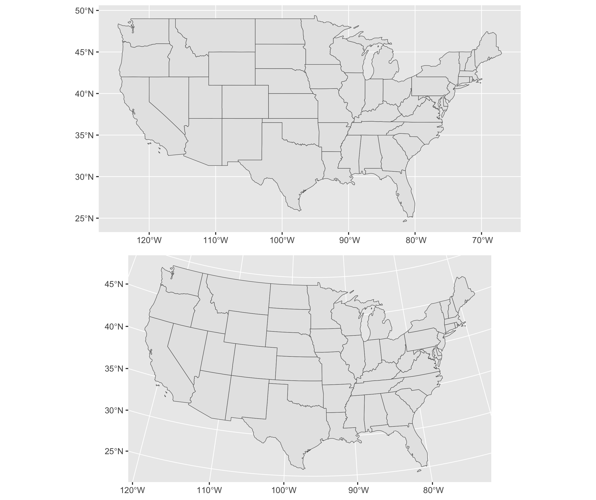
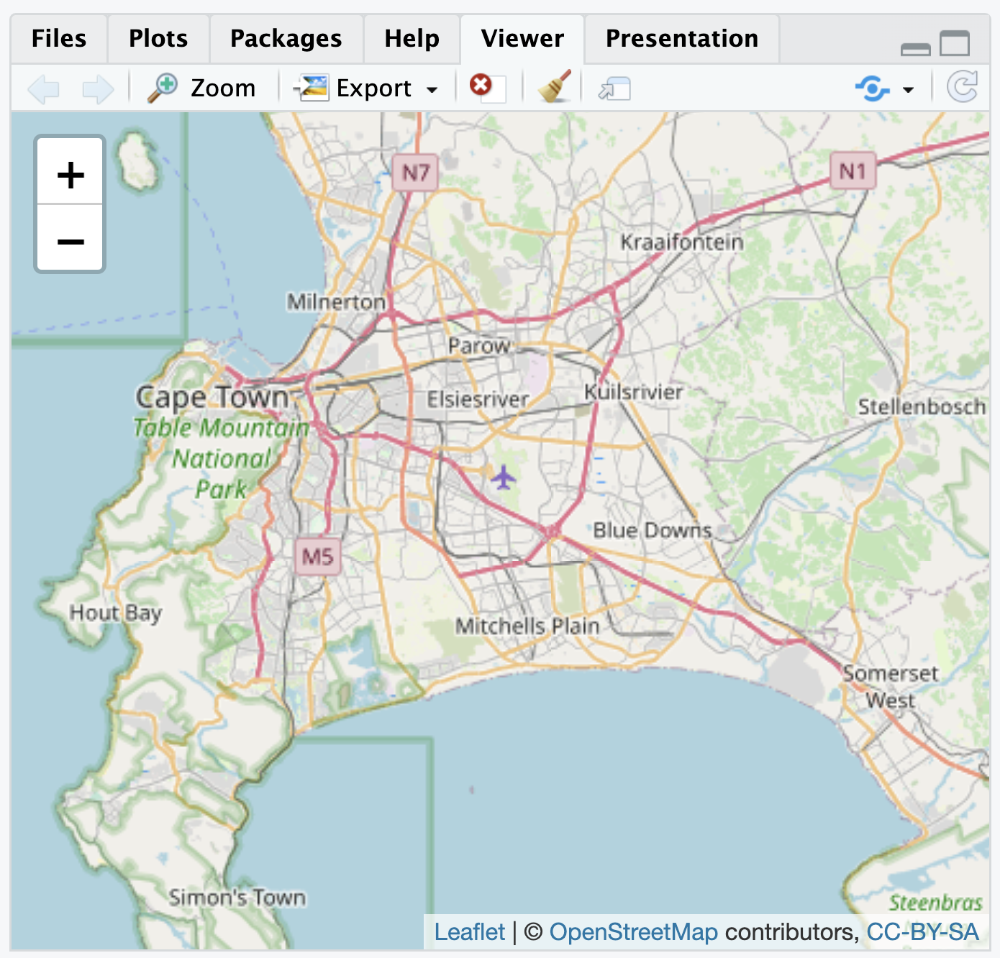
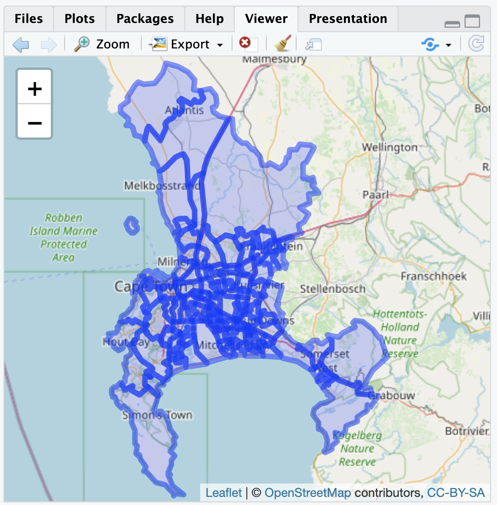
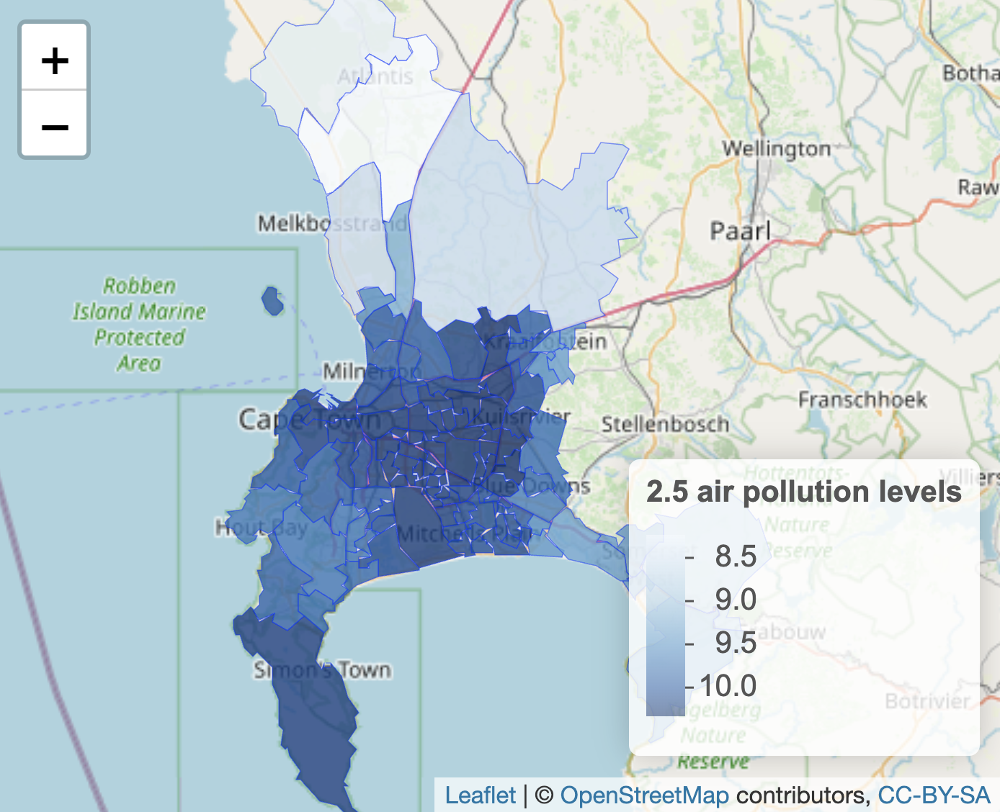
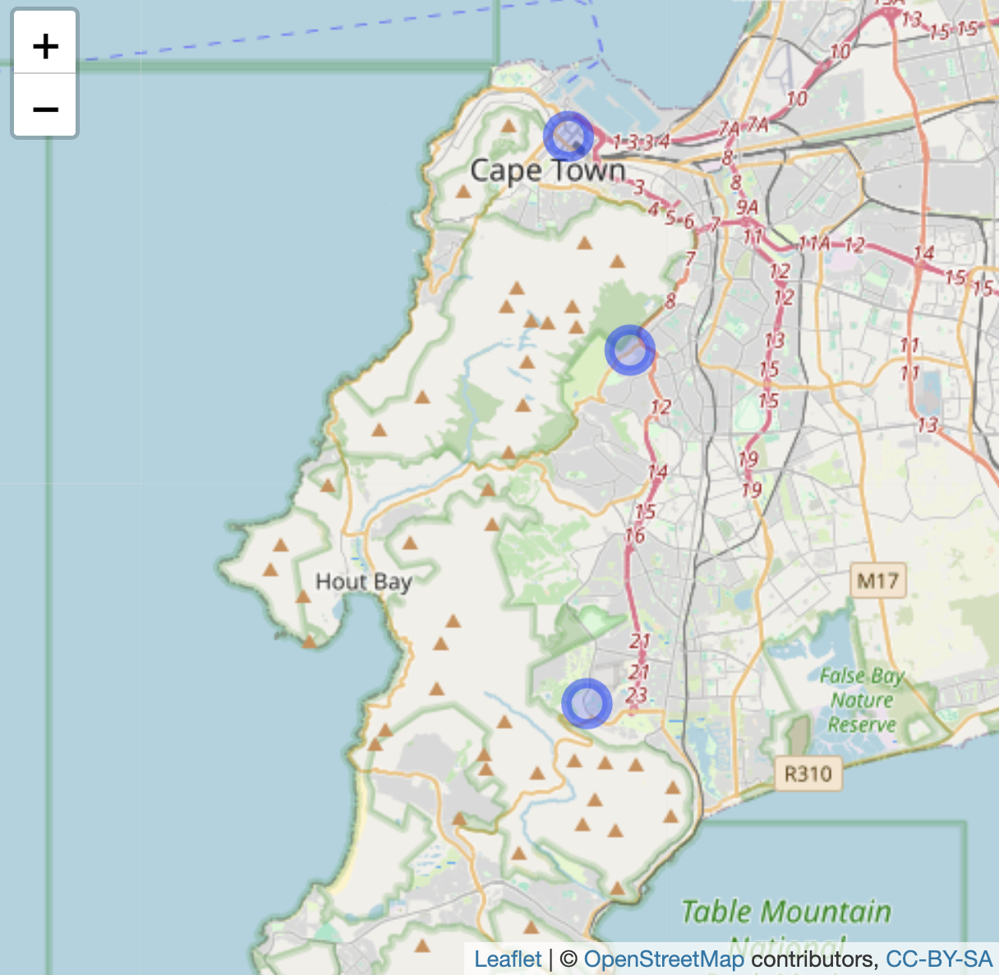
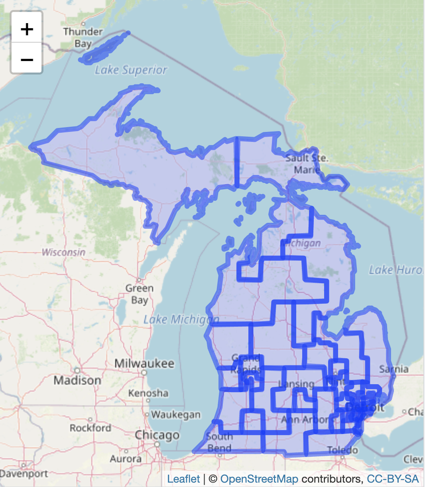
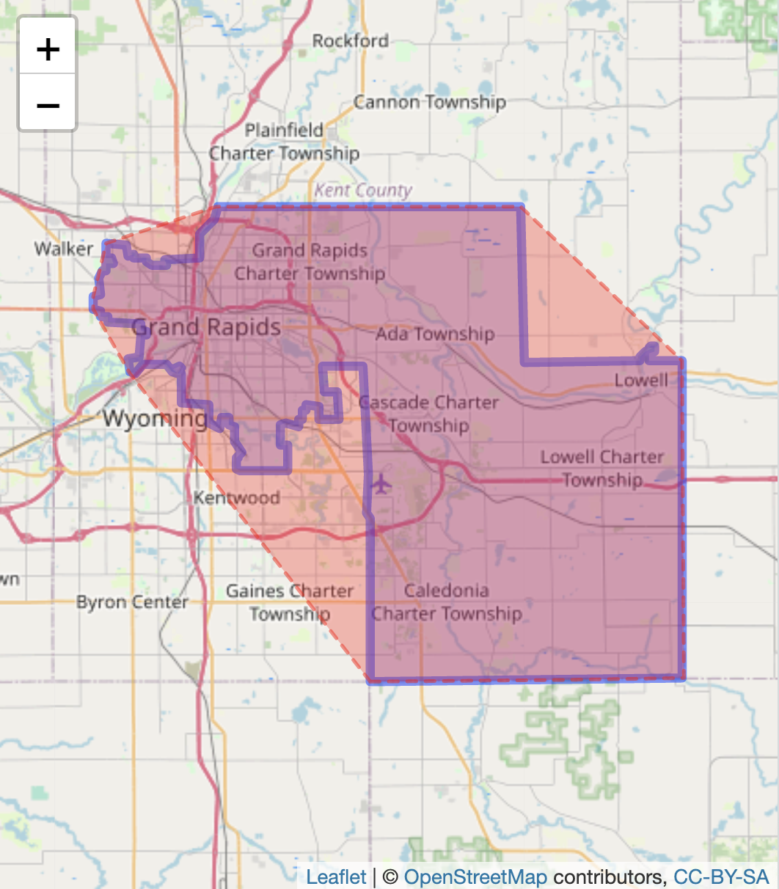
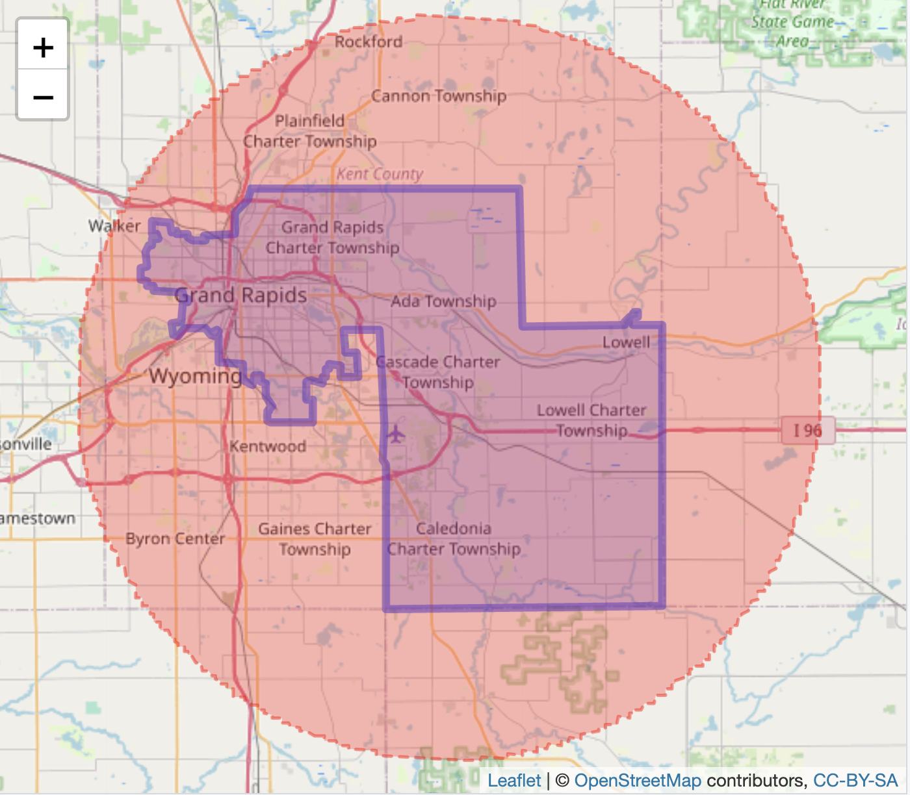
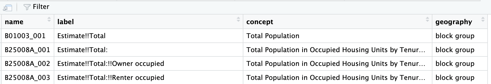

# Maps and Spatial Data {#ch6}

Chapter \@ref(ch6) reviews the use of geographic packages for drawing and analyzing data embedded in maps. 

## Learning objectives and chapter resources {-}

By the end of this chapter, you should be able to (1) explain key characteristics of geospatial data for creating political maps; (2) identify and collect geospatial datafiles relevant to the study of politics; (3) apply tools in visualizing and analyzing geospatial data, analyzing the extent of gerrymandering in U.S. legislative districts. The material in the chapter requires the following packages to be installed: __leaflet__ [@R-leaflet], __leaflet.extras__  [@leafletextras], __sf__ [@pebesma2018; @pebesma2023], __ggspatial__ [@R-ggspatial], __cartogram__ [@R-cartogram], and __tidycensus__ [@R-tidycensus]. For data preparation and labeling maps: __dplyr__ [@R-dplyr] and __ggplot2__ [@R-ggplot2] from the __tidyverse__ [@R-tidyverse], which should already be installed. The material uses the following datasets *michigan12_16.csv*, *Michigan_State_Senate_Districts_2011_plan.geojson*, *ZAF_ADM4.geojson*, *Crime_Incidents_in_2024.geojson*, and *Counties\_\_v17a.shp* from <https://faculty.gvsu.edu/kilburnw/inpolr.html>. 

## Maps as data

Maps and the visualization of data associated with political boundary lines are of inherent interest to the study of politics. The chapter begins with a brief overview of key terminology in the analysis of data with geographic characteristics. From there we apply these principles in the creation of maps visualizing political phenomena, such as election results, leading to the study of 'gerrymandering', the practice of drawing legislative districts to benefit one party over another. 

The use of geospatial data requires some unusual assumptions about how the data was collected and what visually it represents. For example, these assumptions involve underlying models of how latitude and longitude coordinates are determined, and how a particular geographic area of the three-dimensional earth gets represented on a two-dimensional image.  The discussion below is necessarily brief, providing an overview of essential ideas for identifying, cleaning, and combining geographic data. For a more in-depth discussion and application to more advanced methods of analysis, see Lovelace, Nowosad, and Muenchow [-@lovelace2019] and Walker [-@walker2023].  

The term "geospatial" or "spatial data" refers to a particular type of data, information to identify the geographic location and characteristics of natural and man-made features around the world, from rivers and mountain ranges to political boundaries and election results. Geospatial information is organized into two broad types, vector and raster. 

Vector data is the type more common in political science research; it is used to represent particular geometries such as points, lines, and polygons that in turn represent political phenomena of interest. For example, points could represent the location of people or cities, lines for roads, and polygons for the shape of political entities such as legislative districts. Raster data is relatively uncommon in the study of politics. A "raster" refers to a grid or matrix of cells (imagine screen pixels), each containing a value that represents a specific attribute, such as elevation or temperature. To make sense of the data, each of these geometric entities usually has "attribute data" attached, such as the name of the city, road, or political boundary. Attribute data are characteristics of the geographies that are not part of defining the geography itself, such as the number of registered Republican or Democratic voters in a legislative district. 

### Key terms in geospatial data {-}

The terms and underlying assumptions about a "datum", "ellipse", and "projection" require brief explanation.  A "datum" is a reference model of the earth's shape, used as the basis for the coordinate system of latitude and longitude. The datum is based on a particular mathematical model of the "ellipse", the three-dimensional representation of the earth's shape upon which  the coordinates are developed. From a starting point in this model, the northerly or southerly location (latitude) and easterly or westerly location (longitude) coordinates are developed. 

In working with geospatial data, you will often see reference to "North American Datum of 1983 (NAD83)" or more likely the "World Geodetic System of 1984 (WGS84)". The WGS 84 determines the reference coordinate system used by Global Positioning System (GPS) tools. Most geospatial data available for download on the web will use this datum. Ideally, data collected from a different datum intended to be combined should be placed on the same datum, but this step is really only necessary for a high degree of precision or map resolution.  

The cardinal directions North, South, East, and West correspond to particular coordinate designations.  For latitude, coordinates in the Northern hemisphere coordinates are recorded with an N and Southern coordinates with an S; for longitude, Eastern hemisphere with an E and Western hemisphere with a W. In place of cardinal directions, positive coordinate numbers are used for N and negative coordinate numbers for S --- similarly, an E with a positive coordinate number and W with a negative coordinate number. 

### Map projection {-}

A projection refers to a particular way of taking geographic features on the curved three-dimensional surface of Earth and 'projecting' or translating it onto a two-dimensional flat image.  Like taking a curved piece of paper with an image of North America and flattening it, parts of the paper will have to fold over onto itself, distorting the original curved image. Different projections will distort different aspects of the map (like area, shape, or distance) to a greater or lesser extent. For an analysis involving measurements like distance or geographic area, or when working with large areas, it is usually necessary to consider projection. Without a proper projection, measurements can be inaccurate without accounting for the curvature of the Earth. 

To illustrate differences between projections, Figure \@ref(fig:mercatoralberscombo) presents two different projections of the continental USA. The first is a Mercator projection. The Mercator projection, in the upper panel of Figure \@ref(fig:mercatoralberscombo), is a projection prioritizing navigation (think driving directions), but notice the distorted straight line across the USA-Canada border and the distorted shapes of States near it.  Below it is the "Albers Equal-Area Conic Projection", which more closely preserves area and shape of the States at the expense of navigation. While less useful for navigating, the map projection features States with a more familiar shape and accurate area.   
 
```{R mercatoralberscombo, out.width='70%', echo=FALSE,  fig.align='center', fig.cap="Comparison of two map projections for the continental United States. The upper panel uses the Mercator projection, while the lower panel uses the Albers Equal-Area Conic projection. These maps illustrate how projection choice affects the visual representation of geography."}

```

### Geospatial datafile formats {-}

In searching for your own spatial data --- vector data for displaying points, lines, or polygons --- there are  two commonly found formats.  

(1) A "Shapefile" \index{Shapefile}refers to a set of files in a format originally developed by ESRI, a geographic information systems company. The Shapefile itself consists of not just one _.shp_ ('shape') file, but also additional helper files including _.shx_, _.dbf_ (for storing attribute data), and _.prj_.  When working with Shapefiles, these three ancillary files are necessary and should be downloaded with the _.shp_ file, all of which are usually made available in a _.zip_ file archive. Shapefiles are relatively easy to find for the creation of vector maps, such as legislative boundary lines and voting precincts.

(2) A "GeoJSON" file \index{GeoJSON file} refers to the organization of the spatial data into a JSON file, the same as reviewed in Chapter \@ref(ch3). A single _.geojson_ file may contain both geographic and attribute data sometimes referred to as "properties" of the geographic datafile. Because it is a single self-contained file and relatively smaller in file size, data analysts often prefer to work with GeoJSON over the "Shapefile" format.

### Key steps and the big picture of maps and spatial data analysis {-}

Constructing maps to analyze data tied to geographic features typically involves four basic steps. 

(1) Locating and downloading relevant geospatial datafiles, such as a _.geojson_ file outlining legislative districts. If needed, make changes to the map projection; if combining multiple map files together as map layers (discussed further below), verify that each layer references the same datum and projection. 

(2) Locating or organizing any additional attribute data, characteristics of the geographic features (such as votes cast within a State) that are the focus of the analysis. 

(3) Merging the geospatial and attribute data, associating the attribute data with relevant geographic features.

(4) Transforming and visualizing the attribute data within the geography.

In the sections that follow, we first review constructing maps, starting with the creation of interactive maps of political phenomena,  then we will create static image maps.

## Visualizing polygons and points

In working through Chapter \@ref(ch6), note that mapping packages are large in file size and time-consuming to download.  Drawing maps requires much more computing power, along with much more patience until the maps show up in the Plots or Viewer pane of RStudio.  So to make these analyses more feasible, the maps and geospatial data in the chapter usually focus on just one particular U.S. State, Michigan, or small areas with relatively few geographic features. 

The functionality of interactive maps, such as maps that allow immediate panning or zooming on different areas or altering the data displayed on a map, is created through the __leaflet__ [@R-leaflet] package and accessed through the "Viewer" pane (lower right of RStudio). The map interactivity is limited to this Viewer pane or, to view interactive maps outside of RStudio, the maps can be exported to an HTML file and hosted on a web server. The interactive maps cannot be embedded within a Microsoft Word document or PDF. So there is a tradeoff: while interactive maps allow for exploration of geographic features, this interactivity is limited to RStudio or webpages. 

A basic interactive map using __leaflet__ starts with the `leaflet()` function, which will require a geographic location to display in the map. One way to set the location of the map is by simply specifying latitude and longitude coordinates. The `setView()` \index{leaflet R package| \texttt{setView() }}function asks for both latitude (`lat=`) and longitude (`lng=`), and a level of focus or 'zoom', `zoom = `. A simple interactive map can be drawn with these two lines, followed by a third function, `addTiles()` \index{leaflet R package| \texttt{addTiles() }} which will draw the 'tiles' or image squares of the map. 

If necessary, install __leaflet__ (`install.packages("leaflet")`). To draw a map centered around Cape Town, South Africa, longitude is set to 18.6 degrees and latitude to -34 degrees: 

```{r eval=FALSE}
library(leaflet)

leaflet() %>% 
  setView(lng = 18.6, lat = -34, zoom = 10) %>% 
  addTiles()
```

The map will appear in the Viewer pane on the lower right-hand side of RStudio as in Figure \@ref(fig:leaflet1), based on map data from OpenStreetMaps^[See <https://www.openstreetmap.org>].  Using the mouse to pan the map in different directions, and the plus and minus signs to zoom in and out, the map can focus on any arbitrary area. The limiting scope of an interactive map of this kind is the attribute data provided by a researcher. As an additional layer to the map, a researcher can add any additional geospatial and attribute data of political interest. 

```{R leaflet1, echo=FALSE, out.width='50%',  fig.align='center', fig.cap="Interactive \\textbf{leaflet} map of Cape Town, South Africa, with OpenStreetMap tiles as the base layer, as displayed in the Viewer pane."}

```

### Visualizing political boundaries {-}

For example, some political boundaries are viewable through the interactive map, but perhaps over Cape Town a researcher plans to visualize other more detailed political boundaries and characteristics of each.  The GeoQuery app at AidData.org^[See https://www.aiddata.org/. ] makes available a wide range of geospatial data for state administrative units; one such set of units is the lowest level of administrative units for South Africa, recorded in the .geojson file _ZAF_ADM4.geojson_ [@goodman2019]. 

From the __sf__ package, the `st_read()` \index{sf R package| \texttt{st\_read() }}function will interpret the geospatial data, and with the assignment operator `<-` we create a map object `sa_admin_boundaries`. Soon after importing the data, we will clean it with the __dplyr__ package. 

```{r warning=FALSE, message=FALSE}
library(tidyverse)
library(sf)
```

```{r eval=FALSE}
sa_admin_boundaries<-st_read("ZAF_ADM4.geojson")
```
<!-- TK will need to edit the line below that says 'Reading layer', delete file path. --> 
```{r echo=FALSE, message=FALSE, warning=FALSE}
sa_admin_boundaries<-st_read("/Users/kilburnw/Documents/ZAF_ADM4.geojson")
```

After reading in the _.geojson_ file, the function reports on the contents: (1) a map or 'Simple feature collection' of 4392 features, the administrative units throughout South Africa; (2) eight fields, or eight columns for each of the row administrative units within the file, plus an `id` or identification column; (3) the geometry type of multiple shapes or polygons, described in a coordinate system within a 'bounding box' or map with those four corners.  

The goal in this example is to map out each of these administrative units on the interactive map of Cape Town.  The map object `sa_admin_boundaries` contains the administrative units for all of South Africa.  After entering `glimpse(sa_admin_boundaries)` you will see the column `shapeName` names the polygon based on location in a particular village or city. 

To identify the rows corresponding to Cape Town, we can `filter()` on the rows in which the words "Cape Town" appear, overwriting the map data `sa_admin_boundaries` with only those rows.  In Chapter \@ref(ch5) we used the `filter()` command to test whether a particular variable contained an exact character string or numeric value, but in this case _shapeName_ contains both the name of the location and the number of the administrative unit, so `filter(shapeName=="Cape Town")` would not work.  Instead, we want to find any rows containing at least the string "Cape Town". The `str_detect()` function will find rows containing a string (returning a TRUE if the string is present in a row), and within `filter()` those rows will be selected for inclusion in the _sa_admin_boundaries_ dataframe.  Thus, we filter on rows where `str_detect(shapeName, "City of Cape Town")` are `TRUE`:

```{r}
sa_admin_boundaries<- sa_admin_boundaries %>%
  filter(str_detect(shapeName, "City of Cape Town"))
```

Because we have imported the map boundary file with `st_read()`, __leaflet__ will automatically read the _geometry_ column and locate the map boundaries, centering the boundaries in the map Viewer.  The boundaries are polygons, so we add the boundary map with the function `addPolygons()`: \index{leaflet R package| \texttt{addPolygons() }}

```{r eval=FALSE}
leaflet() %>%
 addPolygons(data=sa_admin_boundaries) %>%
 addTiles()
```

The administrative ward polygons should appear as in Figure \@ref(fig:leaflet2). At the default scale, the boundary lines obscure the map features; zoom in to see how the lines divide up the city.  

```{R leaflet2, echo=FALSE, out.width='50%',  fig.align='center', fig.cap="Interactive \\textbf{leaflet} map of Cape Town, South Africa, displaying polygon boundaries of administrative units, with OpenStreetMap tiles as the base layer."}

```

Earlier we briefly reviewed the concept of map projection, transforming spatial data from the three-dimensional Earth to a two-dimensional map. Although we are combining two different sources of geospatial data in Figure \@ref(fig:leaflet2), when adding map layers to `leaflet()` it is usually not necessary to alter a map projection.  With the additional layer located in latitude and longitude on the common WGS84 datum, `leaflet()` will line up the map layers correctly.  Leaflet, like other 'map tile' apps such as Google Maps, uses a specific projection known as "Pseudo-Mercator" or "EPSG 3857". For a relatively small area such as wards in Cape Town, distortions introduced by the Mercator projection are generally minimal and often unnoticeable. Nonetheless, for calculations involving area and distance where precision matters, the projection should be reconsidered for maximal accuracy. 

By default, `leaflet()` draws the polygon shapes with a slight hue to show the extent of the polygon coverage over the map.  Thus beyond the borders of each administrative unit, the polygons do not contain any additional data. We use variation in the shading of the borders to display additional data. For example, AidData.org provides a measure of fine particulate air pollution averaged to each polygon.  

### Visualizing boundary line attributes {-}

The air pollution data measures PM2.5 concentration, measured in the year 2011, averaged to each administrative unit [@brauer2015]. (The 2.5 in PM 2.5 refers to the size of the pollutant, in micrometers, such as from wildfire smoke, power plants or factory emissions.) When selected for downloading from AidData, the air pollution data is stored as a data table CSV, separated from the geospatial data. As characteristics of the polygons, the air pollution data can be treated as 'attribute data', and needs to be merged with the administrative unit boundaries. The first step is to import it and subset it to Cape Town.

```{r eval=FALSE}
sa_air_pollution<-read_csv(file="air_pollution_data.csv")
```

```{r echo=FALSE, message=FALSE, warning=FALSE}
sa_air_pollution<-read_csv(file="./data/ch6 data/air_pollution_data.csv")
```

The air pollution dataset, stored within RStudio as the dataframe _sa_air_pollution_ consists of eight columns. Review the contents with `glimpse(sa_air_pollution)`. The air pollution level is recorded in column _ambient_air_pollution_2013_fus_calibrated.2011.mean_. Like the data for administrative units, the column _shapeName_ describes the geographic location, with each row corresponding to the different boundaries for an administrative ward.  We will subset the data to Cape Town, as done previously:

```{r}
sa_air_pollution<- sa_air_pollution %>%
  filter(str_detect(shapeName, "City of Cape Town"))
```

To visualize the air pollution data, we need to merge it with the polygon data.  The column _ShapeName_ matches the same _ShapeName_ column in the map data, so we will use that one for merging and displaying the differences in air pollution levels. All rows of the datafiles match with only one row of the other. While there are a few different merges that can be used, we will use `inner_join()` to merge the air pollution data onto the _sa_admin_boundaries_ dataset:

```{r}
sa_admin_boundaries <- sa_admin_boundaries %>%
   inner_join(sa_air_pollution, by="shapeName")
```

Run `glimpse(sa_admin_boundaries)` to see how the dataset has changed. The air pollution data is appended onto the administrative boundaries.  Duplicate column names are marked by the suffix _.x_ (from _sa_admin_boundaries_) and _.y_ (from _sa_air_pollution_). Notice the lengthy name for the measure of air pollution.  We will change it to something simpler, such as _air_pollution_level_: 

```{r}
sa_admin_boundaries<-sa_admin_boundaries %>%
 rename(air_pollution_level = 
          ambient_air_pollution_2013_fus_calibrated.2011.mean)
``` 

To plot the variation in polygon color to display levels of air pollution, we need to first specify a color palette to display the variation in color.  The function for doing so is `colorNumeric()`. \index{leaflet R package| \texttt{colorNumeric() }}

```{r eval=FALSE}
pal <- colorNumeric(palette="Blues", 
        domain = sa_admin_boundaries$air_pollution_level)
```

Then we plot the data as follows, after filtering out missing values, storing the complete data in _filtered_boundaries_:

```{r eval=FALSE}
filtered_boundaries <- sa_admin_boundaries %>%
  filter(!is.na(air_pollution_level))

leaflet(filtered_boundaries) %>%
 addPolygons(fillColor=~pal(air_pollution_level), fillOpacity = .8,
             weight = 0.5, ) %>%
 addTiles() %>%
 addLegend(pal = pal, values = ~air_pollution_level, 
          title = "2.5 air pollution levels", position = "bottomright")
``` 
\index{leaflet R package| \texttt{addLegend() }}
The leaflet map will appear similar to Figure \@ref(fig:leaflet3).  Within `addPolygons()` the argument `fillColor()` links to the color palette for the levels of _air_pollution_level_. The boundary lines are further reduced to half their original size with `weight=.5`. 

```{R leaflet3, echo=FALSE, out.width='70%',  fig.align='center', fig.cap="Interactive \\textbf{leaflet} map of Cape Town, South Africa, displaying polygon boundaries of administrative units, shaded by fine particulate air pollution levels (PM2.5), with OpenStreetMap tiles as the base layer."}

```

### Visualizing points and point densities {-}

Rather than embedded within boundary lines, data can be represented by points and visualized on a map. Each point must be measured in latitude and longitude. For a small number of points, the coordinates can be organized into a small dataset. (The process of translating street address locations into coordinates --- geocoding --- \index{geocoding} requires additional packages or other resources, described in the Resources section.) 

In identifying point coordinates, you may return more precision than is needed. For example, Google Maps identified the location of the USA Consulate in Cape Town in decimal degree form at "-34.0768110805937,18.4296571685817", which is a location with far more precision than necessary.  As a rough rule of thumb for accuracy or precision, at one decimal place a location is accurate to within 10 kilometers, at two decimal places 1 kilometer, at three decimal places 100 meters, and at four decimal places 10 meters.  So within 100 meters, we could say the USA Consulate is located 34.077 degrees south of the equator (-34.077) and 18.430 degrees east of the Prime Meridian (18.430). Thus for most purposes two to three decimal places is sufficient.  

Given the coordinates, just one descriptive field for each point may be sufficient to plot the points on a map. The `tribble()` \index{tibble R package (tidyverse)| \texttt{tribble() }}function from the __tibble__ [@R-tibble] package facilitates row-wise data entry.  As a simple example, we could plot the location of three state consulates for the USA, China, and Russia. Latitude and longitude should be organized into two different columns, and we will need at least a third column to record the name of each one. In the `tribble()` function, the data elements are organized row-wise with the first row reserved for variable names preceded by a tilde `~` symbol. In this example, we record the latitude in a variable _lat_, longitude in _long_, and the name of the consulate in a variable _name_. The simplest storage type decision is to record character strings in quotes, while the coordinates will automatically be recorded in numeric form. 

The `tribble()` contents of this function are assigned to a small dataset, _three_consulates_.

```{r}
three_consulates<-tribble(
  ~lat, ~long, ~name,
  -33.979,18.445,"Chinese Consulate",
  -33.920,18.424, "Russian Consulate",
  -34.077,18.430, "American Consulate")
```

In entering the data with `tribble()`, each row (until the last one) ends with a comma, and the closed parenthesis completes the function. As a dataset it appears as a 3 by 3 table: 

```{r}
three_consulates
```

For legibility, the resulting __tibble__ prints only the first decimal of coordinates, but the full coordinates are saved within the dataset. The `three_consulates` layer can be added to any map as an additional layer. Figure \@ref(fig:consulatepoints) displays the consulates over the base map; the function `addCircleMarkers()`\index{leaflet R package| \texttt{addCircleMarkers() }} identifies the _three_consulates_ dataframe coordinates and a label.  The points could be added to the map of administrative unit polygons as an additional layer after `addPolygons()`. 

```{r eval=FALSE}
leaflet( ) %>%
  addTiles() %>%
  addCircleMarkers(lat=three_consulates$lat, lng=three_consulates$long, 
     label = three_consulates$name) 
```

```{R consulatepoints, echo=FALSE, out.width='40%',  fig.align='center', fig.cap="Interactive \\textbf{leaflet} map of Cape Town, South Africa, with OpenStreetMap tiles as the base layer, displaying three point markers based on latitude and longitude coordinates."}

```

### Visualizing point densities {-} 
 
Data represented by points could be visualized discretely, as individual points, or if points are sufficiently numerous, as densities or 'heatmaps' that show trends over geographic areas.  For example, data.gov hosts crime reports from the Washington, DC, Metropolitan Police [@crimeincidents2024]. The _.geojson_ file _Crime_Incidents_in_2024.geojson_ contains crimes reported through the fall of 2024, each one geocoded to a particular location.  

```{r eval=FALSE}
dc_crime<-st_read("Crime_Incidents_in_2024.geojson")
```

```{r cache=TRUE, echo=FALSE, message=FALSE}
dc_crime<-st_read("/Users/kilburnw/Documents/Crime_Incidents_in_2024.geojson", quiet=TRUE)
```
 
The variable _OFFENSE_ records types of crimes.  See the codebook for details. One level of _OFFENSE_ is _HOMICIDE_. Subset the data to homicides: 

```{r}
homicide_data <- dc_crime %>% 
  filter(OFFENSE == "HOMICIDE")
```

Coordinates are recorded in variables _LONGITUDE_ and _LATITUDE_. Each geocoded homicide can be plotted individually through `addCircleMarkers()`, or the density of each event through `addHeatmap()` \index{leaflet.extras R package| \texttt{addHeatmap() }}from the __leaflet.extras__ package [@leafletextras].  To plot the points, we first set the boundaries of the __leaflet__ map, centered around downtown DC, then `addCircleMarkers()`: 

```{r eval=FALSE}
leaflet() %>%
  setView(lng = -77.0369, lat = 38.9072, zoom = 12) %>% 
  addTiles() %>%
addCircleMarkers(data = homicide_data, lng = ~LONGITUDE, 
    lat = ~LATITUDE, color = "red", radius = 2)
```

The upper panel in Figure \@ref(fig:dcmaps) displays the point map, each circle corresponding to a single homicide. The function argument `radius=2` sets the point radius to two pixels. The points appear to cluster around the areas south of Anacostia and Columbia Heights. A heatmap helps to communicate the trends in the clusters. After installing the __leaflet.extras__ package if necessary (`install.packages("leaflet.extras")`), we can plot the points through `addHeatmap()`: 

```{r eval=FALSE}
library(leaflet.extras)

leaflet() %>%
  setView(lng = -77.0369, lat = 38.9072, zoom = 12) %>% 
  addTiles() %>%
  addHeatmap(data = homicide_data, lng = ~LONGITUDE, lat = ~LATITUDE,
     blur = 20, max = 0.05, radius = 15)
```

The heatmap in the lower panel of Figure \@ref(fig:dcmaps) focuses on clusters rather than individual events, and it does reveal a focal point south of Anacostia. Within `addheatmap()`, the three last arguments --- `blur=`, `max=`, and `radius=` --- affect how the map represents density patterns. The `radius` sets the size of the area around each point (measured in pixels) that contributes to the heatmap; larger values result in smoother, more generalized density patterns, while smaller values keep the density tightly localized to each point's immediate vicinity. The `blur` option controls how sharply the density transitions from the center of a point to the edges of its radius. The `max` option sets the scaling for the density intensity, defining how bright or "hot" the most dense areas will appear. Try adjusting the arguments to observe how each affects the map. 
 
```{r dcmaps, echo=FALSE, fig.show='hold', out.width='50%', fig.align='center', fig.cap="Interactive \\textbf{leaflet} map of Washington, DC, displaying homicides in 2024, with OpenStreetMap as the base layer. The upper panel shows individual homicide locations as points, while the lower panel presents a heatmap of homicide concentrations."}
knitr::include_graphics(c("./includegraphics/ch 6 includegraphics/dcpoints.png", "./includegraphics/ch 6 includegraphics/dcpoints2.png"))
```

These maps in __leaflet__ are meant to be interactive, rather than printed through an RMarkdown file as an image to a Word or PDF document. Creating these images requires the creation of maps as plotted graphics. 

### Creating static polygon and point maps {-}

Static maps based on shapes or points imported from a ShapeFile or .geojson file require the __sf__ package, but the inclusion of a base layer necessitates __ggspatial__, along with functions from the __tidyverse__ for data wrangling and visualization, and optionally labelling with __ggrepel__. 

```{r warning=FALSE, message=FALSE}
library(ggspatial)
```

The same .geojson file of administrative boundaries, read into R with `st_read()` and saved as _sa_admin_boundaries_ can be plotted in a static __ggplot2__ graphic. The geometry in the `ggplot()` graphic, `geom_sf()`, plots any "simple features" map object (such as a ShapeFile or geoJSON file) imported into R with `st_read()`. The function will automatically find the _geometry_ column (in `data=sa_admin_boundaries`) for plotting.  Note that drawing static maps via `ggplot()` takes a little more computing time than the interactive maps; so after you enter the commands below, you may have to wait a minute or so to see the next prompt `>`, and then perhaps 1-2 minutes for the actual map to appear in the "Plots" pane. 

The simplest plot of the administrative boundaries would consist of two lines `ggplot() + geom_sf(data=sa_admin_boundaries)`.\index{ggspatial R package| \texttt{geom\_sf() }}  For completeness, however, static maps of this kind usually include an orientation symbol and a scale legend. Among other functions, the __ggspatial__ package provides these features. The two components are added with the functions `annotation_north_arrow()` and `annotation_scale()`. The function includes a `style= north_arrow_fancy_orienteering` for a particular orientation style, placing it at the bottom right of the graph (`location= "br"`). The intended width of the legend scale on the plot area is controlled with `width_hint=` as a proportion of 1.  

To plot both the boundary lines for wards and the air pollution level, we specify a fill layer within the aesthetic `aes()` function. The `geom_sf()` function still requires that the dataset `data=` is explicitly identified.  Figure \@ref(fig:saairfill) shows the administrative wards filled by average level of air pollution. 

```{r saairfill, out.width='70%', fig.align='center', fig.cap="Heat map of Cape Town, South Africa, showing average PM2.5 air pollution concentration by administrative unit in 2011, visualized with \\textbf{ggplot2}. Shading represents pollution levels, with darker areas indicating higher concentrations."}
ggplot() + 
  geom_sf(aes(fill=air_pollution_level), data=sa_admin_boundaries) + 
  theme(legend.position = "bottom") +
  annotation_north_arrow(location = "br", 
        style = north_arrow_fancy_orienteering) +
  annotation_scale(location = "br", width_hint = 0.4) +
  scale_x_continuous(breaks = seq(18, 19, by = .5))
```

Perhaps the most common use of maps is in organizing election results by county. 

## Mapping elections in red, blue, and purple

The creation of 'choroplethic' heatmaps for elections --- such as the red-blue USA election maps in every presidential election --- relies upon the same principles of map-making we have seen in drawing a map of administrative wards in Cape Town.  For example, in elections, the geographic unit (such as a State, County, or precinct) is shaded either by a categorical variable (win/loss for a candidate) or continuous variable (a candidate's margin of victory).

To illustrate how to create election maps, we approach it first with the same `geom_sf()` function in the __ggspatial__ package.  Second we will consider the limitations of these maps in the construction of "cartogram"-style maps with the help of the __cartogram__ package [@R-cartogram]. Finally we will review how interactive maps can be created to investigate gerrymandering.

The basic steps to create these maps are as follows:

(1) Decide upon a geography for the map – Counties? States? precincts? 
(2) Find a boundary line file that outlines the geography. 
(3) Find the election results – aggregated to the intended geography; prepare a data table. 
(4) Merge the election results with the map file, on the key field that links the map geographies together.
(5) Display the resulting map + election results.

### A map of Michigan counties {-}

Our goal is to map the outcome and margins of victory for presidential candidates Trump and Clinton in the 2016 election, at the Michigan County level. The first step is to identify a suitable boundary line file. Many units of government have geographic data portals with open access geospatial data.  A simple internet search will find these portals. Within each one, boundary lines files can easily be downloaded for analysis.  

The Michigan County boundary line file is *Counties\_\_v17a.shp*. From a working directory, use the __sf__ package to read in file, with `st_read()`:  

```{r eval=FALSE}
michigan<-st_read("Counties__v17a.shp")
```

```{r echo=FALSE, warning=FALSE, message=FALSE}
michigan<-st_read("/Users/kilburnw/Documents/Counties__v17a.shp")
```

The geospatial dataset consists of 83 rows (one for each Michigan county) and 15 variables describing each row.  Like the geoJSON file for Cape Town, the geometry is _MULTIPOLYGON_ referencing the shapes for each Michigan county. Enter `glimpse(michigan)` to observe different features of the dataset, in particular _NAME_ and _LABEL_ that describe the counties, the first row of which are for _Alcona_ and _Alcona County_.  In addition to name, the counties are identified by numeric FIPS codes, from States down to the smallest Census Bureau tracts.  Both columns contain the same information, the only difference being the leading zeros. (States are identified by a two-digit code that precedes the FIPS code shown here; for example, Michigan's State level FIPS code is 26, thus the FIPS code identifying Alcona County as a county in Michigan would be _26001_).

Before moving on to the next step, we will plot the `michigan` simple feature dataset: 

```{r micounties, out.width='40%', fig.align='center', fig.cap="Map of Michigan county boundaries created with \\textbf{ggplot2} to plot spatial data."}
ggplot() + 
  geom_sf(data=michigan)
```

As expected, Figure \@ref(fig:micounties) shows the outlines of the Michigan counties from the simple features data _michigan_. The next step is to link election results to the counties, by merging an election dataframe to the _michigan_ counties map data. The election data, _michigan12_16.csv_, contains County-level presidential vote counts for 2012 and 2016.  It is organized with Counties on rows and votes, along with various other county characteristics on the columns.  

Using the `read_csv()` we will read in the CSV file and store it as `MI1216`.  

```{r eval=FALSE} 
MI1216<-read_csv(file="michigan12_16.csv")
```

```{r echo=FALSE, warning=FALSE, message=FALSE} 
MI1216<-read_csv(file="./data/ch6 data/michigan12_16.csv")
```

Like the _michigan_ map data, the _MI1216_ dataset contains 83 rows, one for each Michigan county. There are two variables that record the name of each county, as well as a FIPS code column.  To merge the two datasets, one method would be to use a `join`, such as`inner_join()`. The two matching key variables from each dataset are _FIPSNUM_ in _michigan_ and _fips_ in _MI1216_. `michigan<-michigan %>% inner_join(MI1216, by=c("FIPSNUM", "fips")`

Because the order of the rows in each dataset matches each other, an alternative to a join is simply to bind the columns from one dataset to the other, with the `cbind()` \index{\texttt{cbind()}} function. Since the datasets mirror each other in row structure --- Michigan counties in rows in the same alphabetical order --- we can simply merge the _MI1216_ data onto it adding all the columns from _MI1216_ to the side of _michigan_.  This is easy to do with the function `cbind()`.   

```{r}
michigan<-cbind(michigan, MI1216)
```

The dataset _michigan_ now contains the geographic data as well as the attribute elections data. To verify, try `glimpse(michigan)`.

### A choroplethic map of county-level election results {-}

First we will plot a choropleth map of Michigan with some 2016 election results. We will plot the map with `ggplot()` and code counties the traditional red-blue colors. Then in a second map, we will fill counties by a color gradient including purple to identify the 'swing' counties. So now we can fill in the map with colors from the 2016 election, assigning blue to counties where Clinton won, and red to counties where Trump won. 

We need to specify for the map which counties each candidate won.  One way to do this would be to specify an indicator column that takes the values 1 if Clinton won and 0 if Trump won.  We will add this measure to the dataset with the `ifelse()` function.  The function will evaluate a condition for each row of the dataset, whether `clinton_vote` is greater than `trump_vote`: `clinton_vote > trump_vote`. Then counties where the condition is true will receive a score of 1 and 0 if false.  \index{\texttt{ifelse()}}

```{r}
michigan <- michigan %>%
    mutate(indicator=ifelse(clinton_vote > trump_vote, 1, 0)) 
```

We could leave this indicator as is, with 0 and 1 for Trump and Clinton --- but we could also associate candidate names with these numbers. Doing so requires us to convert the numeric scores into another variable type, a `factor` variable, which combines a numeric score with an associated verbal label, such as "Trump" and "Clinton" in this case.  To convert it, we use `mutate()` with an additional function, `as_factor()` that will convert the numeric score into a factor measure. All we have to do is specify the verbal labels for each numeric code, after converting it to a factor with `as_factor()`:

```{r}
michigan<- michigan %>%
   mutate(indicator = as_factor(indicator))
michigan<- michigan %>%   
   mutate(indicator = fct_recode(indicator, 
   "Trump" = "0", "Clinton" = "1"))
```

To create an election map that simply displays a red-colored county for Trump and blue for Clinton, we need to add a fill color. That fill will be determined by the `indicator variable`, and the color we set manually with `scale_fill_manual()`. To add the fill, we specify it as `geom_sf(aes(fill=indicator))`. Since the indicator variable has only two levels, "Trump" and "Clinton", we will specify two colors in the order red and blue, and then add a name for the legend: `scale_fill_manual(values = c("red", "blue"), name= "Winning candidate")`. 

A simple red-blue election map could be visualized with the following lines of code: 

```{r eval=FALSE}
ggplot(data=michigan) + 
  geom_sf(aes(fill=indicator)) + 
  labs(title="Michigan County level vote",
       subtitle="2016 presidential election") +
  scale_fill_manual(values = c("red", "blue"), 
                    name= "popular vote winner")
```

The map for this code would include X and Y axes scale labels with the latitude and longitude coordinates.  To remove the coordinates, add `theme_void()`, and then reposition the legend to the bottom of the map, ` theme(legend.position = "bottom")`, so that there is less white space above and below it. Figure \@ref(fig:mi2016map) illustrates this adjusted map of the 2016 County level results. Note that in the grayscale, text printed version of the map, the "blue" Counties appear darker than red.  \index{ggplot2 R package (tidyverse)| \texttt{theme\_void() }}

```{r mi2016map, cache=TRUE, fig.cap="Traditional red-blue election map of Michigan counties visualized with \\textbf{ggplot2}. On the grayscale printed version of the map, blue counties appear darker than red."}
ggplot(data=michigan) + 
  geom_sf(aes(fill=indicator)) + 
  labs(title="Michigan Counties, 2016 presidential election") +
  scale_fill_manual(values = c("red", "blue"), 
                    name= "popular vote winner")+
  theme_void() +
  theme(legend.position = "bottom")
```
 
### Blending counties: red, blue, and purple {-}

Of course, a common criticism of maps such as these is that the map obscures the votes received by the loser in each county. After all, Trump's margin of victory was less than 10,000 votes, so we could create a map displaying the shift between red and blue --- to purple --- among the counties that were relatively close.  The key to understanding how this map would be constructed is to imagine that within each state we are plotting the size of the margin of victory won by either Trump or Clinton along a color spectrum ranging from red --- through purple --- to blue.  

Instead of specifying red and blue colors with `scale_fill_manual()`,\index{ggplot2 R package (tidyverse)| \texttt{scale\_fill\_manual() }} we will use a function that creates a gradient of colors between the two.  This function is `scale_fill_gradient2()`, \index{ggplot2 R package (tidyverse)| \texttt{scale\_fill\_gradient2() }} where the `2` stands for a divergent contrast between the two colors.  By default, the function uses the color white as the midpoint, so instead we will specify purple as the midpoint in the transition. 

The next decision is whether to plot Trump's percentage minus Clinton's, or vice versa. That choice affects which color is at the minimum of the gradient and which is specified at the maximum. If it is Trump's percent of the vote minus Clinton's, then the minimum, or low would be blue and the high red: larger values of this measure would correspond to a more red state, while lower would be blue, and then purple is the midpoint: `scale_fill_gradient2(low="red", mid="purple", high="blue")`. 

We create the margin of victory measure: 

```{r}
michigan <- michigan %>%
  mutate(margin=trump_percent - clinton_percent)
```

And then create the map displayed in Figure \@ref(fig:redpurplebluemi): 
 
```{r redpurplebluemi, cache=TRUE,fig.cap="County level election map displaying a percentage margin of victory from red through purple to blue, visualized with \\textbf{ggplot2}. On a graycale printed page, these color transitions are not visible."}
ggplot(data=michigan) + 
  geom_sf(aes(fill=margin)) + 
  labs(title="Michigan Counties, 2016 presidential election",
       subtitle="percentage margin of victory by Trump (red)
                  or Clinton (blue)") +
  scale_fill_gradient2(low="blue", mid="purple", high="red") +
  theme_void() +
  theme(legend.position = "bottom")
```

Notice in the legend that ggplot automatically chooses the breakpoints, the range of percentage scores associated with a particular color. In this case, it chose four bins, or ranges, in increments of 25 percentage points. We can specify our own preferred breakpoints; perhaps in units of ten, `breaks=c(-30, -20, -10, 0, 10, 20, 30)`. This argument would be added to `scale_fill_gradient2()` after `high="red"`. Another aesthetic change would be to move the legend to the side, under the upper peninsula, `theme(legend.position = "left")`. Other maps show these with a neutral color such as white as the midpoint, so that the map emphasizes red or blue shades. Figure \@ref(fig:redwhitebluemi2) displays such a map:
 
```{r redwhitebluemi2,cache=TRUE, fig.cap="County level election map displaying a percentage margin of victory from red through white to blue, in increments of ten, visualized with \\textbf{ggplot2}. On a graycale printed page, these color transitions are not visible." }
ggplot(data=michigan) + 
  geom_sf(aes(fill=margin)) + 
  labs(title="Michigan Counties, 2016 presidential election",
       subtitle="percentage margin of victory by 
       Trump (red) to Clinton (blue)") +
  scale_fill_gradient2(low="blue", mid="white", high="red", 
                       breaks=c(-30, -20, -10, 0, 10, 20, 30)) +
  theme_void() +
  theme(legend.position = "left")
```

For an introduction to other mapping packages, see Machlis [-@machlis2019].  

## Cartogram corrections to election maps 

A cartogram is a type of map in which the area of a geographic unit as it appears on the map is intentionally distorted by another feature of the geographic units, such as population. In the case of a Michigan County election map, this transformation ensures that counties with relatively lower populations (or votes cast) appear proportionally smaller. By scaling geographic areas in this way, cartograms prevent the common misconception that larger land areas correspond to larger contributions to the total vote, a bias inherent in traditional maps. In **R**, the __cartogram__ package [@R-cartogram] will transform existing election maps into the cartogram style visualization.  We will transform the Michigan County red-blue election map. Install the package __cartogram__ if you have not already `install.packages("cartogram")`, and attach it. 

```{r  warning=FALSE, message=FALSE}
library(cartogram)
```

### Cartogram of the Michigan county presidential vote in 2016 {-}

The starting point for the cartogram is an existing map constructed via the __sf__ package.  In __cartogram__, starting with a map object the main function for creating the cartogram map is `cartogram_cont()`.\index{cartogram R package| \texttt{cartogram\_cont() }} The necessary arguments are the map object, the variable for scaling the geographic boundaries, and a maximum number of iterations for the algorithm to run in order to create the new boundary lines. In this example the cartogram uses the same `michigan` simple features data object used to construct the election heat maps with __ggplot2()__. 
The cartogram will be used to draw County shapes in proportion to their total vote --- how much each County contributed to the total vote statewide. So the County shapes for lower population counties will be drawn smaller, higher counties larger, and the color of each County will be red or blue accordingly. The choropleth map shows that upper Michigan is relatively red, along with the thumb, but most of these counties are relatively sparsely populated. So the cartogram algorithm redraws the County lines, making these counties smaller and more populous counties larger.  

One potential obstacle in drawing the cartogram is that the algorithm that scales boundary lines requires an acceptable map projection as the starting point for finding the geographical 'center' of each geographic unit. The `st_transform()` function for altering the projection may be necessary if the __cartogram__ function returns an error indicating a different projection must be used.^[As a last resort, if no other map projection works, try `epsg:4326`, which is a pseudo-projection, an "equirectangular" projection (see <https://en.wikipedia.org/wiki/Equirectangular_projection>) or `epsg:3857`the usual projection for transportation maps.]

To begin we specify the projection: 
\index{sf R package| \texttt{st\_transform() }}
```{r}
michigan<-st_transform(michigan, CRS=epsg:3857)
```

Through `st_transform()`, we specified the CRS as `epsg:3857` and assigned it to the input map *michigan*. Next we will draw a cartogram map, with the function `cartogram_cont()`. We specify the output (`mi_cart`), the input map (`michigan`), and the measure with which to draw the cartogram (`total_votes`). The cartogram algorithm works iteratively, trying to find an arrangement of the area marked by county lines that satisfies the condition of drawing the county lines relative to `total_votes`, counties with more votes to contribute to the total are drawn relatively larger, and smaller vote counties are drawn with a smaller geographic area. It finds one solution, then tries to improve upon it. Setting `itermax=` determines how many of these iterations to go through; four is fine.  Changes beyond that tend to be subtle. 

```{r cache=TRUE}
mi_cart<-cartogram_cont(michigan, "total_votes", itermax=4)                        
```
 
The cartogram algorithm returns back a dataset like `michigan` in every respect except the county line coordinates, which are now scaled according to the `cartogram_cont()` algorithm. The new cartogram map is stored as _mi_cart_. We will redraw the election map with `ggplot()` and `geom_sf()`, essentially repeating the same `ggplot()` syntax from Figure \@ref(fig:mi2016map) applied to *mi_cart* as the input data rather than *michigan*. (To draw a cartogram style map of Figures \@ref(fig:redpurplebluemi) or \@ref(fig:redwhitebluemi2), we would rely on the syntax for each of those maps.)
 
Figure \@ref(fig:micartmap) displays the cartogram representation of Figure \@ref(fig:mi2016map), Michigan County level votes in the 2016 presidential election.  Compare the Cartogram to the prior election map to observe the differences.  TK In the cartogram, the upper and interior solidly 'red' parts of the State are drawn much smaller, while the more populous counties surrounding and containing Detroit on the southeast side of the State are drawn proportionally larger. Trump won the State's popular vote in part by running more competitively in these counties, which appear purple in the color gradient map; perhaps a cartogram map of margin of victory would explain the election result better than the red-blue version. 

```{r micartmap, cache=TRUE, fig.cap="Cartogram representation of the 2016 presidential vote in Michigan Counties, visualized with the \\textbf{cartogram} package."}
ggplot(data=mi_cart) + 
  geom_sf(aes(fill=indicator)) + 
  labs(title="Michigan Counties, 2016 presidential election") +
  scale_fill_manual(values = c("red", "blue"), 
                    name= "popular vote winner")+
  theme_void() +
  theme(legend.position = "bottom")
```

## Measuring gerrymandering in legislative districts

The term 'gerrymandering' refers to the practice of drawing odd or unusually shaped legislative districts, typically for the purpose of partisan advantage. The study of gerrymandering has a lengthy history in political science; for an overview see McGhee [-@mcghee2020]. Two common ways of assessing gerrymandering is through the analysis of a legislative district shape, the degree of compactness, and the skew or lopsidedness of the vote. These gerrymandering metrics can be assessed with some extensions to the spatial operations we have already learned and some skills in data wrangling. This section assumes the __sf__ and __leaflet__ packages are already installed, and that the __tidyverse__ packages are previously attached. 

```{r message=FALSE, warning=FALSE} 
library(sf)
library(leaflet)
```

In this example, we will assess legislative district shape, compactness, for the 2011 redistricting plan for the Michigan State Senate.  Like any other __.geojson__ file, we read the file with `st_read()` from the __sf__ package. 

```{r eval=FALSE}
mi_senate_2011<-
  st_read("Michigan_State_Senate_Districts_2011_plan.geojson")
```

```{r echo=FALSE, warning=FALSE, message=FALSE}
mi_senate_2011<-st_read("./data/ch6 data/Michigan_State_Senate_Districts_2011_plan.geojson", quiet=TRUE)
```

In addition to identifying information about the legislator within each district, the __mi_senate_2011__ file contains border lines of districts in the _geometry_ column. Like previous map files reviewed in this chapter, __leaflet__ will automatically read the _geometry_ column and locate the map boundaries, centering the boundaries in the map Viewer.  Because the boundaries are polygons, we add the boundary map with the function `addPolygons()`:

```{r eval=FALSE}
leaflet() %>%
 addPolygons(data=mi_senate_2011) %>%
 addTiles()
```

The map will appear as in Figure \@ref(fig:misenate), within the Viewer pane, displaying the outline of the districts.  

```{R misenate, echo=FALSE, out.width='40%',  fig.align='center', fig.cap="Interactive \\textbf{leaflet} map of the 2011 Michigan Senate districts, with OpenStreetMap tiles as the base layer."}

```

To further explore the map, features from the map data can be added as a popup label, by adding the `popup=` argument to `addPolygons()`. For example, to display the legislator name contained within the dataset _LEGISLATOR_ column, the function would appear as `addPolygons(data=mi_senate_2011, popup=~LEGISLATOR)`. There are multiple columns in the dataset that describe the districts: "PARTY" and "NAME".  The `paste()` function combines the two fields; the map display supports HTML tags for formatting the popup menu items.  We could create a new column in the _mi_senate_2011_ dataset: 

```{r}
mi_senate_2011<-mi_senate_2011 %>%
    mutate(popup_content = paste("<strong>Name:</strong> ", NAME,
              "<br><strong>Legislator:</strong> ", LEGISLATOR,
              "<br><strong>Party:</strong> ", PARTY))
```                               

The tags enclose the text. For example, `<strong>` and `</strong>` enclose `Name` and present the text in boldface.  The tag `<br>` places a line break before the text, such as before "Legislator". Then we can plot the map with more descriptive information contained in the popup menu:

```{r eval=FALSE}
leaflet() %>%
 addPolygons(data=mi_senate_2011, popup=~popup_content) %>%
 addTiles()
``` 

The map of the districts will be redrawn, and clicking on any one of the districts will reveal the popup containing information about the three legislative districts. Try creating the _popup_content_ and redraw the map with the `popup=` argument and observe the behavior of the map information.

We will calculate some gerrymandering metrics based on assessing compactness. The idea of compactness measurement is that a district shape is compared against a hypothetical compact shape, such as a circle, square or polygon. One of the most common compactness measures is the "Convex Hull", a comparison of the shape of the district to a polygon that encloses  the district.  To illustrate, we start with the 29th district, which encompasses the city of Grand Rapids and areas east and southeast. 

To ease visualization of the compactness measure, we will filter on this district from the data and save it as a single district datafile, _district_29_: 

```{r}
district_29 <- mi_senate_2011 %>%
  filter(NAME==29) 
```  

Try visualizing the district with `leaflet() %>% addPolygons(data=district_29, popup=~popup_content) %>% addTiles()`.  

### Convex Hull score {-}

From the __sf__ package we use the function `st_convex_hull()` \index{sf R package| \texttt{st\_convex\_hull() }} to create the convex hull around the district: 

```{r}
district_29<-district_29 %>%
  mutate(convex_hull = st_convex_hull(geometry))
```

The function searches inside _district_29_ for a column labelled _geometry_, drawing a minimally encompassing polygon around the district. The convex hull appears around the district as the dashed line in Figure \@ref(fig:hull29). Two layers of `addPolygons()` draw the district and the convex hull.   

```{r eval=FALSE}
leaflet() %>%
 addPolygons(data=district_29, popup=~popup_content) %>%
 addPolygons(data = district_29$convex_hull, color = "red", weight = 2,
             dashArray = "5, 5", 
             fillOpacity = 0.3, fillColor = "red") %>%
 addTiles()
```

```{R hull29, echo=FALSE, out.width='70%',  fig.align='center', fig.cap="Interactive \\textbf{leaflet} map of Michigan’s 29th Senate district (2011 plan), with OpenStreetMap tiles as the base layer. The district boundary is outlined with a convex hull surrounding it."}

```
 
The convex hull metric is simply the ratio of the district area to the area of the hypothetical convex hull enclosing it. The closer the ratio is to 1, the more compact the district. The function `st_area()`\index{sf R package| \texttt{st\_area() }} will calculate the area of both the district and the convex hull. 
```{r}
boundary_area <- st_area(district_29)
convex_hull_area <- st_area(district_29$convex_hull)
```

The `st_area()` function automatically searches for a "geometry"column.  For calculating _convex_hull_area_, since the _convex_hull_ column is labelled _convex_hull_ it is specified as part of the _district_29_ dataset. The default scale from the `st_area()` function is square meters; the stored units and area in `boundary_area ` are a little over 600 million squared meters. 

```{r}
boundary_area 
```

Converting the squared meters to squared kilometers (dividing by one million: 1000 $x$ 1000 for squared meters) results in an estimate from `st_area()`\index{sf R package| \texttt{st\_area() }} of 631.85 squared kilometers.  Notice in the data file _district_29_ the recorded area in the column _SQKM_ is 632.5. The convex hull measure is 

```{r}
boundary_area / convex_hull_area
```

The result, .789, would be interpreted as the legislative district area being 79 percent of the convex hull. Based on this measure, the district is relatively compact, although any district's compactness must be interpreted in the context of the redistricting plan and other districts. Studies of the compactness of a redistricting plan take account of multiple measures.

### Polsby-Popper score {-}

In the Polsby-Popper \index{Polsby-Popper} measure the hypothetical compact reference shape is a cirle.  The score compares the area of the district to the area of a circle (surrounding the district) defined by a circumference equal to the district perimeter [@polsby1991].  The more the district resembles a circle, the more compact and the closer the score will be to 1.  A district shape that is less circular, irregular and elongated would have a lower Polsby-Popper score.

The formula comparing the area of the district to the area of the circle is $A_d / A_c$. To avoid actually calculating the area of such a circle, the formula is expressed in values measured from the legislative district as substitutes for the circle.  We will compare the result from this formula with an estimate of the circle area from `st_area()`. 

Polsby-Popper compactness =$\frac{4\pi A_d}{P_d^2}$

where $A_d$ is the area of the district, and $P_d$ is the _perimeter_ of the district.  In the formula, the ratio of $\frac{A_d}{P_d^2}$ is multiplied by 4 times pi, $\pi$. 

Taking a closer look at the formula, recall that the perimeter of a circle is ($2 \pi r$).  In the Polsby-Popper metric, we know the perimeter of the circle (equal to the perimeter of the district), but we do not know the radius of this circle. We need to find the area of the circle with the knowledge of what the perimeter should be. The radius $r$ can be expressed in terms of the perimeter $P$, $r=\frac{P}{2 \pi}$. The area of a circle is $\pi r^2$.  We can substitute this perimeter value into the formula for the radius, resulting in area$=\pi (\frac{P}{2 \pi})^2$. Applying the exponent 2 reduces down to the area of the circle = $A=\frac{P^2}{4 \pi}$.  The compactness measure is the area of the district divided by the area of the circle with the same circumference as the district perimeter, or $\frac{A_d}{\frac{P^2}{4 \pi}}$. The $4\pi$ moves up to the numerator, resulting in the Polsby-Popper formula. 

To estimate the Polsby-Popper score, we rely on `st_area()` to find the area of the district. Next we find the perimeter by tracing the length around the boundary of the district, with `st_boundary()` nested within `st_length()`. 

```{r}
district_29 <- district_29 %>%
    mutate(boundary_area = st_area(district_29)) %>%
    mutate(boundary_perimeter = st_length(st_boundary(district_29)))
```

We previously calculated _boundary_area_ with the `st_area()` function.  The perimeter is stored as column _boundary_perimeter_ in the _district_29_ dataset. To visualize the circle defined by the district perimeter compared to the district, we draw an enclosing circle around the district --- the circle with a circumference equal to the perimeter of the district, centering the circle over the district. This 'centering' is accomplished by locating the geographic centroid (or center point) of the district and drawing a circle with an appropriate radius from that centroid, for the circumference equal to the district perimeter. For the visualization, we calculate the radius based on the formula for the circumference: $C = 2 \pi r$. 

```{r}
district_29 <- district_29 %>%
  mutate(radius = boundary_perimeter / (2 * pi))
```

Next to find the centroid of the district, we use the function `st_centroid()`: \index{sf R package| \texttt{st\_centroid() }}

```{r warning=FALSE}
district_29<-district_29 %>%
  mutate(centroid = st_centroid(district_29))
```

To see where the centroid is located, in the lines of `leaflet()` code, try inserting the line `addMarkers(data=district_29centroid) %>%` in front of the last line `addTiles()`, in the previous set of commands to visualize the district in the Viewer pane. Now that the radius and centroid are calculated, the circle can be drawn around the district:

```{r}
district_29<-district_29 %>%
  mutate(circle = st_buffer(centroid, dist = radius))
```
 
The circle centered over the district appears as in Figure \@ref(fig:polsbycircle):

```{r eval=FALSE} 
leaflet() %>%
 addPolygons(data=district_29, popup=~popup_content) %>%
 addPolygons(data=district_29$circle, color = "red", weight = 2, 
             dashArray = "5, 5", 
             fillOpacity = 0.3, fillColor = "red") %>%
 addTiles()
```

```{R polsbycircle, echo=FALSE, out.width='70%',  fig.align='center', fig.cap="Interactive \\textbf{leaflet} map of Michigan’s 29th Senate district (2011 plan), with OpenStreetMap tiles as the base layer. The district boundary is outlined with the Polsby-Popper circle surrounding it."}

```

The circle does not appear perfectly smooth around the perimeter --- it has jagged lines resulting from the 'buffer' algorithm. We will compare the buffer calculation to the perimeter-based calculation. In __R__ the name `pi` is reserved for $\pi$: 

```{r}
district_29<-district_29 %>%
  mutate(polsby = (4 * pi * boundary_area) / (boundary_perimeter^2)) 
```

```{r}
district_29$polsby
```

The result, 0.3102, means the area of the district is 31 percent of the area of the circle. Next we approximate this calculation with the buffer area of the circle. We already have the area of the district. The denominator of the measure is the area of the circle calculated from `st_area()`:

```{r}
district_29$boundary_area/st_area(district_29$circle)
```

The approximation from the buffer circle is .3067, fairly close to the calculation based on the formula. 

### Compactness calculations across a redistricting plan {-}

Researchers assess compactness across each district within a redistricting plan.  Given a map of districts, we can do so by grouping the calculations by district:  

```{r}
mi_senate_2011 <- mi_senate_2011 %>%
  group_by(NAME) %>%
  mutate(convex_hull = st_convex_hull(geometry)) %>%
  mutate(convex_hull_area =st_area(convex_hull)) %>%
  mutate(boundary_area = st_area(geometry)) %>%
  mutate(hull_score = boundary_area / convex_hull_area) 
```

The `mutate()` function creates the new variables and `mi_senate_2011` now contains a set of the scores, `hull_score`, for each district. We can list the scores below: 

```{r}
mi_senate_2011 %>%
 select(NAME, LEGISLATOR, PARTY, hull_score)
```

We can store these columns into a separate dataset, _hull_scores_dataset_mi_senate_2011_. 

```{r}
hull_scores_dataset_mi_senate_2011<- as_tibble(mi_senate_2011) %>%
   select(NAME, LEGISLATOR, PARTY, hull_score)
```

Observe the first ten scores: 

```{r}
hull_scores_dataset_mi_senate_2011 %>% 
print(n=10)
```

For example, calculate summary statistics by party:  

```{r}
hull_scores_dataset_mi_senate_2011 %>%
group_by(PARTY) %>%
summarise(mean=mean(hull_score))
```

On average the districts are similar in convex hull compactness. In spread, the standard deviations are similar: 

```{r}
hull_scores_dataset_mi_senate_2011 %>%
group_by(PARTY) %>%
summarise(stand_dev=sd(hull_score))
```

## Accessing US Census data

Analyzing gerrymandering often requires assessing the demographic characteristics of electoral districts. The U.S. Census Bureau provides two primary types of data: (1) demographic characteristics of geographic areas, and (2) geographic boundary files (lines, points, and shapes) that define these areas. Several R packages facilitate access to Census data; here, I illustrate the use of the tidycensus package [@R-tidycensus; @walker2023].

While the Census offers a wide range of data products, this example focuses on downloading 2022 American Community Survey (ACS) 5-year estimates at the state level^[See <https://www.census.gov/data/developers/data-sets/acs-5year.2022.html#list-tab-1806015614>]. These datasets can be readily merged with boundary files for legislative district maps, as described below. \index{tidycensus R package| }

Data are downloaded directly from the Census Bureau, which requires registration to access their data servers. The first step is to register for a free access code, specifically an API key: <https://api.census.gov/data/key_signup.html>. After registering and receiving the key, install and attach the **tidycensus** package. (This section of the text also makes use of **tidyverse** functions). 

```{r }
library(tidycensus)
```

The API key is stored in your **R** environment with the `census_api_key()` function. You must reload the environment with `readRenviron("~/.Renviron"))` for the key to be available in your **R** session. 
\index{tidycensus R package| \texttt{census\_api\_key() }}
```{r eval=FALSE}
# not a working API key below
census_api_key("5c9a42d90596a472d3", install=TRUE)
readRenviron("~/.Renviron")
```

Perhaps the most difficult part of working with Census Bureau data is identifying specific measures within any one data product. The sheer volume of variables count into the tens of thousands, a scale much larger than global development indicators from World Bank data.  The **tidycensus** package provides a function `load_variables()` \index{tidycensus R package| \texttt{load\_variables() }}to download available measures from a specified product, in this case the 5-year estimates from the most recent ACS survey:

```{r  }
variable_names<-load_variables("acs5", year="2022")
```

```{r}
variable_names
```

Without a `year=` argument, the function downloads data from the most recent year available, which as of this writing is 2022.  The datatable is saved as data frame _variable_names_, which consists of four columns: (1) name --- alphanumeric identifier for each measure; (2) label --- a specific explanation of the measure; (3) concept --- a broader description of the measure; and (4) geography --- the smallest geographic unit for which the measure is available, such as "tract".  

A quick way to identify variables is displaying the data table with `View(variable_names)`. The search field within `View()` enables a general search across all spreadsheet. In the upper left-hand corner of the `View()` spreadsheet, the filter button applies a case-insensitive search to any of the chosen fields. 

With `filter()` from the **tidyverserse** a smaller table of variables can be saved as a data table, based on a more precise search in specific fields of the data table. For example, to look for population figures, the search can focus on the _concept_ column, saving these search results to another dataframe _pop_search_:  

```{r}
pop_search<-variable_names %>% 
  filter(str_detect(concept, pattern = "Total Population"))
```

In the second line above, the `str_detect()` function from the **stringr** package in the **tidyverse** searches in the column _concept_ for any matching patterns (case sensitive) to "Total Population". It identifies 70 matches, stored in _pop_search_, which can be quickly scanned in `View(pop_search)`. Figure \@ref(fig:censusdata) displays the first few rows of the variable table. Notice that the first row entry under the _concept_ column is the entry "Total Population" without any further elaboration, while the rows below it reference population in "...Occupied Housing Units", meaning these rows reference population counts within the specified housing units.  The _geography_ column shows these counts are available at the block level and higher. The entry in the first row under _name_, _B01003_001_ lists the variable name that will be used to collect data on total population within US States.  

```{R censusdata, echo=FALSE, out.width='100%', fig.align='center', fig.cap="Excerpt of US Census Bureau variables in data table format, accessed through the spreadsheet viewer."}

```

The function `get_acs()`\index{tidycensus R package| \texttt{get\_acs() }} will retrieve the ACS data, given a specified geographic level and the name of the variable, such as for US States: `get_acs(geography = "state", variables ="B01003_001")`. The Census Bureau organizes data on many geographic levels; for a complete list of geographies, see Walker [-@walker2023]. 

```{r  }
get_acs(geography = "state", variables ="B01003_001")
```

The 52 observations include all states, Washington, DC and Puerto Rico. Notice the data table appears in long form; additional indicators would be appended to the end. A _variable_ column records the name of each variable, while _estimate_ records the indicator value. The column _moe_ records the margin of error for the sample estimate.  

An option for `get_acs()`, `output="wide"` will shift the data table to wide format. Additional variables are added as separate column entries. And mnemonic names can be added to the table in place of the default names. Collecting the names in `c()` modifies the `variables=` argument, such as `variables = c(total_pop="B01003_001", black_pop="B01001B_001")`, which would select and relabel the population total and population selecting solely 'Black or African American' as race.   
	
```{r }
get_acs(geography = "state", 
        variables = c(total_pop="B01003_001", 
                      black_pop="B01001B_001"), output="wide")
```

In wide format, the Census variables span across columns, with the selected column names. The function pulls not only the statistic estimates, but also the estimated margins of error for each, noted with _E_ for estimate and _M_ for margin of error appended to the end of each column. The estimates can be selected (along with the geographic identifiers) and saved in a new data table: 

```{r }
state_census<-get_acs(geography = "state", 
        variables = c(total_pop="B01003_001", black_pop="B01001B_001"),
                      output="wide") %>%
select(GEOID, NAME, total_popE, black_popE)
```

The table _state_census_ records these observations: 

```{r}
state_census
```

The US Census Bureau also maintains its own set of geographic Shapefiles^[See https://www.census.gov/geographies/mapping-files/time-series/geo/tiger-line-file.html], which can be merged with census data downloaded from  **tidycensus** package or, in some cases, downloaded directly through **tidycensus** by adding the argument `geometry=TRUE`.  For example, `get_acs(geography = "state", variables = c(total_pop="B01003_001", black_pop="B01001B_001"), output="wide", geometry=TRUE)` would download State (including Washington, DC and Puerto Rico) line coordinates for visualization and further manipulation like other map objects reviewed in this chapter.  The complementary **tigris** package [@R-tigris] automates the importation of the Census geographic datafiles; alternatively, the files can be downloaded directly from the Census Bureau website and merged with the data tables on the _GEOID_ column. 

## Resources {-}

Many units of government maintain Geographic Information Systems (GIS) portals for distributing geospatial data; for example, Michigan's site is <https://gis-michigan.opendata.arcgis.com/>. 

The boundary lines for South Africa from this chapter are from GeoQuery at AidData <https://www.aiddata.org/geoquery>, which hosts many other geospatial datasets. 

GeoQuery includes boundary line files from <https://www.geoboundaries.org> [@runfola2020], another comprehensive source.

Other comprehensive repositories include the University of California at Berkeley GeoData library, <https://geodata.lib.berkeley.edu/>.  TIGER/Line Shapefiles from the US Census Bureau are available from  <https://www.census.gov/geographies/mapping-files/time-series/geo/tiger-line-file.html> 

For Geocoding addresses in the USA, there is the Texas A&M Geoservices <https://geoservices.tamu.edu/Services/Geocode/Interactive/>.

There are many additional packages for visualizing and manipulating geospatial data, following from the methods introduced within this chapter.  For further reading see Lovelace, Nowosad, and Muenchow [-@lovelace2019] (online at <https://r.geocompx.org/>) and Walker [-@walker2023] (online at <https://walker-data.com/census-r/index.html>). 

Additional election and spatial datafiles are available from the Harvard Election Data Archive (<https://projects.iq.harvard.edu/eda>)
and MIT Election Data + Science Lab (<https://electionlab.mit.edu/>). 

## Exercises

For the following exercises, prepare a .Rmd file with the code and responses to the questions below, knitted into an .html file for interactive maps, or PDF or Word document for static maps, as required by the question.  

(1) Create a red-blue election map from the 2011 Michigan State Senate districts, either highlighting the winning State Senate candidate in red or blue colors, or display the margin of the vote percent from red through blue. To merge the vote data onto the State Senate legislative district maps, first change the district name in the Senate maps for 2011 from character to numeric `mi_senate_2011 <- mi_senate_2011 %>% mutate(NAME = as.numeric(NAME))`. Then merge the senate wide-formatted data table _MI_state_senate_2014_wide_ onto the map data _mi_senate_2011_ with `left_join()`, merging `by=c("NAME"="DistrictNumber"))`. Create an indicator to display either the winning candidate in red or blue to display with _scale_fill_manual_, or a measure of the vote margin to display with _scale_fill_gradient2_.  

(2) Using the polygon data for administrative wards in South Africa, _ZAF_ADM4.geojson_ and corresponding air pollution data, subset to a city. With an interactive __leaflet__ map, display the variation in air pollution across the wards. Prepare the map as a presentation graphic with clearly labeled parts; in a paragraph, explain what the variation shows and any interesting features you see.

(3) Repeat the steps for the map of South Africa, but apply the steps for a static map created with __ggplot2__.  Be sure to include both a base layer and the polygons displaying variation in air pollution.  

(4) Identify a US State redistricting plan in a Shapefile (*.shp* file) or GEOjson file; visualize the districts and calculate a compactness measure for each district. Summarize the variation in compactness measures, given a categorical characteristic of the districts such as party affiliation of the election winner.  

(5) Pick a US State; download and clean the US County-level presidential election votes by County. Create a County-level map of the presidential election results. Contrast the map with a Cartogram constructed on the same geography. Discuss the Cartogram alongside the prior map, explaining the different features of the Cartogram compared to the traditional election map. 
 
