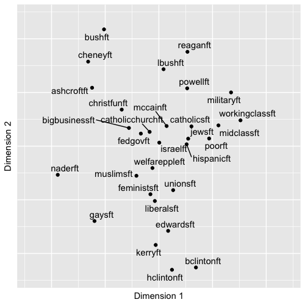
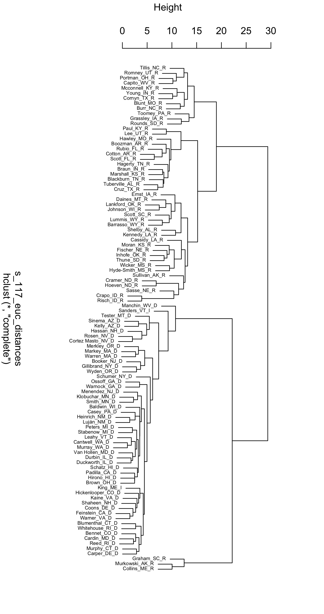

# Scaling and Clustering for Pattern Detection {#ch7}

Chapter \@ref(ch7) reviews the use of distance metrics for summarizing and exploring relationships between observations.  

## Learning objectives and chapter resources {-}

By the end of this chapter you should be able to: (1) describe conceptually the use of multi-dimensional scaling (MDS) as a tool for analyzing data; (2) prepare a data table and construct a matrix of Euclidean or Manhattan distance metrics; (3) apply functions for estimating and evaluating nonmetric MDS solutions; (4) interpret a measure of model goodness of fit; (5) contrast the use of distance metrics in MDS with hierarchical clustering; and (6) interpret a dendrogram. The material in the chapter requires the following packages: __smacof__ [@R-smacof], which will need to be installed, as well as __ggrepel__ [@R-ggrepel], and __tidyverse__ [@R-tidyverse]. The material uses the following datasets _poll_ft.csv_, _co_na_h_votes_117_wide.csv_, _co_117_euc_distances.csv_, and _s_memb_votes_117_wide.csv_ from <https://faculty.gvsu.edu/kilburnw/inpolr.html>.    

## Spatial politics and distance metrics {-}

We frequently conceptualize politics in spatial terms. The ubiquity of variations on the phrase 'liberal to conservative spectrum' captures this intuition. Spatial representations of politics are a kind of political science 'brand', encompassing how the discipline explains lines of political conflict through one- or two-dimensional figures [@Brady2011]. An analytic method for taking data and generating insight into spatial politics through visualization is multidimensional scaling (MDS) --- a technique closely tied to spatial theories of politics and one that political scientists have actively developed and refined  [@armstrong2020; @jacoby2014b; @bradycollier2011]. 

In Chapter \@ref(ch7), we review the use of MDS, along with a related method, cluster analysis. There are many varieties of these methods; our discussion is limited to an overview of nonmetric MDS [@rabinowitz1975] and 'hierarchical' clustering [@bartholomew2008]. While related, each provides distinctly different insight into the same data. We will review the conceptual foundations of MDS and cluster analysis with the creation of 'distance metrics', the primary data input for these procedures, followed by three examples. First, we will apply MDS to the spatial configuration of the American public's feelings toward political candidates and figures. Second, we will apply MDS to explore the spatial relationships between legislators in the U.S. Congress as revealed through roll call voting. Third, we will contrast the insights from MDS with a cluster analysis of the same data sources.  

## Introduction to multidimensional scaling

Multidimensional scaling \index{multidimensional scaling} procedures are a graphical, data visualization focused method of analyzing data. Often the purpose is exploratory, to observe patterns of similarity between subjects of political interest, such as the voting behavior of legislators or an electorates' feelings toward political figures. Just about any dataset composed of measures of a common set of observations could be analyzed through MDS, such as country-level measures of political and economic development. Whatever the input source data, the analytical output leads to a dimensional representation of the similarity among the observations.

An example of such a figure -- a typical product of an MDS analysis -- appears in Figure \@ref(fig:mdsfig1). The figure displays in two dimensions the patterns of feeling thermometer scores toward political figures and groups in the 2004 ANES survey; it is a typical 'output' of an MDS analysis, a two-dimensional scatterplot, given the input of individual-level thermometer scores. The figure shows the location of the subjects, where subjects grouped closer together elicited more similar feelings from the electorate.  Based on input matrix summarizing the patterns of dissimilarity between the feeling thermometer scores across the figures and groups, the MDS algorithm constructed a set of two-dimensional coordinates for each one, so that the coordinates mirror the dissimilarities \index{dissimilarities} as much as possible. 

```{R mdsfig1, echo=FALSE, out.width='80%',  fig.align='center', fig.cap="Nonmetric multidimensional scaling (MDS) plot of feeling thermometer ratings from the 2004 ANES survey, reduced to two dimensions. The plot arranges political figures and social groups based on similarity in respondents' ratings: groups with more similar ratings appear closer together. The familiar partisan and ideological fault lines of American politics emerge, with political figures clustering along ideological directions away from the center, where social groups tend to cluster.", fig.height=5, fig.width=5}

```
 
The MDS input data is a square matrix of dissimilarities, measures that quantify the degree of difference between objects of political interest, considered in pairs. A matrix of dissimilarity data from feeling thermometers could be measures that summarize how  differently the public feels toward political figures. There are two basic varieties of MDS procedures: metric and nonmetric.  A metric MDS procedure makes interval-level assumptions about the input dissimilarities, finding output distances that reflect the numeric score dissimilarities in the input data. A nonmetric MDS procedure makes only ordinal-level assumptions about the input dissimilarities. In effect the input dissimilarity scores between objects of interest are rank ordered, from least to most similar, and the algorithm finds an optimal translation of the rank-ordered dissimilarities into distances. Below I conceptually review the steps in a nonmetric MDS. A concise and technical introduction to metric and nonmetric is Jacoby [-@jacoby1991] or Jacoby and Ciuk [-@jacoby2018]. Nonetheless, both methods start with the construction of dissimilarity matrices. Two commonly used metrics for summarizing dissimilarities are Euclidean and Manhattan distances.   

## Euclidean and Manhattan distances

Perhaps the most common dissimilarity measure used in MDS is the Euclidean distance metric.\index{Euclidean distance} The distance measures the straight line path between two points in a multidimensional space. Figure \@ref(fig:eucliddiagram) illustrates a Euclidean distance between two points (or objects) in a two-dimensional space, X and Y. The Euclidean distance is based on the familiar Pythagorean theorem, $a^2 + b^2 = c^2$, describing the length of the hypotenuse of a right triangle on these two dimensions. Figure \@ref(fig:eucliddiagram) displays the Euclidean, straight line distance between the two points, calculated from the squared sum of the distances between each point on the X and Y dimensions. Working through the arithmetic in __R__ illustrates how it works.  

```{r}
sqrt((6-1)^2 + (5-2)^2)
```

The distance can be generalized to any number of dimensions and points. If we added a third point and a third dimension, identified _p_ , _q_, and _r_:

```{r}
p=c(6,5,7)
q=c(1,2, 10)
r=c(2,5, 12)
```

We can combine rows of the points together (`rbind()`) into a matrix _matx_ and apply the distance function `dist()` to calculate the Euclidean distance: 

```{r}
mat<-rbind(p,q,r)

mat 

dist(mat)
```

The result is a Euclidean distance matrix.  

```{r eucliddiagram, fig.height=5, echo=FALSE, warning=FALSE, message=FALSE, fig.cap="Euclidean distance formula and calculation of the distance between two points on two dimensions, X and Y."}
# library(ggplot2)
library(ggrepel)
library(gridExtra)
object1 <- c(1, 2)
object2 <- c(6, 5)

# scratch
##euclidean_distance <- sqrt(sum((object2 - object1)^2))
##distance_formula <- paste("Euclidean Distance =", round(euclidean_distance, 2))

# data
df <- data.frame(x = c(object1[1], object2[1]),
                 y = c(object1[2], object2[2]),
                 label = c("Object 1", "Object 2"),
                 coords = c(paste("(", object1[1], ",", object1[2], ")"),
                            paste("(", object2[1], ",", object2[2], ")")))

## Euclidean distance graphic -- concept and formula
euclidean1<-ggplot(df, aes(x = x, y = y)) +
  geom_point(size = 3) +
#  geom_label_repel(aes(label = label), size = 5, box.padding = 0.5) +
#  geom_text_repel(aes(label = coords), size = 3.5, box.padding = 0.1) +
  geom_segment(aes(xend = object2[1], yend = object1[2]), linetype = "dashed", alpha = 0.5) +
  geom_segment(aes(xend = object1[1], yend = object1[2]), linetype = "dashed", alpha = 0.5) +
  geom_segment(aes(x = object1[1], y = object1[2], xend = object2[1], yend = object2[2])) +
  xlim(0, 7) +
  ylim(0, 6)+
 # annotate("text", x = (object1[1] + object2[1])/2, y = (object1[2] + object2[2])/2,
 # label = distance_formula, fontface = "bold", size = 5, hjust = "left") +
  # title = "Euclidean Distance between two points, measured on two variables",
  theme_minimal() +
  labs(subtitle="Panel A: concept and formula",
       x = "X",
       y = "Y") +
geom_text(x = 2.7, y = 4.2, label = expression(paste ("d = ", sqrt(({x[2]} - {x[1]})^2 + ({y[2]} - {y[1]})^2)))) +
geom_text(x = 4, y = 1.7, label = expression({x[2]}-{x[1]}),size=3) +
geom_text(x = 6.4, y = 4, label = expression({y[2]}-{y[1]}),size=3) +
geom_text(x = 6, y = 5.55, label = expression(paste("(", ~ x[2], ",", ~ y[2], ")")), size = 3) +
geom_text(x = 1, y = 1.6, label = expression(paste("(", ~ x[1], ",", ~ y[1], ")")), size = 3) 
  
## Old two lines below not working
#annotate("text", x=1, y=1.6, label=expression(paste( ,  , "(", ~ x[1], ",", ~ y[1], ")")),size=3) +
#annotate("text", x=6, y=5.55, label=expression(paste( ,  , "(", ~ x[2], ",", ~ y[2], ")")),size=3)

# Add the text annotation with parentheses and subscripts using geom_text()
#  geom_text(x = 6, y = 5.55, label = expression(paste("(", ~ x[2], ",", ~ y[2], ")")), size = 3)
# geom_text(x = 1, y = 1.6, label = expression(paste("(", ~ x[1], ",", ~ y[1], ")")), size = 3) +


## Euclidean distance graphic -- specific example
euclidean2<-ggplot(df, aes(x = x, y = y)) +
  geom_point(size = 3) +
  #  geom_label_repel(aes(label = label), size = 5, box.padding = 0.5) +
  #  geom_text_repel(aes(label = coords), size = 3.5, box.padding = 0.1) +
  geom_segment(aes(xend = object2[1], yend = object1[2]), linetype = "dashed", alpha = 0.5) +
  geom_segment(aes(xend = object1[1], yend = object1[2]), linetype = "dashed", alpha = 0.5) +
  geom_segment(aes(x = object1[1], y = object1[2], xend = object2[1], yend = object2[2])) +
  xlim(0, 7) +
  ylim(0, 6)+
  # annotate("text", x = (object1[1] + object2[1])/2, y = (object1[2] + object2[2])/2,
  # label = distance_formula, fontface = "bold", size = 5, hjust = "left") +
  theme_minimal() +
  labs(subtitle="Panel B: worked example",
       x = "X",
       y = "Y") +
geom_text(x = 2.7, y = 4.2, label = expression(paste ("distance = ", sqrt(5^2 + 3^2), " = 5.83"))) +
geom_text(x = 4, y = 1.7, label = "6 - 1 = 5", size=3) +
geom_text(x = 6.5, y = 4, label = "5 - 2 = 3", size=3) +
geom_text(x=6, y=5.45, label="(6,5)", size=3) +
geom_text(x=1, y=1.6, label="(1,2)", size=3)

grid.arrange(euclidean1, euclidean2, ncol = 1)
```
 

Another way of calculating the distance is via a Manhattan or 'city block' distance.\index{Manhattan distance} Figure \@ref(fig:manhattandiagram) displays how the Manhattan distance is calculated like walking city blocks, over and up or down. The Manhattan distance is the sum of the absolute difference between the dimensions. For the distance between _p_ and _q_ on the two dimensions, the difference calculated in __R__ is 8: `abs(6-1) + abs(5-2)`. Adding a `distance="manhattan"` argument to `dist()` creates the distances for _matx_:

```{r}
dist(mat,  method="manhattan")
```

```{r manhattandiagram, fig.height=5, echo=FALSE, warning=FALSE, message=FALSE, fig.cap="Manhattan 'city block' distance formula and calculation of the distance between two points on two dimensions, X and Y."}
# library(ggplot2)
library(ggrepel)
library(gridExtra)
object1 <- c(1, 2)
object2 <- c(6, 5)

# scratch
##euclidean_distance <- sqrt(sum((object2 - object1)^2))
##distance_formula <- paste("Euclidean Distance =", round(euclidean_distance, 2))

# data
df <- data.frame(x = c(object1[1], object2[1]),
                 y = c(object1[2], object2[2]),
                 label = c("Object 1", "Object 2"),
                 coords = c(paste("(", object1[1], ",", object1[2], ")"),
                            paste("(", object2[1], ",", object2[2], ")")))

## Euclidean distance graphic -- concept and formula
euclidean1<-ggplot(df, aes(x = x, y = y)) +
  geom_point(size = 3) +
  geom_segment(aes(xend = object2[1], yend = object1[2]), ) +
#  geom_segment(aes(xend = object1[1], yend = object1[2]),  ) +
# no effect  geom_segment(aes(x = object1[1], y = object1[2], xend = object2[1], yend = object2[2]), linetype = "dashed" ) +
  xlim(0, 7) +
  ylim(0, 6)+
 # annotate("text", x = (object1[1] + object2[1])/2, y = (object1[2] + object2[2])/2,
 # label = distance_formula, fontface = "bold", size = 5, hjust = "left") +
  # title = "Euclidean Distance between two points, measured on two variables",
  theme_minimal() +
  labs(subtitle="Panel A: concept and formula",
       x = "x",
       y = "y") +
geom_text(x = 2.7, y = 4.2, label = expression(paste ("d = ", abs({x[2]} - {x[1]}) + abs({y[2]} - {y[1]})))) +
geom_text(x = 4, y = 1.7, label = expression({x[2]}-{x[1]}),size=3) +
geom_text(x = 6.4, y = 4, label = expression({y[2]}-{y[1]}),size=3) +
geom_text(x=1, y=1.6, label=expression(paste( ,  , "(", ~ x[1], ",", ~ y[1], ")")),size=3) +
geom_text(x=6, y=5.55, label=expression(paste( ,  , "(", ~ x[2], ",", ~ y[2], ")")),size=3)


## Euclidean distance graphic -- specific example
euclidean2<-ggplot(df, aes(x = x, y = y)) +
  geom_point(size = 3) +
  #  geom_label_repel(aes(label = label), size = 5, box.padding = 0.5) +
  #  geom_text_repel(aes(label = coords), size = 3.5, box.padding = 0.1) +
  geom_segment(aes(xend = object2[1], yend = object1[2]) ) +
#  geom_segment(aes(xend = object1[1], yend = object1[2]) ) +
#  geom_segment(aes(x = object1[1], y = object1[2], xend = object2[1], yend = object2[2])) +
  xlim(0, 7) +
  ylim(0, 6)+
  # annotate("text", x = (object1[1] + object2[1])/2, y = (object1[2] + object2[2])/2,
  # label = distance_formula, fontface = "bold", size = 5, hjust = "left") +
  theme_minimal() +
  labs(subtitle="Panel B: worked example",
       x = "x",
       y = "y") +
 geom_text(x = 2.7, y = 4.2, label = expression(paste ("distance = ", abs(6-1) + abs(5-2), " = 8 "))) +
 geom_text(x = 4, y = 1.7, label = "6 - 1 = 5", size=3) +
 geom_text(x = 6.5, y = 4, label = "5 - 2 = 3", size=3) +
 geom_text(x=6, y=5.45, label="(6,5)", size=3) +
 geom_text(x=1, y=1.6, label="(1,2)", size=3)

grid.arrange(euclidean1, euclidean2, ncol = 1)
```

Instead of abstract points, in an MDS analysis, distance matrices are created with measurements on political objects of interest --- for example, for feeling thermometers, the dimensions (like X and Y) are each a survey respondent's rating of a candidate, or for legislators, the dimensions are the roll call votes. Give a matrix of dissimilarity, the MDS algorithm translates the dissimiliarities into distances. 

In a nonmetric MDS, the algorithm accounts for the ordinal arrangement of the dissimilarities starting with "target distances" (or "disparities"), the  distances that the algorithm tries to reproduce in the low-dimensional space. The target distances are a new distance matrix, one that preserves the rank order of pairs of objects in their similarity, but not necessarily the exact numerical value of the original matrix of distances. The goal is to find a one- or two-dimensional configuration of the points (as the output visualization) where the actual distances between points closely approximate these target distances. The algorithm focuses on preserving the rank order of the dissimilarities, ensuring that objects perceived as more similar remain closer together in the plot. The fit of the model is evaluated using the function applied by the algorithm to find the configuration, referred to as the "Stress function", \index{Stress metric} which measures the degree of mismatch between the actual distances and the disparities, with lower stress indicating a better fit. The fit statistic is discussed further below. For now, we will work through an example in __R__. 

## Scaling feelings toward political figures and groups

We will work through an example of an MDS analysis of feeling thermometer \index{feeling thermometer} scores *poll_ft.csv*, to illustrate how the procedure works. To begin, we will load two packages, __tidyverse__ and __ggrepel__ (for labeling graphics), then read in the dataset and store it as object _polfigures_. We use the `read_csv()` function from the __tidyverse__ package:   

```{r message=FALSE, warning=FALSE}
library(tidyverse)
library(ggrepel)
```

```{r echo=FALSE, warning=FALSE, message=FALSE}
polfigures<-read_csv(file="data/ch7 data/poll_ft.csv")
```

```{r eval=FALSE}
polfigures<-read_csv(file="poll_ft.csv")
```

Once it is stored as _polfigures_, we will remove the columns that do not contain feeling thermometer scores, to simplify the process of applying a distance metric to the data. 

```{r}
polfigures<- polfigures %>%
  select(-gender, -campint, -fair, -prezapp, -libcon, -party, -partyid, 
         -race, -conservatives, -abor, -educ)
```  

```{r}
polfigures
```

Now the dataset consists solely of 30 feeling thermometer scores, queried from the 1,212 respondents to the 2004 ANES survey, a representative cross-section of the U.S. citizenry, 18 years of age or older by the November 2004 election day. (See the Appendix for data details.) The scores for each political figure or social group is rated on the feeling thermometer scale from 0 to 100, the figure of group identified by name, such as _reaganft_ for Ronald Reagan. Missing values, _NA_, correspond to "don't know" type responses or any other reason in which a rating was not recorded. Observing the first five rows and columns: 

```{r}
polfigures[1:5, 1:5]
```

The `dist()` \index{\texttt{dist()}}function to create the summary distance measures between the candidates requires the input matrix to be transposed from its current form. The candidates are currently on the columns, and survey respondent raters are on the rows. The function requires that the 'stimuli', the objects to be assessed for differences, appear on the rows. A transpose function `t()` will switch rows and columns: 

```{r}
t(polfigures[1:4, 1:4])
```
The transpose `t()` \index{\texttt{t()}} function is necessary to transpose the input dataset, moving column (candidates) to rows and each survey respondent to the columns. 

Notice the _NA_ value _naderft_ from the survey respondent in the second column.  The `dist()` function handles missing values by simply dropping any pairwise comparisons that involve _NA_ values. So for example, across the first four survey respondents or 'dimensions' of comparison, the Euclidean distance between _naderft_ and _kerryft_ is $\sqrt{(85-0)^2 + (50-50)^2 + (60-60)^2}$, dropping from the calculation the undefined difference between $(85-$_NA_$)^2$. From among these four survey respondents, the distance between _naderft_ and _kerryft_ would be based on comparisons between three respondents, while comparisons between _kerryft_ and _bushft_ for example would be based on all four. In addition to dropping any pairwise comparisons involving an _NA_ value, the `dist()` function also applies a scaling adjustment to any distance calculations in which the number of pairwise comparisons used are less than the total possible number of comparisons. 

To observe how the scaling adjustment works, we will apply the `dist()` function to this $4 \times 4$ subset of the data. 

```{r}
dist(t(polfigures[1:4, 1:4]))
```

Notice in the matrix of distances, the Euclidean distance between _kerryft_ and _naderft_ is 98.14955. This distance differs from the result of 85 from `sqrt((85-0)^2 + (50-50)^2 + (60-60)^2)`. The difference is accounted for by the adjustment factor, $\sqrt{\frac{n}{k}}$, where $n$ is the total possible number of comparisons, the total number of 'dimensions' or respondent ratings if there were no _NA_ values. Then $k$ is the number of non-*NA* comparisons. The weight is multiplied by the Euclidean distance; for the distance between _kerryft_ and _naderft_ for these four survey respondents, the scaled distance  would be $\sqrt{\frac{4}{3}} \times 85$, or

```{r}
sqrt((4/3))*85
```

The result matches the distance in the matrix of six entries on the four columns from the `dist()` function. With the full matrix of scores, we apply the transpose function inside the `dist()` function to create the input distance matrix.  The result is stored as _dissimat_: 

```{r}
dissimat<-dist(t(polfigures))
```

The result is a 'distance object', _dissimat_, a $30 \times 30$ matrix containing (by default) Euclidean distances between each feeling thermometer subject. While the default is Euclidean distance, it can be changed with the `method=` argument, such as `dist(t(polfigures), method='manhattam')`. Researchers usually refer to these matrices as 'dissimilarity matrices' or 'dissimilarity measures' to avoid confusion with the output of an MDS algorithm, a visualization translating these dissimilarities into distances in the visualization. 

To view a snippet of the dissimilarity matrix, \index{dissimilarity matrix}we first convert it to a matrix and then view the first few rows and columns:

```{r}
dissimat_matrix<-as.matrix(dissimat)

dissimat_matrix[1:5, 1:5]
```

The subscripts `[1:5, 1:5]` refer to row and column `[r, c]` selections, selecting the first through fifth row. The matrix is symmetric and the main diagonal entries displaying the distance from one political figure on a column to the same political figure on the row is, of course, 0. Across the first row, the distance between _bushft_ and _kerryft_ is 1878.63. The distance between _cheneyft_ and _bushft_ is 782.869.  Again, these are the scaled distances between pairs of feeling thermometers, calculated across all available pairs of non- _NA_ feeling thermometer scores.  

The object `dissimat` is the input into the MDS algorithm that translates these dissimilarities into distances.  Using the __smacof__ package [@R-smacof], the `mds()` \index{smacof R package| \texttt{mds() }}function will find a set of output coordinates for the input dissimilarity matrix, for a given number of dimensions. The function requires that we specify the input matrix (in this example, `dissimat`), the number of dimensions (`ndim=`) and for a nonmetric MDS, `type="ordinal"`. \index{nonmetric MDS} Install the package if necessary, `install.packages("smacof")`.  

```{r message=FALSE, warning=FALSE}
library(smacof)
```

The results will be stored as object _nmds_results_:

```{r}
nmds_results<-mds(dissimat, ndim=2,  type="ordinal") 
```

Typing the name of the object _nmds_results_ reveals details about how the algorithm, in particular a measure of 'badness of fit', which we will review further below.  The main result of the `mds()` function is the set of dimensional positions of the feeling thermometers, which is stored as the configuration of points, _nmds_results$conf_. Typing this object out, or viewing the top six rows with `head()`: 

```{r}
head(nmds_results$conf)
```

The output displays the positions of the thermometer objects, political figures and groups, on the two dimensions, labeled _D1_ and _D2_. Visualizing these configurations is the end goal of the MDS, so the next step is to save the configurations to a dataframe  and visualize it:

```{r }
nmds1<-as.data.frame(nmds_results$conf)
```

As a dataframe, it is organized into rows and columns: 

```{r}
head(nmds1)
```

Note the dataframe contains row names of the thermometers rather than a column within the dataframe; these are row names, stored as `row.names()` within it. The results plotted as points with the label row names in `ggplot()`. Figure \@ref(fig:mdsfig1) displays the MDS algorithm's solution to the problem of finding an arrangement of the feeling thermometers in a two-dimensional X - Y plot, so that the relative distances between each of the points preserves as much as possible the rank order of the disparities calculated from the matrix of Euclidean distances. The `ggplot()` code to generate the figure appears below. The graphic suppresses the numeric placeholders for the  scaling solution, as the coordinates of the points do not have inherent meaning on their own. 

```{r eval=FALSE}
ggplot(nmds1) +
  geom_point(aes(x=D2, y=D1)) +
  geom_text_repel(aes(x=D2, y=D1, label=row.names(nmds1))) +
  scale_y_continuous(limits = c(-1.2, 1.2))+
  scale_x_continuous(limits=c(-1.2, 1.2))+
   labs(x = "Dimension 1", y = "Dimension 2") +
    theme(axis.text.x = element_blank(), 
          axis.ticks.x = element_blank() )+ 
    theme(axis.text.y = element_blank(), 
          axis.ticks.y = element_blank() )
```

The figure visualizes the extent to which figures and groups tend to elicit similarly warm or cool feelings; figures such as these date back to the first thermometer items included in the ANES; for example, see Rusk [-@rusk1972]. In interpreting MDS solutions, the key is the relative spacing of the points, the direction or clustering of points --- and not to focus exclusively on the movement along the X and Y axes defined in the graphic. Overall, the arrangement in Figure \@ref(fig:mdsfig1) reflects a familiar clustering of groups and figures associated with the 'left', 'right' and the Democratic and Republican parties, respectively. 

As a map of the electorate's feelings toward figures and groups, clearly there are clusters of Democratic and Republican figures anchoring the upper and lower portions of the graph, perhaps reflecting a partisan ideological dimension of comparison. There are clusters within these regions of the graph, figures and groups associated together, such as the upper-left quadrant clustering Bush, Cheney, Ashcroft, and "Christian Fundamentalists". The social groups tend to cluster in the middle of the graph, perhaps reflecting a lack of polarized feeling toward each. Note that because the interpretation is about the relative position of the points toward each other, the points can be rotated geometrically around the graph if it helps interpretation; scaling texts such as Armstrong and Bakker [-@armstrong2020] and Jacoby [@jacoby1991] explain how. 

### Assessing MDS model fit {-}

Before presenting the analysis of roll call votes, there are two additional concerns that must accompany any MDS analysis: how 'good' of a fit is the dimensional arrangement of observations? And how many dimensions should be visualized? The "Stress" measure \index{Stress metric} of model fit, and an additional figure -- a "Shepard diagram" --- help to answer these questions. 

The Stress statistic, often referred to as "Stress type 1" to differentiate it from other measures is a standard for assessing how well a visual configuration of the observations reflects the dissimilarity input matrix [@bartholomew2008]. While not technically an average, it can be interpreted as the average deviation between the disparities and the fitted distances in the figure. Typing the name of the MDS object, _nmds_results_, reveals the Stress measure and the basic configuration of the model. 

```{r}
nmds_results 
```
The Stress measures how well the distances in the solution match the dissimilarities from the input data. It ranges from 0 to 1, where lower values indicate better fit, thus it is a 'badness of fit' measure. If the arrangement of the fitted distances between the thermometers in the one- or two-dimensional space perfectly reflects the rank=ordered distances of the thermometers in the input matrix, then the Stress value would be 0, a perfect fit. From there, some guidelines are .05 is a "good" fit, while .2 or higher is a "poor" fit [@bartholomew2008]. There is a tradeoff between better fit through higher dimensionality versus interpretability. In the example of the feeling thermometers, the Stress value shows a good fit, which could be improved with an additional dimension at the expense of parsimony.  Researchers typically plot configurations of one to two dimensions [@jacoby2018]. 
 
### Shepard diagrams {-}

A Shepard diagram \index{Shepard diagram} is a diagnostic scatterplot for assessing the fit of an MDS  [@shepard1962]. The plot displays information about the fit between the observed dissimilarities or disparities (the input data) and the fitted distances (the output figure). For each pair of points, on the X-axis the figure plots the original dissimilarities or disparities, the 'target distances' that represent the ordinal rank order of similarity between the pairs. The Y-axis plots the fitted distances. If the model fits perfectly --- fitted distances match dissimilarities exactly -- the points would line up on a straight 45-degree diagonal line from the origin.

The `plot()` \index{\texttt{plot()}} function extracts the information from _nmds_results_ , specifying `plot.type="Shepard"`.   

```{r shepfig, warning=FALSE, message=FALSE, fig.cap="Shepard diagram for the nonmetric multidimensional scaling (MDS) solution of feeling thermometer ratings from the 2004 ANES,  in two dimensions. The plot compares original dissimilarities to the distances in the MDS configuration."}
plot(nmds_results , plot.type="Shepard")
```

In Figure \@ref(fig:shepfig), the diagram displays in gray points measurements on pairs of points, the input dissimilarities on X and the fitted distances in the output on Y.  As would be expected from a Stress statistic of .092, the fit is not perfect, but the model fits somewhat well, with points clustered along the 45-degree line, although clearly for lower dissimilarities the fit is worse.  The spread of points at the lower left side of the graph corresponds to the difficulty in scaling distances over two dimensions for the points with low dissimilarity. With less spread, as dissimilarity increases, fit improves.  This contrast makes sense, given that for social groups scaled relatively close together, the algorithm was less successful in finding an optimal arrangement of the points, compared to the more polarizing  cluster of political figures toward the edges of the output visualization.  

The black points on the Shepard diagram represent the transformed dissimilarities, or disparities, which serve as the target distances for the MDS algorithm. These points reflect the idealized monotonic fit, preserving the rank order of the original dissimilarities. Notice that, from left to right, the black points either increase or remain constant, but never decrease, ensuring the monotonic relationship. Similar to the imaginary 45-degree line in metric MDS, the grey points, which represent the actual distances in the low-dimensional solution, should lie as close as possible to the black points for a good fit. The components of a Shepard diagram can be recovered from the MDS solution object, _mdsgroup_results_ contains additional information about the MDS solution, accessible as "variables" within the object `names(mdsgroup_results)`, with `$` and the specific item. See the documentation for the __smacof__ package.  
 
## Scaling roll call votes in the US Congress

Voting in legislatures is central to the study of politics. Models of voting behavior have a lengthy history in political science [@poole2005].  Roll call votes \index{roll call votes} in US Congress are votes in which each member's position ('yea', 'nay', or 'present') is individually recorded, for everything from motions and amendments to votes on final passage of legislation. The recorded votes are entered into the official Congressional Record. Interest groups base their ratings of legislators on these votes. The most prominent estimates of legislator ideology, 'DW-NOMINATE' scores, are based on roll call votes [@poole2005]. We will analyze votes from an MDS perspective, to visualize patterns of voting -- differences between party caucuses and individual members.  
 
Roll call votes are from the 117th US Congress (2021 to 2023). We first work through the process of tidying the data to prepare a matrix of votes for the `mds()` algorithm. While useful for practicing data skills, this step can be skipped, and the matrix of votes can be downloaded directly from the textbook's website. Or, to practice data tidying and MDS analysis skills, download the full datafiles from Voteview.com \index{Voteview.com} [@lewis2023]. For each Congress, Voteview organizes the data into three files: one for the voting records, a second for the members, and a third for descriptions of the roll call votes. We will first work with the votes and members' data, then the roll calls to find specific type of legislation. The two datasets used to create the matrix of votes are  _HS117_votes.csv_ and  _HS117_members.csv_, both of which include the House and Senate. 

We will first work with Euclidean distances, and to keep the data manageable at first limit it to the Colorado delegation, then examples with the full House and Senate, illustrating properties of the Manhattan distance metric. Either start with the Voteview datafiles, or skip below to the matrix `mds()` input files beginning with _co_117_euc_distances.csv_. 

Read in the votes data:
```{r eval=FALSE, warning=FALSE, message=FALSE}
HS117_votes<-read_csv(file="HS117_votes.csv")
```

```{r echo=FALSE, warning=FALSE, message=FALSE}
HS117_votes<-read_csv(file="./data/ch7 data/HS117_votes.csv")
```

Familiarize yourself with the contents of it. We subset it to four columns: 

```{r}
HS117_votes <- HS117_votes %>%
  select(chamber, rollnumber, icpsr, cast_code)
```

Next we recode the numeric values for the 'yeas', 'nays', present, and absent votes. The 'nays' are scored at 0, 'yeas' at 1, and to make it easier to recall, 5 for present and 10 for absent.  

```{r}
HS117_votes <- HS117_votes %>%
  mutate(cast_code = case_when(
    cast_code==6 ~ 0,
    cast_code==1 ~ 1,
    cast_code==7 ~ 5,
    cast_code==9 ~ 10))
```

Try `table(HS117_votes$cast_code)` to observe the values for votes cast. Next we read in the data on members:

```{r eval=FALSE}
HS117_members<-read_csv(file="HS117_members.csv")
```

```{r echo=FALSE, warning=FALSE, message=FALSE}
HS117_members<-read_csv(file="./data/ch7 data/HS117_members.csv")
```
The data table contains demographic information about each member, as well as an ideology score [@poole2006]. The key field in the members' data is a unique identifier for each member, _icpsr_. The member data needs to be merged with the votes. We want, for each row of votes in _HS117_votes_, to have the member information appended as additional columns matched to _icpsr_. We use a `right_join()` \index{dplyr R package (tidyverse)| \texttt{right\_join() }} function to merge the votes and members, saving the new merged dataset as _hs_memb_votes_117_.  

```{r warning=FALSE, message=FALSE}
hs_memb_votes_117 <- HS117_members %>%
  select(icpsr, bioname, state_abbrev, party_code) %>%
  right_join(HS117_votes, by="icpsr") %>%
  select(chamber, bioname, party_code, state_abbrev, 
         cast_code, rollnumber, icpsr)
```

In the language of mutating joins in the _tidyverse_ [@wickham2016], _HS117_members_ is the X, and _HS117_votes_ is the Y. So we would like X matched to Y. There are multiple matches from member information to their row-wise record of votes, identified by _icpsr_. So a warning message will appear letting us know that these multiple matches did in fact occur. 

The Voteview data includes mock votes from public positions taken by presidents. Inspect the dataset to observe the presidents in the first few rows.  We will remove the presidents: 

```{r}
hs_memb_votes_117 <- hs_memb_votes_117 %>%
  filter(state_abbrev!="USA")
```

Then we create a new dataset for House votes: work with votes from the House, extracting the _House_ chamber votes to save it as _h_memb_votes_117_. 

```{r}
h_memb_votes_117 <- hs_memb_votes_117 %>%
  filter(chamber=="House") %>% 
  select(-chamber)
```

In the House, there are 996 possible votes they could have taken. (Enter `table(h_memb_votes_117$bioname)` to observe the count of Representatives and votes. We want to limit the data to just those representatives serving a full term. So we filter the data to all representatives with exactly 996 rows: 

```{r}
h_memb_votes_117 <- h_memb_votes_117 %>%
  group_by(bioname) %>%
  filter(n() == 996) %>%
  ungroup()
```

To limit the data and make it more manageable for learning MDS, we subset it to Colorado:

```{r}
co_h_votes_117<- h_memb_votes_117 %>%
  filter(state_abbrev=="CO")
```

Enter _co_h_votes_117_ at the prompt to familiarize yourself with it. For labeling the output we need to create a simple label with name, party, and State, which we will use with the entire House and Senate as well.  
We use the `separate()` \index{stringr R package (tidyverse)| \texttt{separate()} } function on the _bioname_ column, specifying the `sep=", "` as the place to separate the name. Notice the white space after the comma, which prevents a leading white space appended to the first name; `remove=FALSE`.   

```{r}
co_h_votes_117<- co_h_votes_117 %>%
  separate(bioname, c("last_name", "first"), sep=", " )
```

Now the _bioname_ column is separated into parts: 

```{r}
co_h_votes_117
```

Next we will change the _party_code_ to a "D" or "R" and combine the _last_name_, _state_abbrev_, and _party_code_ together, and then drop the remaining _first_ and _icpsr_ columns: 

```{r}
co_h_votes_117<- co_h_votes_117 %>%
  mutate(party_code = case_when(
    party_code == 100 ~ "D", 
    party_code == 200  ~ "R"))  %>%
  unite(name, c("last_name", "state_abbrev", "party_code")) %>%
  select(-first, -icpsr)
```

At this point we have to decide how to handle the votes cast that are not 'yeas' and 'nays', the problem being that there is no order or at least ordinal scale that links these votes with a vote of 'present' or an absence from voting. --A vote of 'present' or an absence is not meaningfully higher or lower than the 'yeas' and 'nays'.

```{r}
co_h_votes_117  %>%
  count(cast_code) %>%
  mutate(prop. = n / sum(n)) 
```

There is only one 'present' vote, and 116 absences, about 1.6 percent of the total. We could count up presences and absences by Representative: 

```{r}
co_h_votes_117 %>%  
  group_by(name) %>%
  summarize(summary_absences = sum(cast_code == 10, na.rm = TRUE)) %>%
  arrange(desc(summary_absences))
```

Or change the _cast_code_ to _5_ to observe Boebert cast the lone 'present'.

We will calculate the distance metrics between the Representatives while converting the 'present' (*5*) and absent (*10*) votes to _NA_ values:  

```{r}
co_na_h_votes_117 <- co_h_votes_117 %>%
  mutate(cast_code = case_when(
    cast_code %in% c(5, 10) ~ NA,
    TRUE ~ cast_code))
```

Inspect the dataset to observe the _NA_ values.  Next we pivot the data, converting it from long format to wide format with `pivot_wider()` \index{dplyr R package (tidyverse)| \texttt{pivot\_wider()} } from the __tidyverse__.  

```{r}
co_na_h_votes_117_wide<-co_na_h_votes_117 %>%
  pivot_wider(values_from = cast_code, names_from = rollnumber)
```

Before continuing, take time to observe the structure of the data `co_na_h_votes_117_wide` in wide format, and think ahead to how the distance metric will handle missing values _NA_. For example, enter `co_na_h_votes_117_wide %>% select(1:11)` and observe that Buck has a missing _NA_ value in roll call vote 10.  In calculating the distances between the Representatives, all comparisons with Buck will ignore roll call vote 10. For all other distances between Representatives, across the 10 votes, each will be included in the distance calculation. Across all votes, if two Representatives have any _NA_ values in the votes being compared, only that specific distance calculation involving an _NA_ value will be excluded, with all others included.  With the wide dataset, to prepare it for the distance calculations, next we move the _name_ variable to the defined names of the rows (in place of numbered row names), which will be necessary for identifying the representatives in the measure of dissimilarity and then the output visualizations. 

```{r}
co_na_h_votes_117_wide <- co_na_h_votes_117_wide %>% 
  column_to_rownames(var="name")
```

With the Representatives on row names and votes organized across columns, we can calculate and compare two different distance metrics, Euclidean and Manhattan:

```{r}
co_117_euc_distances<-dist(co_na_h_votes_117_wide, method="euclidean")
```

The Euclidean distances are the following: 

```{r}
co_117_euc_distances
```

The matrix hints at the furthest 'right' Representative being Boebert, who is the most distant from Colorado Democrats.  The Democrats have relatively close distances.  Compare this matrix with the Manhattan distances: 

```{r}
co_117_man_distances<-dist(co_na_h_votes_117_wide, method="manhattan")
```

```{r}
co_117_man_distances
```

Because the data includes _NA_ values, the Manhattan distances are not whole numbers, distances with the scaling factor applied to each calculation.  If calculated without the scaling factor, a Manhattan distance has an interesting interpretation. Since the Manhattan distance sums the absolute difference between each roll call vote scored 0 'nay' and 1 'yea', the unadjusted Manhattan distance counts the number of votes where two legislators differ.  If two legislators cast a different 'yea' or 'nay' on 300 votes, their Manhattan distance would be 300. 

We can compare the scaled up Manhattan distances with the distances calculated on the votes not containing any missing values, by selecting out each of those columns: 

```{r}
co_117_man_comp_distances <- co_na_h_votes_117_wide %>%
  select_if(~ all(!is.na(.))) %>%
  dist(method="manhattan")
```

The line `select_if()` \index{dplyr R package (tidyverse)| \texttt{select\_if()} } function is applied to a "formula" `~ all(!is.na(.))`, selecting any column that does not contain a _NA_. The `.` dot refers to the current column `select_if()` is working through to find _NA_ values --- and selecting all that do not `is.na(.)` contain any _NA_ values.  

```{r}
co_117_man_comp_distances
```

The distances, in whole numbers, measure the number of votes differing between each legislator. We will compare a one-dimensional representation of the voting similarity between the Euclidean and the unscaled up whole number Manhattan distances. First the Euclidean distances, storing the results in _co_h_117_euc_mds_: 

```{r}
co_h_117_euc_mds<-mds(co_117_euc_distances, ndim=1, type="ordinal")
```

Stress shows an excellent one-dimensional fit of .0027. (Type `co_h_117_euc_mds$stress`). We store the coordinates _co_h_117_euc_mds$conf_ as a dataframe, apply and clean up the labels for each representative, then graph the result: 

```{r}
co_mds_df_euc <- as.data.frame(co_h_117_euc_mds$conf) %>%
  rownames_to_column(var = "name") %>%
  mutate(name = str_remove_all(name, "_CO")) 
```

In the second line, the row names are moved to a column; in the third, the _name_ column is edited with `str_remove_all()` \index{stringr R package (tidyverse)| \texttt{str\_remove\_all()} } to find and delete each of the State identifiers "`_CO`". 

Then _co_mds_df_euc_ is fed into `ggplot()`. We use __ggrepel__ for the labels, like in the prior graphic. One change in the `ggplot()` \index{ggrepel R package| \texttt{geom\_text\_repel() }}is that in place of a variable for a second dimension, we specify `y=0`, since we want to visualize the points on a single dimension. The result appears in Figure \@ref(fig:comdseuc), which show that the Democrats from Colorado voted more cohesively than the Republicans.  Within the delegation, DeGette and Boebert had the most dissimilar voting records, and interpreting the distances in ideological terms both were the most liberal and conservative, respectively.  

```{r comdseuc, fig.cap="One-dimensional solution from multidimensional scaling of U.S. House roll call votes, Colorado delegation, 117th U.S. Congress, Euclidean distances.", fig.height=2 }
ggplot(co_mds_df_euc) +
  geom_point(aes(x = D1, y = 0)) +
  geom_text_repel(aes(x = D1, y = 0, label = name), max.overlaps = 7) +
  labs(x = "Euclidean distance-based ordering of votes", y = " ") +
    theme(axis.text.y = element_blank(), 
          axis.ticks.y = element_blank())
```

We can compare the dimensional solution and visualization from the Euclidean distances with the whole number Manhattan distances that count up the number of differences in votes ('yeas' versus 'nays') between them. We would repeat the process used to find and graph the Euclidean MDS solution. While this code is not evaluated, in this example the Manhattan distances would provide a practically identical one-dimensional visualization.  

```{r eval=FALSE, message=FALSE, warning=FALSE}
co_h_117_man_mds<-mds(co_117_man_comp_distances, ndim=1, type="ordinal")

co_mds_df_man <- as.data.frame(co_h_117_man_mds$conf) %>%
  rownames_to_column(var = "name") %>%
  mutate(name = str_remove_all(name, "_CO"))  
```  

Usually the dimensional graphics are visibly sensitive to the choice of distance metrics, although the general conclusions likely remain the same.  And with only seven objects, a single dimension fits the data well given the low Stress value.  Next, however, we will investigate votes in the U.S. Senate --- all 100 Senators --- and compare a one- and two-dimensional model fit.  We'll go back to the Senate data, and repeat the steps on the U.S. House data.  

### Scaling votes in the Senate  {-}

We start with the combined House and Senate data and select on the Senate chamber: 

```{r}
s_memb_votes_117 <- hs_memb_votes_117 %>%
  filter(chamber=="Senate") %>% 
  select(-chamber)
```

With the U.S. Senate votes saved in _s_memb_votes_117_, entering `table(s_memb_votes_117$bioname)`reveals that 949 roll call votes were taken, and that Vice President Harris cast two votes, along with temporary appointee from Georgia, Senator Loeffler. We will remove their two votes to limit the dataset to the elected Senators serving throughout the session of Congress. 

```{r}
s_memb_votes_117 <- s_memb_votes_117 %>%
 filter(bioname != "LOEFFLER, Kelly") %>%
 filter(bioname != "HARRIS, Kamala Devi")
```

Then we follow the same steps from the House votes to form the name-party-State variable and encode the _NA_ missing values for votes of 'present' and absences. One additional line is to change the _last_name_ of each Senator to title case and to code the two independent Senators as "I" for party affiliation:

```{r warning=FALSE, message=FALSE}
s_memb_votes_117<- s_memb_votes_117 %>%
  separate(bioname, c("last_name", "first"), sep=", " ) %>%
  mutate(last_name = str_to_title(last_name)) %>%
  mutate(party_code = case_when(
    party_code == 100 ~ "D", 
    party_code == 200  ~ "R",
    party_code == 328 ~ "I"))  %>%
  unite(name, c("last_name", "state_abbrev", "party_code")) %>%
  select(-first, -icpsr)  %>%
  mutate(cast_code = case_when(
    cast_code %in% c(5, 10) ~ NA,
    TRUE ~ cast_code))
```

Inspect _s_memb_votes_117_ to observe it matches the format of the House data. Next we pivot the data to wide format (saving it as _s_memb_votes_117_wide_) and move the _name_ column to the row names of the data table to feed into the `mds()` function. 

```{r}
s_memb_votes_117_wide<-s_memb_votes_117 %>%
  pivot_wider(values_from = cast_code, names_from = rollnumber) 
```

The data is pivoted, then we move the _name_ column to the row names: \index{tibble R package (tidyverse)| \texttt{column\_to\_rownames()}}

```{r}
s_memb_votes_117_wide<-s_memb_votes_117_wide %>%
  column_to_rownames(var="name")
```
 
Inspect the data table _s_memb_votes_117_wide_ to verify it matches the structure of the House votes data to create the distances. We will create a matrix of Euclidean distances, stored as _s_117_euc_distances_.

```{r}
s_117_euc_distances<-dist(s_memb_votes_117_wide, method="euclidean")
```

Like the House distance matrix, this matrix is calculated from each roll call vote without any 'present' or 'absences'. The distance object is too large to view as a whole, but to observe part of it, we can convert it to a matrix and view the first few columns and rows:

```{r}
temp_senate_matrix<-as.matrix(s_117_euc_distances)
temp_senate_matrix[1:5, 1:5]
```

```{r}
s_117_euc_mds<-mds(s_117_euc_distances, ndim=1, type="ordinal")
s_117_euc_mds$stress
```

The one-dimensional solution Stress is .024, suggesting a one-dimensional structure fits the pattern of 'yeas' and 'nays'. Next we convert it to a dataframe, bringing the row names to a column, then graphing it with `ggplot()`:\index{tibble R package (tidyverse)| \texttt{rownames\_to\_column()} }

```{r}
s_117_euc_mds <- as.data.frame(s_117_euc_mds$conf) %>%
  rownames_to_column(var = "name")  
```

Figure \@ref(fig:seucmds) visualizes the structure. Along a single dimension, Democrats are more closely clustered together, apparently voting with greater party discipline, than are Republicans.  The `geom_text_repel()` function labels observations where a given label fits, in this case pointing out the Republicans with more moderate voting records based on similarity of roll call votes. Inspect the individual scores for each Senator with `s_117_euc_mds %>% arrange(D1)`. 

```{r seucmds, warning=FALSE, message=FALSE, fig.cap="One-dimensional solution from multidimensional scaling of U.S. Senate roll call votes, 117th U.S. Congress, Euclidean distances.", warning=FALSE, message=FALSE, fig.height=2}
ggplot(s_117_euc_mds) +
  geom_point(aes(x = D1, y = 0)) +
  geom_text_repel(aes(x = D1, y = 0, label = name)) +
  labs(x = "Euclidean distance-based ordering of votes", y = " ") +
    theme(axis.text.y = element_blank(), 
           axis.ticks.y = element_blank())
```

We will investigate whether a two-dimensional representation provides any insight into voting patterns. We calculate the scores for each Senator on the two dimensions: 

```{r}
s_117_euc_mds2<-mds(s_117_euc_distances, ndim=2, type="ordinal")
s_117_euc_mds2$stress
```

The Stress improves only a negligible amount, suggesting little improvement in fit over two dimensions. We create the dataframe, and then feed it into `ggplot()` for the visualization. 

```{r}
s_117_euc_mds2<- as.data.frame(s_117_euc_mds2$conf) %>%
  rownames_to_column(var = "name")  
```

Figure \@ref(fig:seucmds2) depicts the two-dimensional MDS structure of roll call votes in the Senate. As in the last figure, the tick marks and numerical scaling are excluded with the code within `theme()`, to avoid giving the impression that the numeric scores have an underlying meaning tied to the points. 

```{r seucmds2, fig.cap="Two-dimensional solution from multidimensional scaling of U.S. Senate roll call votes, 117th U.S. Congress, Euclidean distances.", warning=FALSE, message=FALSE, fig.height=6}
ggplot(s_117_euc_mds2) +
  geom_point(aes(x = D1, y = D2)) +
  geom_text_repel(aes(x = D1, y = D2, label = name)) +
  labs(x = "Dimension 1", y = "Dimension 2") +
    theme(axis.text.x = element_blank(), 
          axis.ticks.x = element_blank())
    theme(axis.text.y = element_blank(), 
          axis.ticks.y = element_blank())
```

The two-dimensional results clearly show the same left to right difference observable on Dimension 1, with Collins, Murkowski, and Graham having the more centrist voting record along it. The two Senators Hawley and Sanders anchor both ends of the dimension. And of course the close clustering of Democrats reveals a high degree of party unity in voting, perhaps to be expected given their slim majority. And like the first, the second dimension shows distinct differences among Republicans.  On this second dimension, Graham anchors the bottom of the figure, followed by Tillis and Murkowski. Perhaps this dimension reflects a willingness to  vote against the party leadership.  Of course, the interpretation of the dimensions is necessarily impressionistic and somewhat subjective, and the arrangement of the points is dependent on the votes and the chosen distance metric. In presenting MDS results, researchers typically investigate the sensitivity of the results to the chosen metric.  

## Clustering feelings and votes

The term "Cluster analysis" \index{cluster analysis} refers to a wide range of analytical methods. Like MDS, it relies on distance metrics as a data input. Unlike MDS, however, rather than uncover a dimensional structure of the data, the purpose is to identify clusters or groups of similar political phenomena. A common approach to cluster analysis is hierarchical agglomerative clustering \index{hierarchical agglomerative clustering}(HAC) [@bartholomew2008], which is reviewed conceptually below.  

Cluster analysis, like MDS, starts with a matrix of distances to begin identifying clusters.  The typical end product of a cluster analysis is a specific visualization, a dendrogram, which displays the formation of clusters in a hierarchy of similarity. 

The 'agglomerative' term means that the clustering process is bottom-up, starting with the maximal number of clusters, then ending up with all observations combined into one cluster. The HAC algorithm proceeds in a series of steps: (1) each observation begins as its own cluster; (2) the algorithm merges the two closest clusters; (3) clusters become larger and are merged until all observations belong to a single cluster. The process of forming clusters yields overarching, 'hierarchical' clusters as the name implies. 
 
The algorithm's search for clusters requires specific rules for how it should join clusters together. At each step of the clustering process, the input distance matrix is reduced and recalculated among the clusters. The rules are often one of the following: "Single linkage": the distance between the two closest points in different clusters, "Complete linkage": the distance between the two farthest points in different clusters, or "Average linkage": the average distance between all pairs of points in two clusters. The rule for combining clusters determines how clusters are formed, so the results of any cluster analysis are sensitive to the type of linkage used; for an illustration of different linkage effects, see Gareth *et al* [-@gareth2013]. 

Hierachical AC is implemented with the `hclust()` \index{\texttt{hclust()}} function from the base __R__. The default linkage method is the complete linkage. To illustrate the interpretation of the analysis output, the dendrogram, we will start with the Colorado congressional votes. Given the Colorado matrix of Euclidean distances _co_mds_df_euc_, a HAC is: 

```{r}
hac<-hclust(co_117_euc_distances)

hac
```

### The dendrogram {-}

The results in _hac_ show that the default\index{dendrogram} complete linkage method was used; alternatives are specified with the argument `method=`, such as `method="single"` or `"average"`. The output is the dendrogram, accessible with the `plot()` function:

```{r hacdend, fig.cap="Dendrogram based on the Euclidean distance matrix of roll call votes cast by the Colorado delegation."}
plot(hac)
```

Figure \@ref(fig:hacdend) displays the resulting dendrogram. The diagram resembles a tree, with branches showing the sequence of cluster formations from pairs to larger group formations.  The vertical axis labeled "Height" refers to the distances at which the clusters merge; clusters joined together in branches at higher levels of height are less similar. At the bottom of the figure, the labels or 'leaves', show that at first, the algorithm identified pairs such as Neguse and DeGette, and given the odd number of representatives, one singleton, Lamborn.  Then in the next stage the algorithm clustered the four Democrats, then the three Republicans. The dendrogram provides a visual representation of similarity, while forming hierarchically larger (and less similar) groups.    <!-- This method, while relatively fundamental, is a simplified version of a more elaborate and theoretically grounded application of cluster analysis in Wolfson, Madjd-Sadjadi, and James [-@Wolfson2004].-->

To illustrate a more complex dendrogram, apply the `hclust()` function to the set of full Senate distances, _s_117_euc_distances_. 

```{r}
hac_s<-hclust(s_117_euc_distances)
hac_s
```

Plotting a legible dendrogram with 100 objects is not feasible as a small figure on a printed page. Try plotting it and adjust the size to make the labels visible, `plot(hac_s)`. Like any other data visualization in __R__, there are endless ways to customize the appearance of a dendrogram; packages to do so are reviewed at the end of the chapter. Figure \@ref(fig:dendosenate) displays a dendrogram with smaller text labels for the leaves, a suppressed title, and manually rotated, `plot(hac_s, cex=.5, main=NULL, xlab=" ")`. 

```{R dendosenate, echo=FALSE, out.width='100%', fig.cap="Dendrogram displaying the clusters of U.S. Senators in the 117th Congress, based on Euclidean distances of roll call votes."}

```

The Senate dendrogram provides a contrasting view of the patterns of roll call votes.  Unlike the MDS output, there is no underlying order, beyond similarity within pairs and the increasing hierarchy of larger clusters. Senators Murkowski and Collins pair together, and have a voting record dissimilar enough from other Senators that they are joined by Graham only in later state of clustering after other Senators have been paired into groups of a dozen or more. The party caucuses are divided in two, joined together only in the last stage of the clustering algorithm. Take some time to reflect on other aspects of the dendrogram that interest you. 

### General steps in scaling and clustering  {-}

A scaling and clustering analysis starts with a chosen dissimilarity matrix. While there is no one correct distance metric, different input metrics lead to different outputs. In the examples reviewed in this chapter, each of the measures forming the input matrix are on the same scale (0 - 100 degrees; 0 or 1), but in other cases where measures differ widely, standardization may be necessary. And some consideration should be given to the tradeoffs between the characteristics of different distance metrics given the research question [@gareth2013]. Next, decide on the number of dimensions for the MDS solution. Since the goal of the analysis is a visualization, usually researchers find arrangements for one or two dimensions, while checking the Stress statistic to observe how well the configuration represents the data. Once you have run the MDS algorithm, interpret the resulting configuration by focusing on the relative distances between points: look for spaces, clusters, and directions of points. Are there readily apparent clusters; which observations comprise the clusters, and what do the clustered observations have in common? Keep in mind that the axes in an MDS plot do not have an inherent meaning, and neither do the exact scores of the points on each axis.  Assess whether the MDS solution aligns with theoretical expectations or reveals meaningful patterns; in writing up results, include fit statistics and a sensitivity analysis.  In a cluster analysis the linkage method affects the formation of clusters, so researchers often try multiple linkage methods to observe how clusters form differently in a dendrogram. 

### Resources {-}

The package __unvotes__ [@R-unvotes] organizes votes of member states in the United Nations; the same analyses presented in this chapter could be applied to study patterns of country-level voting.  

The __wnominate__ [@Rwnominate] package estimates the ideological scores from roll call votes described in this chapter from Voteview.com.  It could be applied to votes from __unvotes__ or any legislative body. 

As explanatory visualizations, dendrograms are frequently 'pruned' (such as excluding one or two branches) or customized. Popular packages for customizing dendrograms include __dendextend__ [@galili2015] and __ggdendro__ [@R-ggdendro]. 

## Exercises

Knit your R code into a document to answer the following questions:

(1) Using the _polfigures.csv_ data, re-create the two-dimensional representation of the figures (and social groups) using Manhattan distances. How does the different metric change observations about the arrangement of figures and groups in the two-dimensional space? 
  
(2) Using _poll_ft.csv_, subset the data to just the feeling thermometer scores on social groups, with a command such as `socialgroups<-poll[,c(21:39)]`, limiting the data table to only social group feeling thermometers. Using this subsetted data, `socialgroups`, use `mds()` to represent the differences in group feelings within a one-dimensional space. How would you interpret the resulting arrangement of the figures?

(3) Import the _polfigures_ft.csv_ dataset, and create a one-dimensional figure based on Manhattan distances with MDS. Explain the code, each step in the analysis, and interpret the resulting figure.

(4) Pick a U.S. State with a relatively large delegation to the U.S. House of Representatives. Subset the 117th US Congress roll call voting data to this State and the House delegation. (If you have not already, you will need to download the original raw data from Voteview.com and follow the steps to tidy and subset the data.) Using cluster analysis, create a dendrogram visualizing similarity in voting across the delegation. Try an alternative linkage method to the default.  Explain the steps to create the dendrogram, and interpret the results. 

(5) Create a distance matrix on characteristics of the four country-level components of the Human Development Index in the file _hdi_2021.csv_ and visualize it. To construct the distance matrix, use the `scale()` function to create standardized z scores for each variable, prior to applying `dist()`. How do you interpret the figure? 
  
