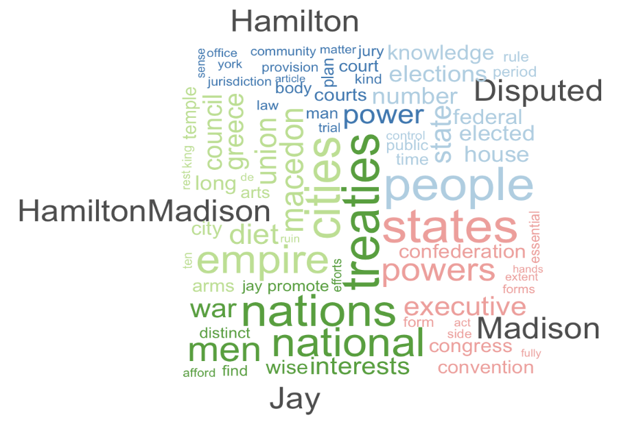

# Patterns in Text as Data {#ch8}

Chapter \@ref(ch8) introduces methods for quantifying relationships between texts and the thematic content of texts. 

## Learning objectives and chapter resources {-}

By the end of this chapter, you should be able to (1) import unstructured text data; (2) prepare a structured corpus and 'tokenized' text; (3) apply scaling and clustering methods to classify text documents by meta characteristic; (4) create word clouds to summarize thematic content; and (5) apply topic modeling to identify thematic content. The material in the chapter requires the **quanteda** [@R-quanteda; @benoit2018; @watanabe2023q] package and ancillary __quanteda.textstats__, along with __readtext__ [@R-readtext], __stopwords__ [@R-stopwords], and __seededlda__ [@R-seededlda], all of which will need to be installed individually. We will apply the __smacof__ package [@R-smacof] to scaling text data and rely on  __tidyverse__ [@R-tidyverse]packages including _stringr__ [@R-stringr] for data import, management, and visualization. The material uses the following datasets _federalist.zip_ and _reg_comments_sampled.csv_ from <https://faculty.gvsu.edu/kilburnw/inpolr.html>. 

## Text as data

In 1897 Wincenty Lutos\l awski, a Polish scholar of literary texts, published  _The Origin and Growth of Plato's Logic: With an Account of Plato's Style and the Chronology of His Writings_.^[I first learned of his work and the term "stylometry" from a lecture by Maciej Eder on his __stylo__ package [@R-stylo] at the Digital Humanities Summer Institute, University of Victoria, British Columbia, on June 10, 2016.] As implied by the title, Lutos\l awski found evidence to order by date Plato's dialogues, through the distinctive elements of Plato's writing style as it changed over time throughout his life [@lutoslawski1897]. Lutos\l awski \index{Lutos\l awski, Wincenty} measured Plato's writing style through counting variation in verb forms and various other parts of speech, coining the term "stylometry" \index{stylometry} to describe the systematic measurement of writing style. His theory --- that an individual author's distinctive writing style could be measured in part through word frequencies --- was remarkably prescient. 

While Lutos\l awski counted frequencies by hand, modern researchers use algorithms for the tedious work. Beyond simple counting, these algorithms classify texts based on stylistic characteristics, just as Lutosławski classified Plato's works into time periods. One enduring example of this is the analysis of the disputed authorship of _The Federalist_ papers [@mosteller1963], which we will investigate in this chapter. By leveraging computational tools, we can measure stylistic markers such as word frequencies to uncover patterns and relationships in texts. We will apply the scaling tools from Chapter \@ref(ch7) on texts to find evidence of authorship. 

The field of "text as data" \index{text as data} has rapidly grown in political science and other disciplines [@benoit2020]. The term refers to the process of treating written or spoken language—such as floor speeches in Congress, country statements at the United Nations, or local news stories—as quantifiable data. Researchers analyze patterns in texts to uncover insights into political behavior, public opinion, or social processes. A common approach involves analyzing word frequencies within and across documents, using these patterns to test hypotheses or discover relationships.

For example, political scientists might quantify the emotional sentiment of candidate statements by political party or assess the authorship of texts. These analyses often rely on computational methods to preprocess texts, breaking them into smaller units of analysis, such as individual words or phrases, a process known as "tokenization". \index{tokenization}Tokens, which may represent words, phrases, or even parts of speech, form the foundation for further analysis.

Two key distinctions in analyzing text as data shape how researchers approach their work. First, researchers study patterns in "function" words\index{function words} or "content" words\index{content words}.  Function words, such as pronouns, articles, and prepositions (e.g., "they," "the," "and," "in"), serve as the structural glue that holds sentences together. Content words, on the other hand, carry substantive meaning and include nouns, verbs, adjectives, and adverbs (e.g., "faction," "run," "beautiful," "quickly"). Function words are often used to explore stylistic features of texts, such as authorship or linguistic style, while content words are more useful for analyzing thematic content or topics.

Second, researchers approach these analyses from a "bag of words"\index{bag of words} or a "strings as words"\index{strings as words} approach.  In a bag of words approach, the order of words is disregarded.  Instead the occurrences of words, or co-occurrences across texts, are measured.  In the strings as words approach, the order of words is considered to assess patterns in their arrangement.  The bag of words approach is foundational in text analysis and forms the basis of the methods we will explore in this chapter.

The analysis within this chapter begins with _The Federalist_ papers, applying a bag of words approach to investigate the authorship of the texts. We will tokenize the documents, construct matrices of term frequencies and distances between papers, then apply the multidimensional scaling analysis from Chapter \@ref(ch7) to uncover patterns in authorship. We will see how Lutosławski's insights into writing style remain relevant in the modern era of computational text analysis. Then we will shift to methods for uncovering thematic content of _The Federalist_ and next the content of a bureaucratic regulation proposal affecting the interpretation of Title IX of US civil rights law. 

## Organizing text as data

In Figure \@ref(fig:wheelgraph) from Chapter \@ref(ch1), the process of data analysis involving "Transform" is especially important in text as data. Unstructured text data must be transformed into a structured format for analysis. A text document is imported into __RStudio__ and organized into different data structures for further analysis. Typically, this process means importing raw text data (plain text files ending with *.txt*) and then storing it within the __RStudio__ environment in a particular data structure. 

One commonly used data structure is a corpus object. A corpus\index{corpus} is a structured collection of text files that not only preserves metadata\index{metadata} (such as author, date, or source) but also facilitates access to the text for further processing. The next step is breaking the text into smaller analytical units known as "tokens"\index{tokens}. Tokens are typically words or word phrases, but they can also represent sentences or even parts of speech. A more precise term for tokens is n-grams\index{n-gram}, where "n" refers to the number of combined words. For example, a "1-gram" represents a single word, while a "2-gram" refers to a two-word phrase, such as "of the" or "it is." Tokenizing a corpus enables the measurement of term frequencies.

Once tokenized, the text can be organized into a document features matrix\index{document features matrix} (DFM), a foundational data structure for text analysis. In a DFM (also known as 'document term matrix'), rows correspond to n-grams (or tokens), columns represent documents in the corpus, and each cell contains the frequency of a term's occurrence within a specific document. This matrix provides a numerical representation of the text, which can be used for analyses based on the bag of words approach. In the examples below, we import text files, tokenize them, and construct term document matrices as a basis for further exploration and analysis.

### Importing text documents {-}

Text as data may often be organized as individual files, such as news media stories, debate transcripts, or court decisions --- one file per story, speech, or opinion.  For example, Project Gutenberg [-@projectgutenberg]\index{Project Gutenberg} or The Hathi Trust\index{The Hathi Trust} [-@hathitrust] are two sources for public domain text-based primary sources. We will import _The Federalist_ papers in individual text file format, then review more familiar methods of working with text data in CSV format. 

The _Federalist_ papers were a set of 85 essays written by John Jay\index{Jay, John}, Alexander Hamilton\index{Hamilton, Alexander}, and James Madison\index{Madison, James}, published under the pen name 'publius'\index{publius} in New York newspapers from the years 1787 to 1788.  In defense of the institutional arrangements of the new _Constitution_ proposed in the summer 1787 Philadelphia convention, Jay wrote numbers 2-5 and 64, while most were written by Hamilton and Madison individually, and as co-authors numbers 18-20.  The set of papers with disputed authorship --- either Hamilton or Madison --- are numbers 49-57, 62, and 63. 

Download the set of _Federalist Papers_. The _.zip_ file contains individual text files for each one. We will use the function `readtext()` from the __readtext__ package to import the documents, which will organize the text documents into a dataframe. Unzip the folder of _Federalist_ papers and observe how each one is saved as a separate text file. The _Federalist Papers_ filenames are organized with the number of the essay first, separated by an underscore, then the known or disputed author.  For example, _Federalist_ 1 is titled _01_Hamilton.txt_. 

To read in all text documents within a working directory, the function would be `readtext("*.txt")`.  The character `*` in `readtext()` \index{readtext R package| \texttt{readtext() }} is a "wildcard character", meaning that it represents any and all file character strings or names.  In this context, it means `readtext()` will attempt to read in every file of any name in the directory, as long as it is a text file (".txt"). For the function to work without a file path `("your file path/*.txt")`, first set the working directory to the location of the files (Session...Set Working Directory). We read in each text file with the `readtext()` from the __readtext__ package:

```{r warning=FALSE, message=FALSE}
library(tidyverse)
library(readtext)
library(quanteda)
```

```{r eval=FALSE, warning=FALSE, message=FALSE}
fed_papers<-readtext("*.txt")

fed_papers
```

```{r echo=FALSE}
fed_papers<-readtext("./data/ch8 data/federalist papers/*.txt")

fed_papers
```

The papers are imported as 85 separate rows of a dataframe with a column for the _doc_id_ (the text file name), and _text_ the full text of each document. Notice that the function reports `0 docvars`, which are meta-level characteristics.  We can modify the `readtext()` function to include meta characteristics such as the author (or purported author) and include the characteristics when it is read, by specifying two additional arguments, `docvarsfrom` for the source of the metadata and `docvarnames` for the intended name of the metadata. The metadata is pulled from two parts of the filename based on the underscore character that separates name and author: 

```{r eval=FALSE}
fed_papers<-readtext("*.txt", docvarsfrom="filenames", 
                  docvarnames=c("number", "author"), dvsep="_")
```

```{r echo=FALSE}
fed_papers<-readtext("./data/ch8 data/federalist papers/*.txt", docvarsfrom="filenames", docvarnames=c("number", "author"), dvsep="_")
```

Now the _number_ and _author_ variables for each paper specify these two characteristics. The `docvars()` \index{quanteda R package | \texttt{docvars() }} function with _fed_papers_ as an argument returns each document variable. The selection of meta characteristics should be related to theoretical considerations, a feature related to the analysis task at hand. In this case, the meta characteristics are the basis for investigating authorship of the disputed series of _The Federalist_ papers. 

## Corpus, tokens, and the document features matrix

Though the text is imported, it is not yet a corpus. To create one we apply `corpus()` \index{quanteda R package | \texttt{corpus() }} on the imported _readtext_ object _fed_papers_. 

```{r  }
corp_fed_papers<-corpus(fed_papers)

corp_fed_papers
```

The result shows the corpus as the text for each of the 85 essays, along with the two meta characteristics for author and number of essay. 

### Tokenizing a text {-}

To create the tokens, the `tokens()` \index{quanteda R package | \texttt{tokens() }} function tokenizes \index{tokens object} the corpus:

```{r}
tokens_fed_papers <- tokens(corp_fed_papers)

tokens_fed_papers
```

The function applies to the corpus object,\index{corpus object} _corp_fed_papers_, as an argument.  The result is tokens organized by the corpus of 85 papers. With the text for each essay represented by  individual tokens, a tokens object consisting of 85 documents, each representing one text file in the corpus and accompanied by two document-level variables (_docvars_). For example, the first document (_01_Hamilton.txt_) is tokenized into units such as "General," "Introduction," and "For," while preserving punctuation marks like "." as separate tokens. Each document contains several hundred to thousands of tokens.

The tokenized punctuation relates to another aspect of text as data, which is whether and why to preprocess texts. Tokenizing at the word level, we are probably not interested in including punctuation marks and numbers.  By default, the `tokens()` \index{quanteda R package | \texttt{tokens() }} function will remove whitespace separators (`remove_separators=TRUE` is the default argument) -- the space between words. Removing numbers and punctuation is not default and requires the arguments `remove_numbers=TRUE` and `remove_punct=TRUE`. (In addition, a `tokens_remove()` \index{quanteda R package | \texttt{tokens\_remove() }} function will remove tokens as needed, named in double quotes in a `c()` function.)  We will replace the current tokens object. 

```{r}
tokens_fed_papers <- tokens(corp_fed_papers, remove_punct=TRUE, 
                         remove_numbers=TRUE)
```

Enter the name of the tokens object _tokens_fed_papers_ \index{tokens object} to observe it now excludes numbers and punctuation. To generate n-grams of any size, use the `tokens_ngrams()` \index{quanteda R package | \texttt{tokens\_ngrams() }} function piped in as an additional line. For 2-grams, the two lines together would be `tokens_fed_papers <- tokens(corp_fed_papers, remove_punct = TRUE, remove_numbers = TRUE) %>% tokens_ngrams(n = 2)`.

### Constructing a document-term matrix {-}

From tokens we can construct the document-term matrix. The `dfm()` \index{quanteda R package | \texttt{dfm() }}function creates the document term (features) matrix, the only required input argument being a tokenized text. Without a prior reason to count as different words terms such as "The" and "the", with the argument `tolower=TRUE`, `dfm()` will convert to lower case all of the tokenized terms before constructing the matrix:  

```{r warning=FALSE, message=FALSE}
dfm_fed_papers<-dfm(tokens_fed_papers, tolower=TRUE)
```

Enter the name of the new DFM object \index{DFM object}, _dfm_fed_papers_, to observe the organization of the tokens with lower case letters. The matrix consists of the 85 papers on rows, while the terms (features) appear on columns. The 8,861 features refers to the unique (preprocessed) words across the documents.  Sparsity \index{sparsity} (91.99%) refers to the proportion of zeroes appearing in the cells.  Envisioning the matrix, it would consist of over 90% 0 entries; for instance, the vast majority of words used perhaps in one or two documents but not any others.   
 
### Describing the DFM with token frequency {-}

One of the extension packages for __quanteda__, __quanteda.textstats__, provides a range of different functions for describing the result of `dfm()` \index{quanteda R package | \texttt{dfm() }}.  It will need to be installed. 

```{r warning=FALSE, message=FALSE}
library(quanteda.textstats)
```

The `textstat_frequency()` function calculates frequency statistics in a document-feature matrix (DFM), returning a dataframe of the statistics. By default it will print out statistics for each feature; we will limit it to the top ten terms, `textstat_frequency(dfm_fed_papers, n = 10)` \index{quanteda.textstats R package | \texttt{textstat\_frequency() }} and store the results in dataframe _freq_stats_fed_papers_. 

```{r}
freq_stats_fed_papers <- textstat_frequency(dfm_fed_papers, n = 10)
```

The dataframe includes columns for the feature, frequency (the total count of the feature across all documents), rank (the rank of the feature when ordered by frequency), and document frequency (the number of documents in which the feature appears).

```{r}
freq_stats_fed_papers
```

Of course, the top ten terms are all function ('stop') words.  It is not until the 28th most frequent word that the list includes a thematic, content term.  (Try `n=30` to verify.) Notice the last column "group".  The meta characteristics of the text can serve as a grouping variable (`group=author`). Amending the line to read `textstat_frequency(dfm_fed_papers, n = 10, group=author)` will return the statistics divided by author. The top ten are function words, of course.  

Even within the top ten, the frequency declines quickly from "the", "of", and "to" or "and".  The pattern relates to an empirical rule, Zipf's law,\index{Zipf's law} that describes the relationship between the rank and frequency of words in a corpus of text. It states that the frequency of a word is inversely proportional to its rank: the most frequent word occurs approximately twice as often as the second most frequent word, three times as often as the third most frequent word, and so on [@ignatow2017]. The law is often presented graphically.  Try adjusting the `n=` in `textstat_frequency()` and graph frequency by rank to observe the relationship, `ggplot(freq_stats_fed_papers) + geom_point(aes(y =  frequency, x = rank)) `. Frequency descends rapidly, so that relatively few words (mostly function) are common, but most words (content) are rare.  

### Subsetting a dfm by function and content words {-}

Our goal is to create a subset `dfm()` \index{quanteda R package | \texttt{dfm() }} consisting only of function words, which we will use in the scaling analysis.  The `dfm_trim()` function will edit a document features matrix based on term frequency and other characteristics. While there is no one authoritative list of function words, various sources identify different sets of terms as function words.  We use a list, or dictionary, of content words from the __stopwords__ package \index{{stopwords} R package| \texttt{stopwords() }} [@R-stopwords], which contains multiple lists of function words. (The term "stop words" is another term for "function words".)  The package is automatically installed and attached with __quanteda__. 

The default list of function words for the English language is the output from the function `stopwords()`. The first 20 words in the list are

```{r}
head(stopwords(), 20)
```

The total list consists of 175 different terms; enter `stopwords()` to view it. We will create a subset of the matrix consisting solely of the words in the default list, by applying the __quanteda__ function `dfm_select()` \index{quanteda R package | \texttt{dfm\_select() }} to the _dfm_fed_papers_ object.  Within the function, we specify the features matrix object and the pattern of words to select, in this case `pattern = stopwords()`. 

```{r}
stop_dfm_fed<- dfm_select(dfm_fed_papers, pattern = stopwords() )
```

Check the DFM object _stop_dfm_fed_ to observe it now consists of 123 features, the frequency counts of the words in each document. The subset matrix is saved as _stop_dfm_fed_.  Out of the 175 stopwords from the list, 123 were present at least once in _The Federalist_ papers. 

## Scaling function words in *The Federalist* papers  

To create the dissimilarity matrix of distances we use the `dist()` \index{\texttt{dist()}} function. The matrix _stop_dfm_fed_ is organized the same as the input roll call votes data for the `dist()` function in Chapter \@ref(ch7). Like members of Congress on rows and roll call votes on columns, each _Federalist_ paper appears on a row and function words on columns.  The entries in the matrix are a frequency count of each word. Across the first row, _01_Hamilton.txt_, the word _for_ appears 13 times, while the word _after_ appears twice. In _03_Jay.txt_ the word _after_ appears 0 times.  Check the dimensions of the matrix (`dim(stop_dfm_fed)`) and observe that it consists of 85 rows (one for each paper) and 123 columns for the number of function words appearing in it. 

We can input it directly into the `dist()` function to create a matrix of pairwise dissimilarities in word usage. 

```{r}
dissimat_fed<-dist(stop_dfm_fed)
```

The results stored in _dissimat_fed_ is a distance matrix of the pairwise distances between documents, like the distance matrices in Chapter \@ref(ch7). We can convert the distance object to a full matrix using `as.matrix()` \index{\texttt{as.matrix()}}. The first four rows and columns: 

```{r}
as.matrix(dissimat_fed)[1:4, 1:4]
```

As expected, of course the diagonal entries are 0 representing the distance between each text and itself, while the off diagonals display the Euclidean distance between each paper based on the 123 function words. Larger Euclidean distances measure greater differences between papers in the frequency of usage of the function words. To input the distances and output the scaling solution, we use the __smacof__ package from Chapter \@ref(ch7).  

```{r}
library(smacof)
```

Before applying the `mds()` \index{smacof R package| \texttt{mds() }} function to _dissimat_fed_, we first convert the matrix into an acceptable format for the function. This step is necessary for technical reasons having to do with how the `dist()` function creates the distance matrix from the input document-term matrix. We will store it as a full matrix with `as.matrix()`, then find the scaling solution for two dimensions: 

```{r}
dissimat_fed<-as.matrix(dissimat_fed)

nmds.results<-mds(dissimat_fed, ndim=2) 
```

The object `nmds.results` contains the results, with the `nmds.results$conf` containing the output, the location of each paper in a two-dimensional space.  We save the results as a dataframe, _coord_fed_. Variables containing the coordinates are D1 and D2, for use in a __ggplot2__ \index{ggplot2 R package (tidyverse)| } scatterplot. 

```{r }
coord_fed<-as.data.frame(nmds.results$conf)
```

First several lines show structure of the dataframe. 

```{r  }
head(coord_fed)
```

For labeling points, we will add columns from the row names, and extract parts of the text of each _Federalist_ paper column.

```{r  }
coord_fed <- coord_fed %>%
  mutate(authors=row.names(coord_fed))

head(coord_fed)
```

Regular expressions\index{regular expression} are patterns used to search for and extract specific text. Within the columns of _coord_fed_, we use regular expressions to extract the number of the paper, and the name associated with it. Two `mutate()` functions create a _number_ and _author_ column: 

```{r  }
coord_fed <- coord_fed %>%
  mutate(number=str_extract(authors,"[0-9]+")) %>%
  mutate(author=str_extract(authors,
                 ("HamiltonMadison|Hamilton|Madison|Jay|Disputed")))

head(coord_fed)
```

In the first `mutate()` line, the `str_extract()` \index{stringr R package (tidyverse)| \texttt{str\_extract() }} function from the __stringr__ package attached with `library(tidyverse)` uses the pattern `[0-9]+` to search for any sequence of digits in the authors column and to extract it. The expression `[0-9]` matches any single digit, and `+` ensures it captures one or more consecutive digits. See Wickham and Grolemund [-@wickham2016] to learn more about the use of regular expressions in data analysis. 
With the _number_ and _author_ columns for labels, we can graph the twodimensional scaling solution in a scatterplot.

```{r fed123mfw, fig.cap="Two-dimensional scaling of distances between \\emph{The Federalist} papers, measured on 123 function words.  The papers of each individual author tend to cluster together, with the disputed authorship papers situated between Hamilton and Madison's clusters, although overlapping slightly more with Madison than Hamilton."}
 ggplot(data=coord_fed) +
  geom_point(aes(x=D1, y=D2, color=author)) +
  geom_text(aes(x=D1, y=D2, label=number, color=author), 
            check_overlap = TRUE, 
            show.legend=FALSE, hjust=1.3)+
  theme(legend.position="bottom")+ 
  scale_color_viridis(discrete=TRUE)  
```
  
Figure \@ref(fig:fed123mfw) displays the MDS solution visualizing the relationship between papers based on the similarity in usage between the 123 different function words. Each of the 85 papers is a point on the two dimensions, the points closer together are more similar in usage compared to those further away. There are distinct clusters, suggesting that the authors had fairly consistent and distinct writing styles as measured by the frequency of function words. Jay's papers form a distinct cluster in the lower-left quadrant, suggesting a distinctive style. Hamilton's papers and Madison's papers divide in clusters, but also overlap through the middle, perhaps reflecting some shared stylistic characteristics or perhaps common variability in writing styles. The disputed papers overlap between both authors, although tending to overlap more with Madison than Hamilton. A working hypothesis for further investigation is that Madison, rather than Hamilton, was the primary author of the disputed works. Further investigating it based on the most frequent words used by the authors, not just the most frequent function word 1-grams, is left for the Exercises at the end of the chapter. 

### Normalizing frequencies across different text lengths {-}

*The Federalist* papers are not each the same length. A common method of accounting for differences in text lengths is to measure token frequencies in z scores\index{z score}. For a document-features matrix, the standardized scores are accounted for row-wise: for each cell, subtract the row mean and divide by the row standard deviation. In place of frequency counts in a DFM, each value is expressed as a z score, indicating how many standard deviations the count is above or below the mean for each respective paper. The terms, or features, in the DFM are standardized relative to the counts within each document, removing the effect of paper-specific variability in length. 

To see how it works, take the first five rows and columns from _dfm_fed_papers_, save it as matrix _temp_dfm_

```{r}
temp_dfm<-as.matrix(dfm_fed_papers[1:5, 1:5])
```

Because calculations are usually performed columnwise in __R__, making the calculations row-wise requires some additional adjustments. The `rowMeans()` \index{\texttt{rowMeans()}} function will calculate row-wise means. The `apply()` \index{\texttt{apply()}} function applies a function to a row or column of data; finding the row-wise standard deviation is `apply(temp_dfm, 1, sd)`, where `1` specifies applying the `sd` function to rows instead of columns. 

Row-wise means: 

```{r}
rowMeans(temp_dfm)
```

Row-wise standard deviations: 

```{r}
apply(temp_dfm, 1, sd)
```

To subtract each word frequency from the document mean number of words, `(temp_dfm) - rowMeans(temp_dfm)`. Then we divide by the standard deviation, `apply(temp_dfm, 1, sd)`:

```{r}
z_temp_dfm<-(temp_dfm - rowMeans(temp_dfm)) / apply(temp_dfm, 1, sd)
```

Saving it as _z_temp_dfm_, the matrix contains z score transformations: 

```{r}
z_temp_dfm
```

To save it as a DFM, apply `as.dfm()` \index{quanteda R package | \texttt{as.dfm() }}:  `z_temp_dfm <- as.dfm(z_temp_dfm)`. The same procedures could be applied to the full DFM _dfm_fed_papers_ as an input to calculating scaling distances. In the `mds()` function, we could observe how much the standardized scores change the output compared to the raw frequencies. Calculating Euclidean distances on the z scores is equivalent to the Pearson's r, the linear correlation coefficient [@bartholomew2008]; subtracting the correlation matrix from 1 converts it into a matrix of dissimilarities, `1-dist(z_temp_dfm)`. We could save this matrix of dissimilarities as an object and apply it within the `mds()` function. 

## Thematic content words in *The Federalist* papers

Often researchers are specifically interested in patterns of content words, as the thematic evidence of texts. In this section we review one familiar graphical approach, word clouds, followed by two others: a commonly used statistic, term frequency inverse document frequency (TFIDF), and the use of topic models. These methods have in common a text pre processing step of removing the function words from a tokenized text prior to any further analysis. 

We remove the stopwords from the DFM _dfm_fed_papers_ by filtering with `dfm_remove()`, \index{quanteda R package | \texttt{dfm\_remove() }}using a more comprehensive list of function words. After attaching the _stopwords_ package, we access the more comprehensive list of function words identified in the 1960s, referred to as the 'SMART' list. (See the __stopwords__ package helpfile for more information.) We will save the edited DFM to a new object: 

```{r}
library(stopwords)
dfm_fed_papers_nostop <- dfm_remove(dfm_fed_papers, 
                                    pattern = stopwords())
```

Enter the name of the new dfm _dfm_fed_papers_nostop_ and observe the characteristics of the new DFM. The new DFM with the function words removed contains 8,685 features and is 92.83 percentage sparse, meaning that over 90 percentage of the matrix entries are 0 where a particular content word does not appear in a paper.

### Content word clouds {-}

Word clouds are widely recognized visual representations of the thematic content of text. A cloud visualizes words in varying sizes, with the size of each word proportional to its frequency in a text. While relatively simple, word clouds are an intuitive way to communicate the subject matter or themes of a text. Creating a word cloud requires pre-processing of the text to remove function words.  Otherwise, a word cloud would consist mostly of high frequency function words, obscuring the thematic content words. In the __quanteda.textplots__ \index{quanteda.textplots R package | } extension package to __quanteda__, the `textplot_wordcloud()` \index{quanteda.textplots R package | \texttt{textplot\_wordcloud() }}  creates word clouds from document feature matrices.  The function will need to be installed: `install.packages("quanteda.textplots")`.  

```{r}
library(quanteda.textplots)
```

For *The Federalist* papers, the input document features matrix is  _dfm_fed_papers_nostop_. Without any additional arguments, an all-encompassing word cloud can be created with `textplot_wordcloud(dfm_fed_papers_nostop)`. Typically, however, word clouds require some adjustments, such as whether to plot words with a particular minimum frequency and what proportion of the words to draw in a vertical orientation, a common visual practice in word clouds.  We will restrict the words that appear to those with a frequency greater than 5 (`min.count=5`) and set a proportion (a quarter) of the words to be drawn at a right angle (`rotation=.25`):

```{r eval=FALSE}
textplot_wordcloud(dfm_fed_papers_nostop, min_count=5, rotation = .25)
```

Figure \@ref(fig:fedwordcloud) displays a word cloud of _The Federalist_ papers.  The arrangement of horizontal versus vertical words is unrelated to frequency.  The results reflect the familiar subject matter of the papers as a whole.

```{R fedwordcloud, fig.cap="Word cloud of the full text of \\emph{The Federalist} papers, function words removed.", echo=FALSE, fig.align='center', out.width='80%'}

```

In __quanteda__, a "comparison cloud" \index{comparison cloud} divides word clouds by text groups, and within each group visualizes the distinctive words within each -- the common words within a group that are uncommon across other groups. Linking together lines with a pipe operator `%>%` or `|>`, we identify the DFM, then set groups with `dfm_group()`, then plot the comparison word cloud by including `comparison=TRUE` in the `textplot_wordcloud()` function: 

```{r eval=FALSE}
dfm_fed_papers_nostop %>%
  dfm_group(groups = author) %>%
  textplot_wordcloud(min_count=5,comparison = TRUE)
```

Figure \@ref(fig:fedwordcloudcomp) displays the comparison cloud. Notice, for example, for Madison's essays the distinction for words "executive," "congress," and "state", reflecting his arguments throughout his essays about the structure of the federal government controlling tyranny by checks and balances. Or for Jay, his particular focus on foreign policy and diplomacy reflected in the words "nations", "treaties", and "war".  

```{R fedwordcloudcomp, echo=FALSE, out.width='90%', fig.cap="A comparison word cloud of the full text of \\emph{The Federalist} papers, function words removed, divided by known author."}

```

## Term frequency $\times$ inverse document frequency 

A more formal way to assess the subject matter of texts is to identify words (or phrases) from each paper that are unusual across papers, but common enough within one that the terms could illustrate the 'topic' of each document.   A common measure is the "Term Frequency Inverse Document Frequency" (TF $\times$ IDF) \index{term frequency inverse document frequency (TF$\times$IDF)} statistic [@manning2009]. The statistic captures this intuition of identifying the distinctiveness of particular words or phrases in a text, to capture its thematic content. Because its calculation can be automated in an __R__ function, its usefulness is that it can be applied to large sets of documents to investigate subject matter, rather than requiring a researcher to hand-code, or closely read, each document.  

To illustrate how it works, consider three short, illustrative excerpts from the following _The Federalist_ papers:

```{r eval=FALSE}
Fed10<-"If a faction consists of less than a majority 
relief is supplied by the republican principle"  # (16 words total)

Fed51<- "In republican government the legislative authority 
necessarily predominates" # (9 words total)

Fed78 <- "The standard of good behavior for the continuance in office 
of the judicial magistracy" # (14 words total)
```

To illustrate, we will calculate TF\*IDF for three terms: (1) "republican", (2) "judicial", and "the", on these short excerpts, before automating it across the entirety of _The Federalist_ papers.  

There are two components: TF and IDF. The TF, term frequency, in simplest form is the number of words in a text that are that term, $TF_{t,d}$, the number of terms $t$ in document $d$.  For the term "republican" in _Fed10_, that frequency is $TF=1$. The frequency could also be measured in relative or proportional terms: the number of times a term appears in a document divided by the total number of terms in the document. For example, "republican" in Fed10: It is 1 out of 16 (1/16) words, $TF=.0625$. The proportional frequency is often used to normalize over texts of different lengths. 

To create a measure of 'distinctiveness', however, we should also consider how common the word is in other texts of a corpus. If "republican" appears frequently in other papers, then it would not be so distinctive of _The Federalist_ paper 10. Thus the term is weighted, or discounted, through the inverse document frequency, IDF, to account for how common the term is across all documents.  

To calculate the IDF \index{inverse document frequency (IDF)} we find the total number of documents in the corpus, $N$, then divide it by $DF_t$, the term document frequency --- the number of documents where the term appears. In this example comparing 10, 51, and 78, there are three documents forming the corpus, so $N = 3$.  For $DF_t$, the number of documents where the term appears, "republican" appears, is in two documents. So the IDF = $\frac{N}{DF_t}= \frac{3}{2} =  1.5$. Unusual terms --- appearing in relatively few documents --- have higher IDF scores. 

There is an additional adjustment to the IDF. We need to consider how we should weight a term that appears in all documents. For example, the term "the" appears in all documents, so it should be minimally weighted. If we take the logarithm of $\frac{N}{DF_t}$ for $log\frac{3}{3}$, the IDF is 0 (the logarithm of 1 is equal to 0), meaning that terms not distinctive of a particular paper are scored 0, so the more common the word is across documents, the lower the IDF weight. (Usually the base-10 logarithm is used, the IDF for a term $t$, is $IDF_t$ $= log_{10}\frac{N}{DF_t}$.)

All that is left to do is combine TF and IDF. We apply the IDF weight to TF --- multiply the IDF and TF together. 

The TF$\times$IDF statistic is $TF_{t,d} * log\frac{N}{DF_t}$.  

Compare the different TF$\times$IDF statistics for each term across the documents. For "republican", using a normalized or proportional term frequency, in _Fed10_ "republican" TF\*IDF = .0625 * 1.5 = 0.09375. For _Fed51_ "republican" TF\*IDF = .125 * 1.5 = 0.1875. For _Fed78_, the term does not appear, so the TF is 0, thus TF\*IDF = 0. 

Across the three documents, the TF\*IDF term for "republican" could be interpreted as most important or indicative of _Fed78_.  The term "the" is found in all three documents (thus the IDF term is 0), making the TF\*IDF term 0 for "the" in each document. The term "judicial" does not appear in _Fed10_ and _Fed51_, thus scoring a 0 TF\*IDF while in _Fed78_ the TF (1/14) = .07143.  

Compared to "republican" the IDF is higher, since "judicial" appears in just one document, $IDF = log(3/1) = .4771$, resulting in a TF$\times$IDF score of $.07143*.4771 = 0.03408$. Overall, the term "republican" is more distinctive in _Fed78_, "the" is of course indistinctive, while "judicial" is distinctive and exemplifies the concept of _Fed78_. 

### Automatically calculating the TF x IDF {-}

With some additional steps, the function `dfm_tfidf()` \index{quanteda R package | \texttt{dfm\_tfidf() }}  in the core __quanteda__ package calculates tf-idf statistics for each term within a document features matrix. For example, given the input DFM __dfm_fed_papers_nostop__, calculate the TF for each feature with `dfm_weight(dfm_fed_papers_nostop)` \index{quanteda R package | \texttt{dfm\_weight() }}. For a relative or proportional frequency: `dfm_weight(dfm_fed_papers_nostop, scheme = "prop")`, which is useful to normalize across texts of different lengths. 

By default, given an input DFM, the  function `dfm_tfidf()` calculates the IDF term with a base-10 logarithm; for the _Federalist_ DFM, the function would be `dfm_tfidf(dfm_fed_papers_nostop)`. For the product of the two terms, two arguments `scheme_tf="prop", scheme_df="inverse"` result in the DFM weighted by the IDF, the product TF$\times$IDF:

```{r}
tfidf_dfm_fed<-dfm_tfidf(dfm_fed_papers_nostop, scheme_tf="prop", 
                         scheme_df="inverse")
```

The TF$\times$IDf statistics stored in `tfidf_dfm_fed` appear in place of the frequency counts. Typing the object name will return that it now consists of a `Document-feature matrix of: 85 documents, 8,685 features (92.83% sparse) and 2 docvars.`
Applying the `as.matrix()` function and indexing the DFM for the first three rows and columns: 

```{r}
as.matrix(tfidf_dfm_fed)[1:3,1:3]
```

The frequency counts in the DFM are replaced by the TF$\times$IDF statistics. Note that in DFM function words are excluded, but the statistics could have been just as easily calculated with function words included; this matrix could be used as an input to the `dist()` function for a scaling or cluster analysis. The statistics are often compared across documents to summarize the contents of documents. In this case, what interests us is the set of highest scoring TF$\times$IDF terms for each _Federalist_ paper. 

The `topfeatures()` \index{quanteda R package | \texttt{topfeatures() }} function returns a set of rank-ordered features for the whole DFM or optionally for a DFM by document variables. For example, `topfeatures(tfidf_dfm_fed, groups=author)` returns the highest scoring TF$\times$IDF terms for each author. 

We have previously observed the inspection of a DFM as a matrix. We convert it to a matrix with `as.matrix()` and save it as a matrix object, `mat.tfidf`: 

```{r}
mat.tfidf <- as.matrix(tfidf_dfm_fed)
```

An interesting characteristic of the TF$\times$IDF statistic is that when ranked within texts, the highest scoring terms can potentially be interpreted as thematic indicators of a text's contents.  We can arrange the terms within the matrix with two functions, `head()` \index{\texttt{head()}} to limit the terms to the top ten or so, and `sort()` \index{\texttt{sort()}} to arrange the terms from highest to lowest TF\*IDF scoring.  With an index, we select the row corresponding to a _Federalist_ paper. (*Federalist* number 10 by Madison is on row 10 `mat.tfidf[10,]`.)

For _Federalist_ 10:

```{r}
head(sort(mat.tfidf[10, ], decreasing=TRUE), n=10)
```

And _Federalist_ 78:

```{r}
head(sort(mat.tfidf[78, ], decreasing=TRUE), n=10)
```

Notice the three most distinctive terms for _Federalist_ 10 are "faction", "majority", and "democracy", while for _Federalist_ 78 it is "courts", "judges", and "judiciary". For anyone familiar with the subject matter of the essays, the highest scoring terms reflect the thematic content of the essays.

### Topic models   {-}

Topic models\index{topic model} are algorithms designed to classify text themes that represent the core subject matter of the text. Like the use of TF$\times$IDF statistics with content words, topic models identify distinctive clusters of words as illustrative of a text's subject matter or that of a meta characteristic.  There are many different refinements and uses of topic models, but generally a topic model groups terms from a document into coherent topics to identify the topic of a document --- and among other capabilities can assign topic proportions to documents.  For example, we could apply a topic model to _The Federalist_ papers and investigate the topics of each known author, comparing those to the disputed set of papers --- perhaps providing additional clues about their authorship. 

In this section we will introduce and apply a particular type of topic model, a 'Latent Dirichlet Allocation (LDA)' model  [@ignatow2017] to _The Federalist_ papers and in a second example, comments on a proposed U.S. federal bureaucratic rule. There are many different approaches to topic modeling algorithms. Similar to the interpretation of a small set of TF$\times$IDF terms, we will use the model to identify sets of words identified as particularly characteristic of a document --- or an author, or any other meta characteristic. Like multidimensional scaling, topic models techniques are highly inductive [@ignatow2017]; in scaling, a researcher picks a number of dimensions, and in topic models a number of topics.  Given a number of topics, the algorithm then finds the terms in the document most likely comprising those topics. While not reviewed in this chapter, with a "seeded" or guided topic model, the researcher provides a starting point of terms to guide the algorithm in selecting topics.  
 
The __seededlda__  package  [@watanabe2023lda] provides topic modeling functions.  Given an input DFM of raw frequencies, the function `textmodel_lda()` \index{seededlda R package | \texttt{textmodel\_lda() }} will find `k` number of topics specified in advance. 

```{r warning=FALSE, message=FALSE}
library(seededlda)
```

The raw frequency DFM from _The Federalist Papers_ is _dfm_fed_papers_nostop_. The simplest use of the algorithm is to identify a set of topics from it.   The selection of the number of topics `k` is essentially exploratory if not guided by theory. Here we select three topics to begin exploring the algorithm's identification of the topics:

```{r}
fed_topics_3 <- textmodel_lda(dfm_fed_papers_nostop, k =3)
```

The results of the topic model are stored in _fed_topics_3. Various functions help to unpack the model. 

The `terms()` \index{seededlda R package | \texttt{terms() }} function lists the top terms associated with each topic. The function returns the top ten words by default: 

```{r}
terms(fed_topics_3)
```

Since the purpose is to interpret the topic, usually the default number of terms is sufficient, although a modification like `terms(fed_topics_3, n=15)` would return the top 15 terms.  The selection of these terms by the model illustrates an important aspect of it; unlike the TF$\times$IDF terms per _The Federalist_ paper, these are the terms most probable given the topic.   Interpreting the meaning of the topics is, of course, subjective.

One way to interpret the topics is to form sentences of phrases from each. An interpretation could be that _topic1_ refers to the theme of the authority and power of the U.S. States and federal government under the constitution (e.g., "power," "states," "constitution"). The _topic2_ set refers to the role of government and its relationship with the public or people (e.g.,  "government," "people," "public"), while _topic3_ refers to national unity and foreign affairs (e.g., "union", "war", "foreign").  Of course _The Federalist_ number 85 in total and are mostly written on various discrete subjects, although the three higher-order topics could perhaps be interpreted as a set of unifying themes across the essays. 

The algorithm also assigns each of the texts the most likely topic to be found within it. The `topics()` function returns the most likely topic (out of the three) for each essay, as in `topics(fed_topics_3)`.  Enter it, and the list of topics will scroll past. 

To see the topics for the first few papers:

```{r}
head(topics(fed_topics_3))
```

For example, the topic model assigned _01_Hamilton.txt_ to _topic2_, meaning the model determined that _topic2_ has the highest proportion of words in this essay.  Across each one, a few tentative patterns emerge. 

The majority of _The Federalist_ papers, including most authored by Hamilton, Madison, Jay, and the disputed papers, are assigned _topic2_, suggesting that the document encompasses a central or recurring theme across the essays. Hamilton's essays are in a sense more diverse than the others, being assigned to all three topics.  Madison's essays are nearly all assigned to _topic2_, but a few are associated with _topic1_. Jay's three essays are assigned to _topic2_, _topic3_, and _topic3_, respectively. The Disputed papers are mostly assigned to _topic2_, suggesting thematic similarity with many of Hamilton and Madison's known works. Unfortunately, the distribution of the three main topics do not provide much insight into the authorship of the Disputed papers. 

Within each paper, we can inspect the proportion of the papers assigned to each topic by tabulating the "theta matrix", which is the distribution of each topic across the papers. The matrix is stored as a variable within the model results, `fed_topics_3$theta`.  Tabulating the first few lines: 

```{r}
head(fed_topics_3$theta)
```

The document _01_Hamilton.txt_ was assigned to _topic2_, because the largest share of terms were assigned to _topic2_ (.57) or 57 percent. The algorithm assigned about 19 percent to _topic1_ and 24 percent to _topic3_. 
 
These topics form over the entire corpus of individual _Federalist_ papers. Another approach is to find topics within authors, grouping the DFM by author and then applying the topic model to each group. A useful application of topic models is to organize topics by known author, to compare subject matter from named to the disputed authorship. 

First group the DFM by author, using the `dfm_group()` \index{quanteda R package | \texttt{dfm\_group() }} function from __quanteda__. 

```{r}
dfm_fed_grouped <- dfm_group(dfm_fed_papers_nostop, groups = 
                         docvars(dfm_fed_papers_nostop, "author"))
```

We identify the authors by the `docvars()` \index{quanteda R package | \texttt{docvars() }} function. Next fit the model, selecting three topics:

```{r cache=TRUE}
fed_group_lda <- textmodel_lda(dfm_fed_grouped, k = 3)
```

The model is fit by grouping all the papers together by author, ignoring the sequence of papers or even the differences between, for example, essay _01_Hamilton.txt_ and _06_Hamilton.txt_. Both of those documents would simply be lumped together as Hamilton's tests. Next we view topic proportions for each known author, which will be contained within _theta_:

```{r}
fed_group_lda$theta
```
    
We would review the terms within each topic through `terms(fed_group_lda)`. The "theta matrix"\index{theta matrix} shows, intriguingly, that viewed from the author, _topic1_ is assigned as the majority  for only the Disputed and Madison authored texts.  Hamilton and Jay tend to write on a more varied subject matter across the three, as did Jay.   

Selecting the appropriate number of `k=` topics to cluster together from texts is subjective and highly interpretative.  Of course, the number of topics chosen will influence the interpretability of the results. With no objective standard, the 'best' number of topics depends on the particular corpus of documents at hand, the subject matter and research question addressed with it. In this case of _The Federalist_, a researcher would want to compare these results with a larger number of topics. Within the study of topic models there are additional statistics to assess results for a particular `k` value. (See the __quanteda__ help files, Benoit and Stefan Müller [-@benoit2024], and Silge and Robinson [-@silge2017].)   A common strategy is to fit several models with a range of 'k' values, then compare the results based on the metrics and interpret ability. A model with too few topics risks clumping together discrete subjects of interest, while a model with too many topics risks splitting coherent topics into repetitively incoherent smaller topics [@ignatow2017]. 

## Corpus themes: comments on a proposed Title IX Rule

We will review one additional application of topic models. On April 13, 2023, the US Department of Education published a proposed rule in the _Federal Register_ \index{Federal Register}, titled "Nondiscrimination on the Basis of Sex in Education Programs or Activities Receiving Federal Financial Assistance: Sex-Related Eligibility Criteria for Male and Female Athletic Teams"^[See https://www.regulations.gov/document/ED-2022-OCR-0143-0001/]. The proposed regulation addressed how the department planned to interpret the application of Title IX of the United States Code. Specifically, the proposed rule stated that any school district's outright, categorical ban against transgender athlete participation would be interpreted as a violation of the Title IX\index{Title IX} non-discrimination clause [@mervosh2023]. The proposed rule generated over 130,000 comments from the public. We will analyze a simple random sample of 1,000 separate comments, to use text as data tools for getting a sense of what the comments are about and written in support or opposition to the proposed rule.  Rather than being organized as text documents, the comments are stored within a CSV file: 

```{r eval=FALSE}
reg_comments_sampled<-read_csv(file="reg_comments_sampled.csv") 
```

```{r echo=FALSE, warning=FALSE, message=FALSE}
reg_comments_sampled<-read_csv(file="./data/ch8 data/reg_comments_sampled.csv") 
```
 
The `comments` field contains the full text of the submitted comment.  We will work through the same steps as before with text data -- constructing a corpus of 1-grams, tokenizing it, and constructing and filtering the DFM, all starting with the _comment_ field.  We start by reading in the corpus and creating the tokens:

```{r}
comments_sampled_corp<-corpus(reg_comments_sampled$comment, 
                       docvars=reg_comments_sampled$id)

comments_sampled_tok<-tokens(comments_sampled_corp,
                      remove_punct=TRUE, remove_numbers=TRUE) 
```

The set of tokenized comments are stored in _comments_sampled_tok_.  The first comment, for example: 

```{r}
comments_sampled_tok[1]
```

For getting a sense of the subject matter of the comments, the idea of "keywords in context" \index{keywords in context} is useful. The `kwic()` \index{quanteda R package | \texttt{kwic() }} function will search for particular key terms in a tokens object and return matches, along with the contextual words within which the key term appears. To use the function, specify the tokens object and pattern:

```{r}
kw_support<-kwic(comments_sampled_tok, pattern="support")
```

We save the results in an object _kw_support_. Inspecting the tail end of the results:

```{r}
tail(kw_support)
```

The results show the key term surrounded by the five words before and after each occurrence. (To display fewer words, add the argument `window = 3` to change the window to three words, for example.) The results provide a sense of how the comments could be further studied to observe the proportions supporting or opposing the proposed rule.  Each line includes the comment text row (e.g., `[text950, 8]`) and the position of the word in the comment (e.g., the eighth word). Of course, the lines display the ambiguity of simply relying on a single word such as "support", since it could be negated with "I do not..."

Altering the `kwic()` search to include the phrase: 

```{r}
kw_support_phrase<-kwic(comments_sampled_tok, 
                   pattern="I support the Department of Education")
```

```{r}
tail(kw_support)
```

The _docname_ variable in _kw_support_ identifies the comment.  Typing `kw_support$docname` would display the comment identifiers, such as "text980".  The length of the column of variables would be the total number of comments appearing as form letters of support. Since there are 1000 total comments, the proportion of comments from `kw_support` is 

```{r}
length(kw_support$docname) /1000
```

Or about 12 percent of the submitted comments appear to be verbatim form letters in support of the proposed rule. 

To create a topic model, we use the tokens as input for `dfm()`: \index{quanteda R package | \texttt{dfm() }}  

```{r}
dfm_comments_sampled<-dfm(comments_sampled_tok, tolower=TRUE)
```

Then remove function words, along with the word we expect to be in nearly every comment, such as "education". 

```{r}
dfm_comments_nostop <- dfm_remove(dfm_comments_sampled, 
    c(stopwords(), "proposed", "rule", "title", 
      "ix", "department", "education"))
```
 
Given the DFM, we apply the `textmodel_lda()` function.  We specify the number of subjects, `k`.   We'll set `k=4` to observe the sorts of terms the model tends to cluster together:

```{r cache=TRUE}
comments_lda <- textmodel_lda(dfm_comments_nostop, k=4)

comments_lda
```

```{r}
terms(comments_lda)
```
 
The distinction between four topics appears slight. Perhaps there are some differences worth investigating further, such as _topic3_ referring to general principles in gender and athletics, while _topic1_ and _topic2_ focus more on the childrens' experiences in athletics.  This example points toward some of the limitations of topic models --- the topics may not necessarily make sense _a priori_. 

To incorporate word context, we could apply the topic model to a DFM built from multigrams , such as four-word phrases.  Doing so would require going back to the `tokens()` function and adding a line `%>% tokens_ngrams(n = 4)` to create the tokens as input for the DFM. Yet each additional n-gram adds features to the DFM and substantially requires more computing power to apply functions such as `textmodel_lda()`. With the greater time and computing power required, these models are not investigated further, but could be explored given a willingness to let the `textmodel_lda()` work through the algorithm. 
   
## Resources {-}

_The Federalist_ papers analyzed here are available from the Library of Congress along with other primary sources of text in American government <https://guides.loc.gov/federalist-papers/full-text>. The Hathi Trust <https://www.hathitrust.org/> and Project Gutenberg <https://www.gutenberg.org/> contains the full text of millions of books, freely available. 

The Party Manifesto Project <https://manifesto-project.wzb.eu/> is a hand-coded text as data research resource on the contents of political party platforms. 

Google N-gram viewer: <https://books.google.com/ngrams/>

The __quanteda__ package  [@R-quanteda] homepage presents reference manuals and tutorials, see <https://tutorials.quanteda.io/> for further study.  

The __stylo__ [@R-stylo] package\index{stylo R package | } provides a point-and-click menu for a range of different methods of stylometric analyses in a "bag of words" approach, see <https://github.com/computationalstylistics/stylo>. 

The __tidytext__  [@silge2017] package\index{tidytext R package | } is a set of text as data functions organized for use in __tidyverse__ style R coding, see <https://www.tidytextmining.com/index.html>.  

## Exercises

Knit __R__ code into a document to answer the following questions:

(1) Construct additional n-gram analyses of _The Federalist_ papers. Describe how the apparent separation of the authors within the papers appears to differ, depending on whether a greater number of most frequent words are used, and whether two- or three-word combinations (rather than single word) n-grams are analyzed. For example, how does the inclusion of content words improve the separation (in the two-dimensional scaling diagram) of the texts by author?  

(2) Create a one-dimensional representation of the scaling solution of _The Federalist_ papers; start by editing  `nmds.results<-smacofSym(dissimat_fed, ndim=2)` from the chapter text. Contrast the one-dimensional representation with the two-dimensional. How would it change any interpretations of the evidence?

(3) Construct a word cloud from the sampled Title IX regulatory comments in the CSV _reg_comments_sampled.csv_.  Interpret the results.  What additional terms would you trim from the DFM, and why? Remove the terms and redo the word cloud. Does the revised cloud make any substantial difference in interpreting the comments? How or how not? 

(4) Using a distance metric of your choice, create and interpret a cluster dendrogram of _The Federalist Papers_ similarity. How does the clustering of papers compare to the two-dimensional scaling solution in differentiating between the authors?

(5) Access one of the example datasets within __quanteda__, a collection of speeches by U.S. presidents after being sworn into office ("inaugural addresses") from 1789 to 2017, _data_corpus_inaugural_. (Copy the data to a corpus object, `inaugural_corpus <- data_corpus_inaugural` to begin.) Investigate the subject matter with any of the methods reviewed within this chapter.    


             
             

